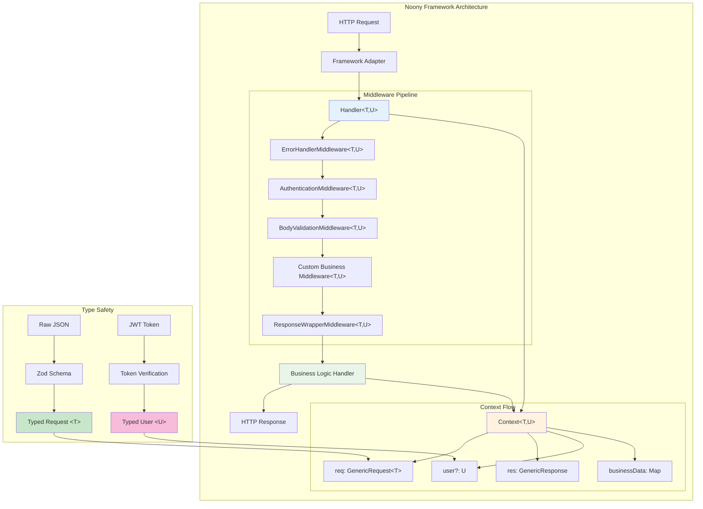
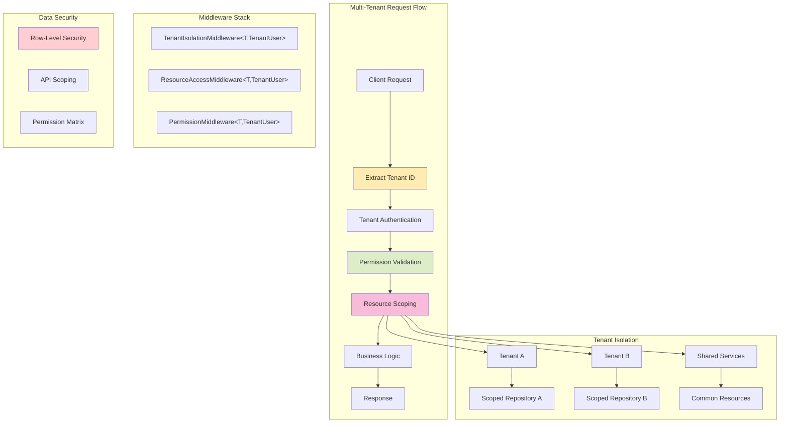
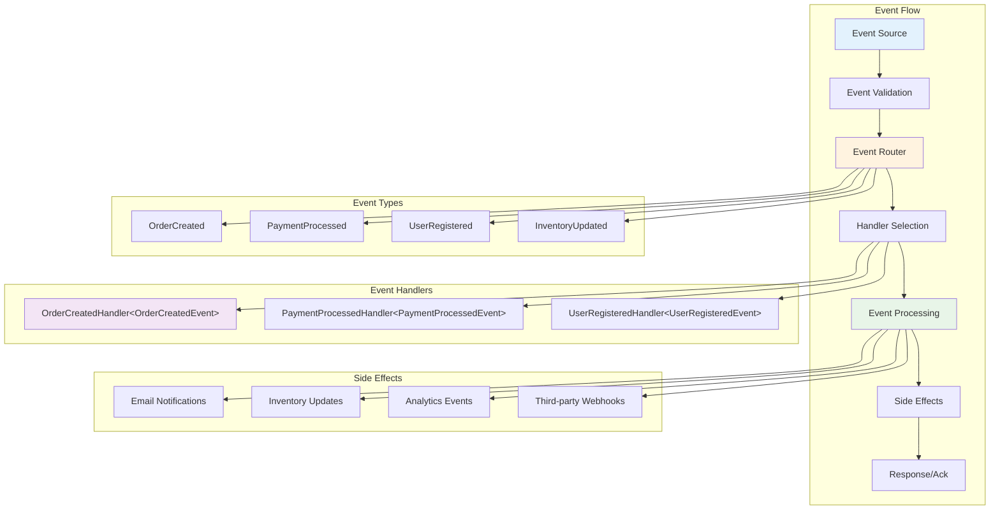
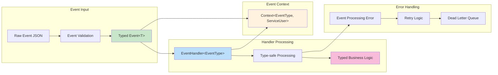
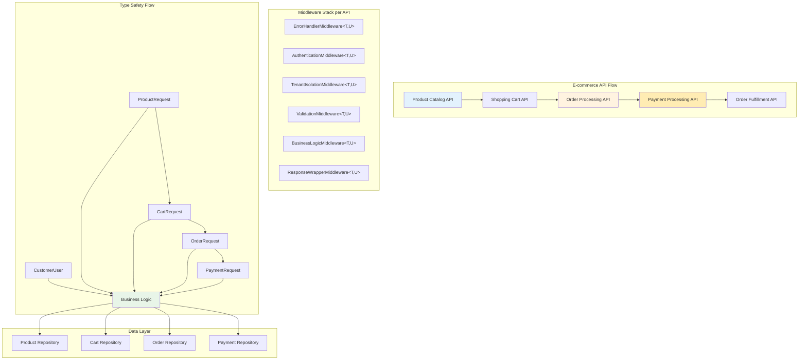

# Noony Framework Complete Guide

**The definitive guide to the Noony serverless middleware framework with TypeScript generics**

> This is your single source of truth for everything Noony. Every example includes full type safety with generics.

## Table of Contents

1. [Quick Start](#quick-start)
2. [Core Concepts with Generics](#core-concepts-with-generics)
3. [Basic Patterns](#basic-patterns)
4. [Intermediate Patterns](#intermediate-patterns)
5. [Advanced Patterns](#advanced-patterns)
6. [Functional Programming](#functional-programming)
7. [Production Examples](#production-examples)
8. [Best Practices](#best-practices)
9. [When to Use What](#when-to-use-what)

---

## Quick Start

### Installation and Basic Setup

```typescript
import { 
  Handler, 
  Context, 
  BaseMiddleware,
  ErrorHandlerMiddleware,
  BodyValidationMiddleware,
  ResponseWrapperMiddleware 
} from '@noony/core';
import { z } from 'zod';

// 1. Define your request type with Zod
const createUserSchema = z.object({
  name: z.string().min(2, 'Name must be at least 2 characters'),
  email: z.string().email('Must be a valid email'),
  age: z.number().min(18, 'Must be 18 or older')
});

// 2. Infer TypeScript types from schema
type CreateUserRequest = z.infer<typeof createUserSchema>;

// 3. Define your user type (what goes in context.user)
interface User {
  id: string;
  role: 'user' | 'admin';
  tenantId: string;
}

// 4. Create handler with full generics
const createUserHandler = new Handler<CreateUserRequest, User>()
  .use(new ErrorHandlerMiddleware<CreateUserRequest, User>())
  .use(new BodyValidationMiddleware<CreateUserRequest, User>(createUserSchema))
  .use(new ResponseWrapperMiddleware<CreateUserRequest, User>())
  .handle(async (context: Context<CreateUserRequest, User>) => {
    // TypeScript knows exactly what types these are!
    const { name, email, age } = context.req.validatedBody!; // Type: CreateUserRequest
    const user = context.user!; // Type: User
    
    // Business logic with full type safety
    const newUser = await userService.create({ name, email, age, createdBy: user.id });
    
    context.res.json({ user: newUser });
  });

// 5. Export for Google Cloud Functions
export const createUser = http('createUser', (req, res) => 
  createUserHandler.execute(req, res)
);
```

**Key Takeaway**: Always use `Handler<RequestType, UserType>` and `Context<RequestType, UserType>` for complete type safety.

---

## Core Concepts with Generics

### Framework Architecture Overview



### Generic Type Flow

```mermaid
graph LR
    subgraph "Request Processing"
        A[Raw Body: unknown] --> B[JSON Parse] 
        B --> C[Zod Validation]
        C --> D[Typed Data: T]
    end
    
    subgraph "Authentication"
        E[JWT Token] --> F[Token Decode]
        F --> G[User Data: U]
    end
    
    subgraph "Context Creation"
        H[Context&lt;T, U&gt;]
        D --> H
        G --> H
    end
    
    subgraph "Middleware Chain"
        I[BaseMiddleware&lt;T, U&gt;]
        J[before(context: Context&lt;T, U&gt;)]
        K[after(context: Context&lt;T, U&gt;)]
        L[onError(error, context: Context&lt;T, U&gt;)]
        
        H --> I
        I --> J
        I --> K
        I --> L
    end
    
    subgraph "Business Logic"
        M[Handler Function]
        N[context.req.validatedBody: T]
        O[context.user: U]
        
        H --> M
        M --> N
        M --> O
    end
    
    style D fill:#c8e6c9
    style G fill:#bbdefb
    style H fill:#fff3e0
    style N fill:#f3e5f5
    style O fill:#fce4ec
```

### Handler<T, U>

The Handler is the core orchestrator with two generic types:
- **T**: The validated request body type
- **U**: The authenticated user type

```typescript
// Generic Handler signature
class Handler<T = unknown, U = unknown> {
  use<TReq = T, UUser = U>(middleware: BaseMiddleware<TReq, UUser>): Handler<TReq, UUser>
  handle(businessLogic: (context: Context<T, U>) => Promise<void>): void
  execute(req: any, res: any): Promise<void>
}
```

### Context<T, U>

The Context carries type-safe data through the middleware chain:

```typescript
interface Context<T = unknown, U = unknown> {
  req: {
    body?: any;
    parsedBody?: any;
    validatedBody?: T;  // Always type T after validation
    headers: Record<string, string | string[]>;
    query?: Record<string, any>;
    params?: Record<string, any>;
  };
  res: {
    status(code: number): this;
    json(data: any): void;
    send(data: any): void;
  };
  user?: U;  // Always type U after authentication
  requestId: string;
  startTime: number;
  businessData?: Map<string, any>;
}
```

### BaseMiddleware<T, U>

All middleware implements this generic interface:

```typescript
interface BaseMiddleware<T = unknown, U = unknown> {
  before?(context: Context<T, U>): Promise<void>;
  after?(context: Context<T, U>): Promise<void>;
  onError?(error: Error, context: Context<T, U>): Promise<void>;
}
```

**Custom Middleware Example**:

```typescript
class LoggingMiddleware<T, U> implements BaseMiddleware<T, U> {
  async before(context: Context<T, U>): Promise<void> {
    console.log(`Request ${context.requestId} started`);
    console.log('User:', context.user); // Type: U | undefined
  }
  
  async after(context: Context<T, U>): Promise<void> {
    const duration = Date.now() - context.startTime;
    console.log(`Request ${context.requestId} completed in ${duration}ms`);
  }
}
```

---

## Basic Patterns

### Simple CRUD Operations

```typescript
// User Management Types
interface CreateUserRequest {
  name: string;
  email: string;
  role: 'user' | 'admin';
}

interface UpdateUserRequest {
  id: string;
  name?: string;
  email?: string;
  role?: 'user' | 'admin';
}

interface AuthenticatedUser {
  id: string;
  email: string;
  role: 'user' | 'admin';
  permissions: string[];
}

// Create User Handler
const createUserHandler = new Handler<CreateUserRequest, AuthenticatedUser>()
  .use(new ErrorHandlerMiddleware<CreateUserRequest, AuthenticatedUser>())
  .use(new AuthenticationMiddleware<CreateUserRequest, AuthenticatedUser>(tokenVerifier))
  .use(new BodyValidationMiddleware<CreateUserRequest, AuthenticatedUser>(createUserSchema))
  .use(new ResponseWrapperMiddleware<CreateUserRequest, AuthenticatedUser>())
  .handle(async (context: Context<CreateUserRequest, AuthenticatedUser>) => {
    const userData = context.req.validatedBody!; // Type: CreateUserRequest
    const currentUser = context.user!; // Type: AuthenticatedUser
    
    // Permission check with full typing
    if (!currentUser.permissions.includes('user:create')) {
      throw new AuthenticationError('Insufficient permissions');
    }
    
    const newUser = await userRepository.create(userData);
    context.res.status(201).json({ user: newUser });
  });

// Update User Handler  
const updateUserHandler = new Handler<UpdateUserRequest, AuthenticatedUser>()
  .use(new ErrorHandlerMiddleware<UpdateUserRequest, AuthenticatedUser>())
  .use(new AuthenticationMiddleware<UpdateUserRequest, AuthenticatedUser>(tokenVerifier))
  .use(new BodyValidationMiddleware<UpdateUserRequest, AuthenticatedUser>(updateUserSchema))
  .use(new ResponseWrapperMiddleware<UpdateUserRequest, AuthenticatedUser>())
  .handle(async (context: Context<UpdateUserRequest, AuthenticatedUser>) => {
    const { id, ...updates } = context.req.validatedBody!; // Type: UpdateUserRequest
    const currentUser = context.user!; // Type: AuthenticatedUser
    
    // Business logic with type safety
    const updatedUser = await userRepository.update(id, updates);
    context.res.json({ user: updatedUser });
  });
```

### List Operations with Filtering

```typescript
// Query Parameters Type
interface UserListQuery {
  page?: number;
  limit?: number;
  role?: 'user' | 'admin';
  search?: string;
}

// Custom Middleware for Query Processing
class QueryParametersMiddleware<T, U> implements BaseMiddleware<T, U> {
  constructor(private querySchema: z.ZodSchema<any>) {}
  
  async before(context: Context<T, U>): Promise<void> {
    try {
      const validatedQuery = this.querySchema.parse(context.req.query || {});
      context.businessData?.set('validatedQuery', validatedQuery);
    } catch (error) {
      throw new ValidationError('Invalid query parameters');
    }
  }
}

// List Users Handler
const listUsersHandler = new Handler<unknown, AuthenticatedUser>()
  .use(new ErrorHandlerMiddleware<unknown, AuthenticatedUser>())
  .use(new AuthenticationMiddleware<unknown, AuthenticatedUser>(tokenVerifier))
  .use(new QueryParametersMiddleware<unknown, AuthenticatedUser>(
    z.object({
      page: z.coerce.number().min(1).default(1),
      limit: z.coerce.number().min(1).max(100).default(10),
      role: z.enum(['user', 'admin']).optional(),
      search: z.string().optional()
    })
  ))
  .use(new ResponseWrapperMiddleware<unknown, AuthenticatedUser>())
  .handle(async (context: Context<unknown, AuthenticatedUser>) => {
    const currentUser = context.user!; // Type: AuthenticatedUser
    const query = context.businessData?.get('validatedQuery') as UserListQuery;
    
    // Permission-based filtering with full typing
    let filters: any = {};
    if (currentUser.role !== 'admin') {
      filters.createdBy = currentUser.id;
    }
    if (query.role) {
      filters.role = query.role;
    }
    if (query.search) {
      filters.name = { $regex: query.search, $options: 'i' };
    }
    
    const users = await userRepository.findMany(filters, {
      skip: (query.page - 1) * query.limit,
      limit: query.limit
    });
    
    context.res.json({ users, pagination: query });
  });
```

---

## Intermediate Patterns

### Complex Validation with Cross-Field Dependencies

```typescript
// Order Management Types
interface CreateOrderRequest {
  customerId: string;
  items: OrderItem[];
  shippingAddress: Address;
  billingAddress?: Address;
  paymentMethod: PaymentMethod;
  couponCode?: string;
}

interface OrderItem {
  productId: string;
  quantity: number;
  price: number;
}

interface BusinessUser {
  id: string;
  role: 'customer' | 'admin' | 'staff';
  customerId?: string;
  permissions: string[];
}

// Advanced Validation Middleware
class OrderValidationMiddleware<T extends CreateOrderRequest, U> implements BaseMiddleware<T, U> {
  async before(context: Context<T, U>): Promise<void> {
    const order = context.req.validatedBody!;
    
    // Cross-field validation with full typing
    await this.validateCustomerExists(order.customerId);
    await this.validateProductsExist(order.items.map(item => item.productId));
    await this.validateInventory(order.items);
    
    if (order.couponCode) {
      await this.validateCoupon(order.couponCode, order.items);
    }
    
    // Calculate totals with type safety
    const totals = this.calculateOrderTotals(order.items, order.couponCode);
    context.businessData?.set('orderTotals', totals);
  }
  
  private async validateCustomerExists(customerId: string): Promise<void> {
    const customer = await customerRepository.findById(customerId);
    if (!customer) {
      throw new ValidationError('Customer not found');
    }
  }
  
  private async validateProductsExist(productIds: string[]): Promise<void> {
    const products = await productRepository.findByIds(productIds);
    if (products.length !== productIds.length) {
      throw new ValidationError('Some products not found');
    }
  }
  
  private async validateInventory(items: OrderItem[]): Promise<void> {
    for (const item of items) {
      const product = await productRepository.findById(item.productId);
      if (!product || product.stock < item.quantity) {
        throw new ValidationError(`Insufficient stock for product ${item.productId}`);
      }
    }
  }
  
  private calculateOrderTotals(items: OrderItem[], couponCode?: string): OrderTotals {
    // Full type safety in calculations
    const subtotal = items.reduce((sum, item) => sum + (item.price * item.quantity), 0);
    // ... discount and tax calculations
    return { subtotal, discount: 0, tax: subtotal * 0.1, total: subtotal * 1.1 };
  }
}

// Order Creation Handler
const createOrderHandler = new Handler<CreateOrderRequest, BusinessUser>()
  .use(new ErrorHandlerMiddleware<CreateOrderRequest, BusinessUser>())
  .use(new AuthenticationMiddleware<CreateOrderRequest, BusinessUser>(tokenVerifier))
  .use(new BodyValidationMiddleware<CreateOrderRequest, BusinessUser>(createOrderSchema))
  .use(new OrderValidationMiddleware<CreateOrderRequest, BusinessUser>())
  .use(new ResponseWrapperMiddleware<CreateOrderRequest, BusinessUser>())
  .handle(async (context: Context<CreateOrderRequest, BusinessUser>) => {
    const orderData = context.req.validatedBody!; // Type: CreateOrderRequest
    const user = context.user!; // Type: BusinessUser
    const totals = context.businessData?.get('orderTotals') as OrderTotals;
    
    // Permission check with full typing
    if (user.role === 'customer' && user.customerId !== orderData.customerId) {
      throw new AuthenticationError('Cannot create order for different customer');
    }
    
    // Create order with calculated totals
    const order = await orderRepository.create({
      ...orderData,
      ...totals,
      status: 'pending',
      createdBy: user.id
    });
    
    context.res.status(201).json({ order });
  });
```

### Multi-Step Processing Pipeline

```typescript
// Payment Processing Types
interface ProcessPaymentRequest {
  orderId: string;
  paymentMethodId: string;
  amount: number;
  currency: 'USD' | 'EUR' | 'GBP';
}

interface PaymentUser {
  id: string;
  role: string;
  stripeCustomerId?: string;
}

// Pipeline Middleware - Each step is fully typed
class PaymentValidationMiddleware<T extends ProcessPaymentRequest, U> implements BaseMiddleware<T, U> {
  async before(context: Context<T, U>): Promise<void> {
    const payment = context.req.validatedBody!;
    
    // Validate order exists and is payable
    const order = await orderRepository.findById(payment.orderId);
    if (!order) {
      throw new ValidationError('Order not found');
    }
    if (order.status !== 'pending') {
      throw new ValidationError('Order is not payable');
    }
    if (order.total !== payment.amount) {
      throw new ValidationError('Payment amount does not match order total');
    }
    
    context.businessData?.set('order', order);
  }
}

class PaymentMethodValidationMiddleware<T extends ProcessPaymentRequest, U extends PaymentUser> implements BaseMiddleware<T, U> {
  async before(context: Context<T, U>): Promise<void> {
    const payment = context.req.validatedBody!;
    const user = context.user!;
    
    // Validate payment method belongs to user
    const paymentMethod = await stripeService.getPaymentMethod(payment.paymentMethodId);
    if (!paymentMethod || paymentMethod.customer !== user.stripeCustomerId) {
      throw new ValidationError('Payment method not found or unauthorized');
    }
    
    context.businessData?.set('paymentMethod', paymentMethod);
  }
}

class PaymentProcessingMiddleware<T extends ProcessPaymentRequest, U> implements BaseMiddleware<T, U> {
  async before(context: Context<T, U>): Promise<void> {
    const payment = context.req.validatedBody!;
    const order = context.businessData?.get('order');
    const paymentMethod = context.businessData?.get('paymentMethod');
    
    try {
      // Process payment with full type safety
      const paymentIntent = await stripeService.createPaymentIntent({
        amount: payment.amount * 100, // Convert to cents
        currency: payment.currency,
        payment_method: payment.paymentMethodId,
        confirm: true
      });
      
      context.businessData?.set('paymentIntent', paymentIntent);
    } catch (error) {
      throw new BusinessError('Payment processing failed', error.message);
    }
  }
}

// Payment Handler with Full Pipeline
const processPaymentHandler = new Handler<ProcessPaymentRequest, PaymentUser>()
  .use(new ErrorHandlerMiddleware<ProcessPaymentRequest, PaymentUser>())
  .use(new AuthenticationMiddleware<ProcessPaymentRequest, PaymentUser>(tokenVerifier))
  .use(new BodyValidationMiddleware<ProcessPaymentRequest, PaymentUser>(processPaymentSchema))
  .use(new PaymentValidationMiddleware<ProcessPaymentRequest, PaymentUser>())
  .use(new PaymentMethodValidationMiddleware<ProcessPaymentRequest, PaymentUser>())
  .use(new PaymentProcessingMiddleware<ProcessPaymentRequest, PaymentUser>())
  .use(new ResponseWrapperMiddleware<ProcessPaymentRequest, PaymentUser>())
  .handle(async (context: Context<ProcessPaymentRequest, PaymentUser>) => {
    const paymentIntent = context.businessData?.get('paymentIntent');
    const order = context.businessData?.get('order');
    
    // Update order status with full typing
    const updatedOrder = await orderRepository.update(order.id, {
      status: 'paid',
      paymentIntentId: paymentIntent.id,
      paidAt: new Date()
    });
    
    // Send confirmation email (fire and forget)
    emailService.sendOrderConfirmation(updatedOrder).catch(console.error);
    
    context.res.json({ 
      success: true, 
      order: updatedOrder,
      paymentIntent: { id: paymentIntent.id, status: paymentIntent.status }
    });
  });
```

---

## Advanced Patterns

### Multi-Tenant Architecture with Type Safety

### Multi-Tenant Architecture Diagram



```typescript
// Multi-Tenant Types
interface TenantUser {
  id: string;
  email: string;
  tenantId: string;
  role: 'owner' | 'admin' | 'user';
  permissions: string[];
}

interface TenantAwareRequest {
  tenantId?: string; // Can be overridden by header or user context
}

// Tenant Isolation Middleware
class TenantIsolationMiddleware<T extends TenantAwareRequest, U extends TenantUser> implements BaseMiddleware<T, U> {
  async before(context: Context<T, U>): Promise<void> {
    const user = context.user!;
    const requestedTenantId = context.req.headers['x-tenant-id'] as string || 
                             context.req.validatedBody?.tenantId || 
                             user.tenantId;
    
    // Tenant access validation
    if (user.role !== 'owner' && requestedTenantId !== user.tenantId) {
      throw new AuthenticationError('Access denied to tenant');
    }
    
    // Set tenant context
    context.businessData?.set('tenantId', requestedTenantId);
    
    // Create tenant-scoped repositories
    const tenantScope = { tenantId: requestedTenantId };
    const userRepo = userRepository.withScope(tenantScope);
    const productRepo = productRepository.withScope(tenantScope);
    
    context.businessData?.set('userRepository', userRepo);
    context.businessData?.set('productRepository', productRepo);
  }
}

// Resource Access Control Middleware
class ResourceAccessMiddleware<T, U extends TenantUser> implements BaseMiddleware<T, U> {
  constructor(private requiredPermissions: string[]) {}
  
  async before(context: Context<T, U>): Promise<void> {
    const user = context.user!;
    const tenantId = context.businessData?.get('tenantId');
    
    // Check permissions within tenant context
    const hasPermission = this.requiredPermissions.every(permission => 
      user.permissions.includes(`${tenantId}:${permission}`) ||
      user.permissions.includes(`*:${permission}`) ||
      user.role === 'owner'
    );
    
    if (!hasPermission) {
      throw new AuthenticationError(`Missing permissions: ${this.requiredPermissions.join(', ')}`);
    }
  }
}

// Multi-Tenant Product Management
interface CreateProductRequest extends TenantAwareRequest {
  name: string;
  description: string;
  price: number;
  category: string;
}

const createProductHandler = new Handler<CreateProductRequest, TenantUser>()
  .use(new ErrorHandlerMiddleware<CreateProductRequest, TenantUser>())
  .use(new AuthenticationMiddleware<CreateProductRequest, TenantUser>(tokenVerifier))
  .use(new TenantIsolationMiddleware<CreateProductRequest, TenantUser>())
  .use(new ResourceAccessMiddleware<CreateProductRequest, TenantUser>(['product:create']))
  .use(new BodyValidationMiddleware<CreateProductRequest, TenantUser>(createProductSchema))
  .use(new ResponseWrapperMiddleware<CreateProductRequest, TenantUser>())
  .handle(async (context: Context<CreateProductRequest, TenantUser>) => {
    const productData = context.req.validatedBody!; // Type: CreateProductRequest
    const tenantId = context.businessData?.get('tenantId') as string;
    const productRepo = context.businessData?.get('productRepository');
    
    // Create product within tenant scope
    const product = await productRepo.create({
      ...productData,
      tenantId,
      createdBy: context.user!.id
    });
    
    context.res.status(201).json({ product });
  });
```

### Event-Driven Architecture with Type Safety

### Event Processing Architecture



### Event Handler Type Safety Flow



```typescript
// Event Types
interface BaseEvent<T = any> {
  id: string;
  type: string;
  data: T;
  timestamp: Date;
  tenantId?: string;
  userId?: string;
}

interface OrderCreatedEvent extends BaseEvent<{
  orderId: string;
  customerId: string;
  amount: number;
  items: OrderItem[];
}> {
  type: 'order.created';
}

interface PaymentProcessedEvent extends BaseEvent<{
  orderId: string;
  paymentId: string;
  amount: number;
  status: 'success' | 'failed';
}> {
  type: 'payment.processed';
}

// Event Processing Types
type EventMap = {
  'order.created': OrderCreatedEvent;
  'payment.processed': PaymentProcessedEvent;
};

// Generic Event Handler
class EventProcessingMiddleware<T extends BaseEvent, U> implements BaseMiddleware<T, U> {
  async before(context: Context<T, U>): Promise<void> {
    const eventData = context.req.validatedBody!;
    
    // Validate event structure
    if (!eventData.id || !eventData.type || !eventData.data) {
      throw new ValidationError('Invalid event structure');
    }
    
    // Store event for processing
    await eventRepository.store(eventData);
    context.businessData?.set('event', eventData);
  }
}

// Event Router Middleware
class EventRouterMiddleware<T extends BaseEvent, U> implements BaseMiddleware<T, U> {
  async before(context: Context<T, U>): Promise<void> {
    const event = context.businessData?.get('event') as T;
    
    // Route to appropriate handler based on event type
    const handler = this.getEventHandler(event.type);
    if (handler) {
      context.businessData?.set('eventHandler', handler);
    } else {
      throw new ValidationError(`No handler found for event type: ${event.type}`);
    }
  }
  
  private getEventHandler(eventType: string): EventHandler<any> | null {
    const handlers: Record<string, EventHandler<any>> = {
      'order.created': new OrderCreatedHandler(),
      'payment.processed': new PaymentProcessedHandler()
    };
    
    return handlers[eventType] || null;
  }
}

// Specific Event Handlers
class OrderCreatedHandler implements EventHandler<OrderCreatedEvent> {
  async process(event: OrderCreatedEvent): Promise<void> {
    const { orderId, customerId, amount } = event.data;
    
    // Send confirmation email
    await emailService.sendOrderConfirmation(orderId, customerId);
    
    // Update inventory
    for (const item of event.data.items) {
      await inventoryService.reserve(item.productId, item.quantity);
    }
    
    // Create loyalty points
    await loyaltyService.addPoints(customerId, Math.floor(amount * 0.01));
  }
}

// Generic Event Processing Handler
const processEventHandler = new Handler<BaseEvent, unknown>()
  .use(new ErrorHandlerMiddleware<BaseEvent, unknown>())
  .use(new EventProcessingMiddleware<BaseEvent, unknown>())
  .use(new EventRouterMiddleware<BaseEvent, unknown>())
  .use(new ResponseWrapperMiddleware<BaseEvent, unknown>())
  .handle(async (context: Context<BaseEvent, unknown>) => {
    const event = context.businessData?.get('event') as BaseEvent;
    const handler = context.businessData?.get('eventHandler') as EventHandler<BaseEvent>;
    
    try {
      await handler.process(event);
      
      // Update event status
      await eventRepository.markAsProcessed(event.id);
      
      context.res.json({ 
        success: true, 
        eventId: event.id,
        processedAt: new Date()
      });
    } catch (error) {
      await eventRepository.markAsFailed(event.id, error.message);
      throw error;
    }
  });
```

---

## Functional Programming

### Higher-Order Functions with Generics

```typescript
// Composable Middleware Factory
const createMiddlewareComposer = <T, U>() => ({
  compose: (...middlewares: Array<new () => BaseMiddleware<T, U>>) =>
    middlewares.reduce(
      (handler, MiddlewareClass) => handler.use(new MiddlewareClass()),
      new Handler<T, U>()
    ),
    
  pipe: <TIn, TOut>(
    handler: Handler<TIn, U>,
    transformer: (input: TIn) => TOut
  ): Handler<TOut, U> => {
    // Transform middleware that changes request type
    class TransformMiddleware implements BaseMiddleware<TOut, U> {
      async before(context: Context<TOut, U>): Promise<void> {
        // Apply transformation with full type safety
        const transformed = transformer(context.req.validatedBody as unknown as TIn);
        context.req.validatedBody = transformed;
      }
    }
    
    return new Handler<TOut, U>().use(new TransformMiddleware());
  }
});

// Curried Middleware Factories
const createValidationMiddleware = <T>(schema: z.ZodSchema<T>) => 
  <U>() => new BodyValidationMiddleware<T, U>(schema);

const createAuthMiddleware = <U>(verifier: TokenVerifier<U>) => 
  <T>() => new AuthenticationMiddleware<T, U>(verifier);

const createPermissionMiddleware = (permissions: string[]) => 
  <T, U extends { permissions: string[] }>() => 
    new ResourceAccessMiddleware<T, U>(permissions);

// Functional Pipeline Construction
const createUserPipeline = createMiddlewareComposer<CreateUserRequest, AdminUser>()
  .compose(
    ErrorHandlerMiddleware,
    createAuthMiddleware(adminTokenVerifier)<CreateUserRequest>(),
    createPermissionMiddleware(['user:create'])<CreateUserRequest, AdminUser>(),
    createValidationMiddleware(createUserSchema)<AdminUser>(),
    ResponseWrapperMiddleware
  );

// Functional Error Handling
type Result<T, E = Error> = 
  | { success: true; data: T }
  | { success: false; error: E };

const safeAsync = <T, E = Error>(
  operation: () => Promise<T>
): Promise<Result<T, E>> =>
  operation()
    .then(data => ({ success: true, data } as const))
    .catch(error => ({ success: false, error: error as E } as const));

// Monadic Middleware Pattern
class SafeMiddleware<T, U> implements BaseMiddleware<T, U> {
  constructor(
    private operation: (context: Context<T, U>) => Promise<void>
  ) {}
  
  async before(context: Context<T, U>): Promise<void> {
    const result = await safeAsync(() => this.operation(context));
    
    if (!result.success) {
      throw new BusinessError('Operation failed', result.error.message);
    }
  }
}

// Functional Async Composition
const asyncPipe = <T>(...fns: Array<(arg: T) => Promise<T>>) => 
  (value: T): Promise<T> => 
    fns.reduce(async (acc, fn) => fn(await acc), Promise.resolve(value));

// Data Transformation Pipeline
const createDataProcessor = <TUser extends { id: string }>() => {
  const enrichUser = async (user: TUser): Promise<TUser & { preferences: any }> => {
    const preferences = await preferenceService.get(user.id);
    return { ...user, preferences };
  };
  
  const addPermissions = async (user: TUser & { preferences: any }): Promise<TUser & { preferences: any; permissions: string[] }> => {
    const permissions = await permissionService.get(user.id);
    return { ...user, permissions };
  };
  
  const addStats = async (user: TUser & { preferences: any; permissions: string[] }): Promise<TUser & { preferences: any; permissions: string[]; stats: any }> => {
    const stats = await statsService.get(user.id);
    return { ...user, stats };
  };
  
  return asyncPipe(enrichUser, addPermissions, addStats);
};

// Usage in Middleware
class DataEnrichmentMiddleware<T, U extends { id: string }> implements BaseMiddleware<T, U> {
  private processor = createDataProcessor<U>();
  
  async before(context: Context<T, U>): Promise<void> {
    const enrichedUser = await this.processor(context.user!);
    context.user = enrichedUser as U;
  }
}
```

---

## Production Examples

### E-commerce System Architecture



### Complex Order Processing Pipeline

```mermaid
sequenceDiagram
    participant Client
    participant Handler as Handler&lt;OrderRequest,Customer&gt;
    participant Auth as AuthMiddleware
    participant Valid as ValidationMiddleware
    participant Inventory as InventoryMiddleware
    participant Payment as PaymentMiddleware
    participant BL as Business Logic
    
    Client->>Handler: POST /orders
    Handler->>Auth: Authenticate customer
    Auth->>Valid: Validate order data
    Valid->>Inventory: Check item availability
    Inventory->>Payment: Process payment
    Payment->>BL: Execute order creation
    
    Note over BL: All data is fully typed:<br/>OrderRequest & CustomerUser
    
    BL->>Payment: Confirm payment
    Payment->>Inventory: Reserve items
    Inventory->>Valid: Send confirmation
    Valid->>Auth: Complete transaction
    Auth->>Handler: Return success
    Handler->>Client: Order created response
    
    Note over Client,Handler: Error at any step triggers<br/>onError() chain in reverse
```

### E-commerce API with Full Type Safety

```typescript
// Complete E-commerce Types
interface Product {
  id: string;
  name: string;
  description: string;
  price: number;
  category: string;
  stock: number;
  tenantId: string;
}

interface Customer {
  id: string;
  email: string;
  name: string;
  addresses: Address[];
  stripeCustomerId: string;
  tenantId: string;
}

interface EcommerceUser {
  id: string;
  email: string;
  role: 'customer' | 'admin' | 'staff';
  tenantId: string;
  customerId?: string;
  permissions: string[];
}

// Product Catalog Endpoint
interface GetProductsQuery {
  category?: string;
  minPrice?: number;
  maxPrice?: number;
  search?: string;
  page: number;
  limit: number;
}

const getProductsHandler = new Handler<unknown, EcommerceUser>()
  .use(new ErrorHandlerMiddleware<unknown, EcommerceUser>())
  .use(new AuthenticationMiddleware<unknown, EcommerceUser>(ecommerceTokenVerifier))
  .use(new TenantIsolationMiddleware<unknown, EcommerceUser>())
  .use(new QueryParametersMiddleware<unknown, EcommerceUser>(
    z.object({
      category: z.string().optional(),
      minPrice: z.coerce.number().min(0).optional(),
      maxPrice: z.coerce.number().min(0).optional(),
      search: z.string().optional(),
      page: z.coerce.number().min(1).default(1),
      limit: z.coerce.number().min(1).max(50).default(10)
    })
  ))
  .use(new ResponseWrapperMiddleware<unknown, EcommerceUser>())
  .handle(async (context: Context<unknown, EcommerceUser>) => {
    const query = context.businessData?.get('validatedQuery') as GetProductsQuery;
    const tenantId = context.businessData?.get('tenantId') as string;
    const productRepo = context.businessData?.get('productRepository');
    
    // Build filters with full type safety
    const filters: any = { tenantId, stock: { $gt: 0 } };
    
    if (query.category) {
      filters.category = query.category;
    }
    if (query.minPrice || query.maxPrice) {
      filters.price = {};
      if (query.minPrice) filters.price.$gte = query.minPrice;
      if (query.maxPrice) filters.price.$lte = query.maxPrice;
    }
    if (query.search) {
      filters.$text = { $search: query.search };
    }
    
    // Execute query with pagination
    const [products, total] = await Promise.all([
      productRepo.findMany(filters, {
        skip: (query.page - 1) * query.limit,
        limit: query.limit,
        sort: { name: 1 }
      }),
      productRepo.count(filters)
    ]);
    
    context.res.json({
      products,
      pagination: {
        page: query.page,
        limit: query.limit,
        total,
        pages: Math.ceil(total / query.limit)
      }
    });
  });

// Shopping Cart Management
interface AddToCartRequest {
  productId: string;
  quantity: number;
}

interface CartItem {
  productId: string;
  quantity: number;
  price: number;
  product: Product;
}

class CartManagementMiddleware<T extends AddToCartRequest, U extends EcommerceUser> implements BaseMiddleware<T, U> {
  async before(context: Context<T, U>): Promise<void> {
    const { productId, quantity } = context.req.validatedBody!;
    const user = context.user!;
    
    if (!user.customerId) {
      throw new AuthenticationError('Customer ID required');
    }
    
    // Validate product exists and has stock
    const product = await productRepository.findById(productId);
    if (!product) {
      throw new ValidationError('Product not found');
    }
    if (product.stock < quantity) {
      throw new ValidationError('Insufficient stock');
    }
    
    context.businessData?.set('product', product);
    context.businessData?.set('customerId', user.customerId);
  }
}

const addToCartHandler = new Handler<AddToCartRequest, EcommerceUser>()
  .use(new ErrorHandlerMiddleware<AddToCartRequest, EcommerceUser>())
  .use(new AuthenticationMiddleware<AddToCartRequest, EcommerceUser>(ecommerceTokenVerifier))
  .use(new TenantIsolationMiddleware<AddToCartRequest, EcommerceUser>())
  .use(new BodyValidationMiddleware<AddToCartRequest, EcommerceUser>(
    z.object({
      productId: z.string().uuid(),
      quantity: z.number().min(1).max(10)
    })
  ))
  .use(new CartManagementMiddleware<AddToCartRequest, EcommerceUser>())
  .use(new ResponseWrapperMiddleware<AddToCartRequest, EcommerceUser>())
  .handle(async (context: Context<AddToCartRequest, EcommerceUser>) => {
    const { productId, quantity } = context.req.validatedBody!;
    const product = context.businessData?.get('product') as Product;
    const customerId = context.businessData?.get('customerId') as string;
    
    // Add to cart with full type safety
    const cartItem = await cartRepository.addItem(customerId, {
      productId,
      quantity,
      price: product.price,
      product
    });
    
    // Get updated cart total
    const cart = await cartRepository.getByCustomerId(customerId);
    const total = cart.items.reduce((sum, item) => sum + (item.price * item.quantity), 0);
    
    context.res.json({
      cartItem,
      cartTotal: total,
      itemCount: cart.items.length
    });
  });

// Order Checkout Process
interface CheckoutRequest {
  items: Array<{ productId: string; quantity: number }>;
  shippingAddressId: string;
  billingAddressId?: string;
  paymentMethodId: string;
  couponCode?: string;
}

// Multi-step checkout validation
class CheckoutValidationMiddleware<T extends CheckoutRequest, U extends EcommerceUser> implements BaseMiddleware<T, U> {
  async before(context: Context<T, U>): Promise<void> {
    const checkout = context.req.validatedBody!;
    const user = context.user!;
    
    // Validate all items are available
    const products = await productRepository.findByIds(
      checkout.items.map(item => item.productId)
    );
    
    for (const item of checkout.items) {
      const product = products.find(p => p.id === item.productId);
      if (!product) {
        throw new ValidationError(`Product ${item.productId} not found`);
      }
      if (product.stock < item.quantity) {
        throw new ValidationError(`Insufficient stock for ${product.name}`);
      }
    }
    
    // Validate addresses belong to customer
    const customer = await customerRepository.findById(user.customerId!);
    const shippingAddress = customer.addresses.find(addr => addr.id === checkout.shippingAddressId);
    if (!shippingAddress) {
      throw new ValidationError('Invalid shipping address');
    }
    
    const billingAddress = checkout.billingAddressId
      ? customer.addresses.find(addr => addr.id === checkout.billingAddressId)
      : shippingAddress;
    
    if (!billingAddress) {
      throw new ValidationError('Invalid billing address');
    }
    
    // Store validation results
    context.businessData?.set('products', products);
    context.businessData?.set('customer', customer);
    context.businessData?.set('shippingAddress', shippingAddress);
    context.businessData?.set('billingAddress', billingAddress);
  }
}

const checkoutHandler = new Handler<CheckoutRequest, EcommerceUser>()
  .use(new ErrorHandlerMiddleware<CheckoutRequest, EcommerceUser>())
  .use(new AuthenticationMiddleware<CheckoutRequest, EcommerceUser>(ecommerceTokenVerifier))
  .use(new TenantIsolationMiddleware<CheckoutRequest, EcommerceUser>())
  .use(new BodyValidationMiddleware<CheckoutRequest, EcommerceUser>(checkoutSchema))
  .use(new CheckoutValidationMiddleware<CheckoutRequest, EcommerceUser>())
  .use(new ResponseWrapperMiddleware<CheckoutRequest, EcommerceUser>())
  .handle(async (context: Context<CheckoutRequest, EcommerceUser>) => {
    const checkout = context.req.validatedBody!;
    const products = context.businessData?.get('products') as Product[];
    const customer = context.businessData?.get('customer') as Customer;
    const shippingAddress = context.businessData?.get('shippingAddress') as Address;
    const billingAddress = context.businessData?.get('billingAddress') as Address;
    
    // Calculate order totals
    let subtotal = 0;
    const orderItems = checkout.items.map(item => {
      const product = products.find(p => p.id === item.productId)!;
      const itemTotal = product.price * item.quantity;
      subtotal += itemTotal;
      
      return {
        productId: product.id,
        name: product.name,
        price: product.price,
        quantity: item.quantity,
        total: itemTotal
      };
    });
    
    // Apply coupon if provided
    let discount = 0;
    if (checkout.couponCode) {
      const coupon = await couponRepository.findByCode(checkout.couponCode);
      if (coupon && coupon.isValid) {
        discount = coupon.discountType === 'percentage' 
          ? subtotal * (coupon.discountValue / 100)
          : Math.min(coupon.discountValue, subtotal);
      }
    }
    
    const tax = (subtotal - discount) * 0.08; // 8% tax
    const total = subtotal - discount + tax;
    
    // Create order
    const order = await orderRepository.create({
      customerId: customer.id,
      items: orderItems,
      subtotal,
      discount,
      tax,
      total,
      status: 'pending',
      shippingAddress,
      billingAddress,
      paymentMethodId: checkout.paymentMethodId,
      tenantId: context.businessData?.get('tenantId')
    });
    
    // Reserve inventory
    for (const item of checkout.items) {
      await inventoryRepository.reserve(item.productId, item.quantity);
    }
    
    context.res.status(201).json({ order });
  });
```

---

## Best Practices

### Always Use Generics

```typescript
// ❌ Bad: No generics - loses type safety
const badHandler = new Handler()
  .use(new ErrorHandlerMiddleware())
  .handle(async (context) => {
    const data = context.req.validatedBody; // Type: any
    const user = context.user; // Type: any
  });

// ✅ Good: Full generics - complete type safety
const goodHandler = new Handler<CreateUserRequest, AuthenticatedUser>()
  .use(new ErrorHandlerMiddleware<CreateUserRequest, AuthenticatedUser>())
  .handle(async (context: Context<CreateUserRequest, AuthenticatedUser>) => {
    const data = context.req.validatedBody!; // Type: CreateUserRequest
    const user = context.user!; // Type: AuthenticatedUser
  });
```

### Middleware Ordering

```typescript
// ✅ Correct order with generics
const handler = new Handler<RequestType, UserType>()
  .use(new ErrorHandlerMiddleware<RequestType, UserType>())        // 1. First - catches all errors
  .use(new HeaderValidationMiddleware<RequestType, UserType>())    // 2. Early validation
  .use(new AuthenticationMiddleware<RequestType, UserType>())      // 3. Authentication
  .use(new BodyParserMiddleware<RequestType, UserType>())          // 4. Parse body
  .use(new BodyValidationMiddleware<RequestType, UserType>())      // 5. Validate parsed body
  .use(new BusinessMiddleware<RequestType, UserType>())            // 6. Business logic
  .use(new ResponseWrapperMiddleware<RequestType, UserType>())     // 7. Last - wraps response
  .handle(async (context: Context<RequestType, UserType>) => {
    // Your business logic here
  });
```

### Error Handling Patterns

```typescript
// Custom error classes with proper inheritance
class ValidationError extends Error {
  constructor(message: string, public field?: string) {
    super(message);
    this.name = 'ValidationError';
  }
}

class BusinessError extends Error {
  constructor(message: string, public code?: string) {
    super(message);
    this.name = 'BusinessError';
  }
}

// Type-safe error handling middleware
class TypedErrorHandlerMiddleware<T, U> implements BaseMiddleware<T, U> {
  async onError(error: Error, context: Context<T, U>): Promise<void> {
    if (error instanceof ValidationError) {
      context.res.status(400).json({
        success: false,
        error: {
          type: 'validation_error',
          message: error.message,
          field: error.field
        }
      });
    } else if (error instanceof BusinessError) {
      context.res.status(422).json({
        success: false,
        error: {
          type: 'business_error',
          message: error.message,
          code: error.code
        }
      });
    } else {
      // Log unexpected errors
      console.error(`Unexpected error in ${context.requestId}:`, error);
      
      context.res.status(500).json({
        success: false,
        error: {
          type: 'internal_error',
          message: 'An unexpected error occurred'
        }
      });
    }
  }
}
```

---

## When to Use What

### Decision Tree

```typescript
// 1. Simple CRUD operations
// Use: Basic patterns with validation and authentication
const simpleCrudHandler = new Handler<RequestType, UserType>()
  .use(new ErrorHandlerMiddleware<RequestType, UserType>())
  .use(new AuthenticationMiddleware<RequestType, UserType>())
  .use(new BodyValidationMiddleware<RequestType, UserType>())
  .use(new ResponseWrapperMiddleware<RequestType, UserType>());

// 2. Complex business logic with multiple validation steps
// Use: Custom middleware with cross-field validation
const complexBusinessHandler = new Handler<ComplexRequest, BusinessUser>()
  .use(new ErrorHandlerMiddleware<ComplexRequest, BusinessUser>())
  .use(new AuthenticationMiddleware<ComplexRequest, BusinessUser>())
  .use(new BusinessValidationMiddleware<ComplexRequest, BusinessUser>())
  .use(new WorkflowMiddleware<ComplexRequest, BusinessUser>());

// 3. Multi-tenant applications
// Use: Tenant isolation middleware
const multiTenantHandler = new Handler<TenantRequest, TenantUser>()
  .use(new ErrorHandlerMiddleware<TenantRequest, TenantUser>())
  .use(new AuthenticationMiddleware<TenantRequest, TenantUser>())
  .use(new TenantIsolationMiddleware<TenantRequest, TenantUser>())
  .use(new ResourceAccessMiddleware<TenantRequest, TenantUser>());

// 4. Event processing systems
// Use: Event routing and processing middleware
const eventHandler = new Handler<EventType, ServiceUser>()
  .use(new ErrorHandlerMiddleware<EventType, ServiceUser>())
  .use(new EventValidationMiddleware<EventType, ServiceUser>())
  .use(new EventRouterMiddleware<EventType, ServiceUser>());

// 5. Payment/financial operations
// Use: Multi-step validation and processing pipeline
const paymentHandler = new Handler<PaymentRequest, PaymentUser>()
  .use(new ErrorHandlerMiddleware<PaymentRequest, PaymentUser>())
  .use(new AuthenticationMiddleware<PaymentRequest, PaymentUser>())
  .use(new PaymentValidationMiddleware<PaymentRequest, PaymentUser>())
  .use(new PaymentProcessingMiddleware<PaymentRequest, PaymentUser>());
```

### Middleware Selection Guide

| Use Case | Middleware Pattern | Example |
|----------|-------------------|---------|
| **Simple API** | Basic validation + auth | User CRUD operations |
| **Complex Business Logic** | Custom validation middleware | Order processing |
| **Multi-tenant** | Tenant isolation + resource access | SaaS platforms |
| **Event Processing** | Event routing + handlers | Webhook processing |
| **Financial Operations** | Multi-step validation pipeline | Payment processing |
| **File Processing** | Stream processing middleware | File uploads |
| **Real-time Features** | WebSocket middleware | Chat applications |
| **Third-party Integrations** | External API middleware | Stripe/PayPal integration |

---

## Accessing Logged User from JWT Session

After JWT authentication using the `AuthenticationMiddleware`, you can access the logged user from `context.user`:

```typescript
// In your handler after authentication middleware
.handle(async (context: Context<RequestType, UserType>) => {
  // Access the authenticated user with full type safety
  const user = context.user!; // Type: UserType
  
  // Access JWT claims if available
  if (user && typeof user === 'object' && 'sub' in user) {
    const userId = user.sub; // JWT subject claim (user ID)
    const email = user.email; // If included in JWT payload
  }
  
  // Use user data for business logic
  const result = await someService.getDataForUser(user.id);
});
```

### JWT Authentication Flow

The `AuthenticationMiddleware` automatically:

1. **Extracts JWT token** from `Authorization: Bearer <token>` header
2. **Verifies token** using your custom token verification port
3. **Validates security aspects** (expiration, not-before, audience, etc.)
4. **Populates `context.user`** with decoded JWT payload and user data
5. **Provides type safety** through the `UserType` generic parameter

### Example with Custom User Type

```typescript
interface AuthenticatedUser {
  id: string;
  email: string;
  role: 'user' | 'admin';
  permissions: string[];
  sub: string; // JWT subject
  exp: number; // JWT expiration
}

const handler = new Handler<RequestType, AuthenticatedUser>()
  .use(new AuthenticationMiddleware<RequestType, AuthenticatedUser>(tokenVerifier))
  .handle(async (context: Context<RequestType, AuthenticatedUser>) => {
    const user = context.user!; // Type: AuthenticatedUser
    
    // Access typed user properties
    console.log(`User ${user.email} with role ${user.role}`);
    
    // Check permissions
    if (user.permissions.includes('admin:read')) {
      // Admin functionality
    }
  });
```

### JWT Security Validation

The middleware automatically validates:

- **Token expiration** (`exp` claim)
- **Not-before time** (`nbf` claim)  
- **Token age** (configurable `maxTokenAge`)
- **Issuer validation** (`iss` claim)
- **Audience validation** (`aud` claim)
- **Token blacklisting** (optional callback)
- **Rate limiting** (configurable per IP/user)

---

## Summary

**Key Takeaways:**

1. **Always use generics**: `Handler<RequestType, UserType>` provides complete type safety
2. **Middleware order matters**: ErrorHandler first, ResponseWrapper last
3. **Custom middleware**: Implement `BaseMiddleware<T, U>` for business logic
4. **Type flow**: Generics flow through the entire middleware chain
5. **Validation**: Use Zod schemas with `z.infer<typeof schema>` for types
6. **Error handling**: Custom error classes with proper HTTP status codes
7. **Business logic**: Store shared data in `context.businessData`
8. **Multi-tenant**: Use tenant isolation middleware for SaaS applications
9. **Events**: Route and process events with type-safe handlers
10. **Testing**: Functional patterns make middleware highly testable

This guide provides everything you need to build production-ready serverless applications with the Noony framework while maintaining complete type safety through TypeScript generics.
