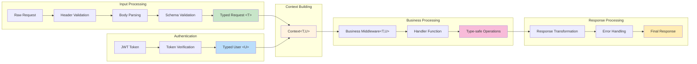
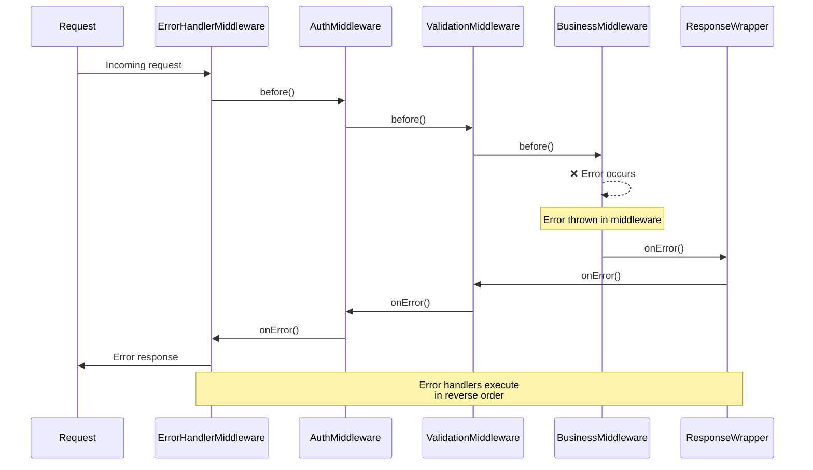
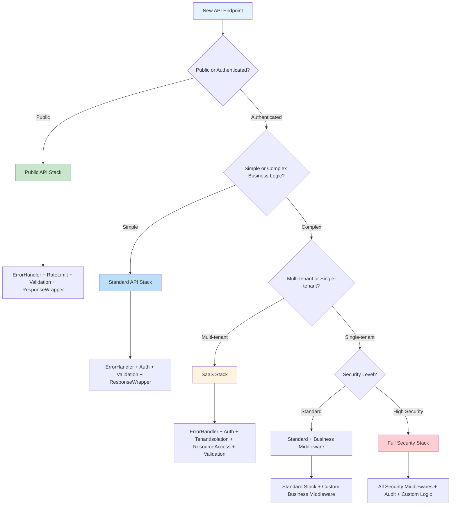

# Noony Framework Components Reference

**Complete detailed explanation of every Noony component, their types, and when to use them**

> This is your comprehensive reference for understanding every single component in the Noony framework with full TypeScript generics.

## Table of Contents

1. [Core Components](#core-components)
2. [Handler System](#handler-system)
3. [Context System](#context-system)
4. [Middleware System](#middleware-system)
5. [Error System](#error-system)
6. [Built-in Middlewares](#built-in-middlewares)
7. [Utility Components](#utility-components)
8. [When to Use Each Component](#when-to-use-each-component)

---

## Core Components

### Component Architecture Overview

```mermaid
graph TB
    subgraph "Core Framework Components"
        A[Handler&lt;T,U&gt;] --> B[BaseMiddleware&lt;T,U&gt;]
        A --> C[Context&lt;T,U&gt;]
        
        subgraph "Context Components"
            C --> D[GenericRequest&lt;T&gt;]
            C --> E[GenericResponse]
            C --> F[businessData: Map]
            C --> G[user?: U]
            C --> H[error?: Error]
        end
        
        subgraph "Request/Response Flow"
            I[Raw HTTP Request] --> D
            E --> J[HTTP Response]
        end
        
        subgraph "Middleware Lifecycle"
            B --> K[before(context)]
            B --> L[after(context)]
            B --> M[onError(error, context)]
        end
    end
    
    subgraph "Type Safety Chain"
        N[Raw JSON] --> O[Zod Schema]
        O --> P[Typed Request &lt;T&gt;]
        Q[JWT Token] --> R[User Verification]
        R --> S[Typed User &lt;U&gt;]
    end
    
    P --> D
    S --> G
    
    style A fill:#e3f2fd
    style C fill:#fff3e0
    style B fill:#e8f5e8
    style P fill:#c8e6c9
    style S fill:#f8bbd9
```

### Component Interaction Flow

```mermaid
sequenceDiagram
    participant Client
    participant Handler as Handler&lt;T,U&gt;
    participant MW as BaseMiddleware&lt;T,U&gt;
    participant Context as Context&lt;T,U&gt;
    participant BL as Business Logic
    
    Client->>Handler: HTTP Request
    Handler->>Context: Create context
    Note over Context: GenericRequest&lt;T&gt;<br/>GenericResponse<br/>businessData: Map
    
    Handler->>MW: before(context)
    MW->>Context: Validate & transform data
    Context->>Context: req.validatedBody: T<br/>user: U
    
    Handler->>BL: Execute business logic
    BL->>Context: Access typed data
    Note over BL: context.req.validatedBody!: T<br/>context.user!: U
    
    BL->>Context: Set response
    Handler->>MW: after(context)
    MW->>Context: Transform response
    Handler->>Client: HTTP Response
    
    Note over Client,Handler: Type safety maintained<br/>throughout entire flow
```

### 1. Handler<T, U>

**The central orchestrator of the Noony framework**

```typescript
export class Handler<T = unknown, U = unknown> {
  private baseMiddlewares: BaseMiddleware<T, U>[] = [];
  private handler!: (context: Context<T, U>) => Promise<void>;
  
  // Methods
  use<NewT = T, NewU = U>(middleware: BaseMiddleware<NewT, NewU>): Handler<NewT, NewU>
  handle(handler: (context: Context<T, U>) => Promise<void>): Handler<T, U>
  execute(req: CustomRequest<T>, res: CustomResponse): Promise<void>
  executeGeneric(req: GenericRequest<T>, res: GenericResponse): Promise<void>
}
```

**Type Parameters:**
- **T**: The validated request body type (what you expect after parsing/validation)
- **U**: The authenticated user type (what goes into context.user)

**When to Use:**
- **Always** - This is the foundation of every Noony application
- Every endpoint needs a Handler instance
- Use generics to maintain type safety throughout the middleware chain

**Examples by Use Case:**

```typescript
// Simple API endpoint
const simpleHandler = new Handler<CreateUserRequest, AuthenticatedUser>()
  .use(new ErrorHandlerMiddleware<CreateUserRequest, AuthenticatedUser>())
  .use(new BodyValidationMiddleware<CreateUserRequest, AuthenticatedUser>(schema))
  .handle(async (context: Context<CreateUserRequest, AuthenticatedUser>) => {
    // Fully typed context
  });

// Public endpoint (no user authentication)
const publicHandler = new Handler<PublicRequest, unknown>()
  .use(new ErrorHandlerMiddleware<PublicRequest, unknown>())
  .handle(async (context: Context<PublicRequest, unknown>) => {
    // context.user is unknown (no authentication)
  });

// Complex business logic
const businessHandler = new Handler<ComplexRequest, BusinessUser>()
  .use(new ErrorHandlerMiddleware<ComplexRequest, BusinessUser>())
  .use(new AuthenticationMiddleware<ComplexRequest, BusinessUser>(verifier))
  .use(new CustomBusinessMiddleware<ComplexRequest, BusinessUser>())
  .handle(async (context: Context<ComplexRequest, BusinessUser>) => {
    // Full business context with typing
  });
```

---

### 2. Context<T, U>

**The execution context that carries data through the middleware chain**

```typescript
export interface Context<T = unknown, V = unknown> {
  readonly req: GenericRequest<T>;
  readonly res: GenericResponse;
  container?: Container;
  error?: Error | null;
  readonly businessData: Map<string, unknown>;
  user?: V;
  readonly startTime: number;
  readonly requestId: string;
  timeoutSignal?: AbortSignal;
  responseData?: unknown;
}
```

**Properties Explained:**

| Property | Type | Purpose | When to Use |
|----------|------|---------|-------------|
| `req` | `GenericRequest<T>` | Framework-agnostic request object | Always - access headers, body, query params |
| `res` | `GenericResponse` | Framework-agnostic response object | Always - send responses, set status codes |
| `container` | `Container` | TypeDI dependency injection container | When using DI middleware |
| `error` | `Error \| null` | Current error state | In error handling middleware |
| `businessData` | `Map<string, unknown>` | Shared data between middlewares | Pass computed data between middlewares |
| `user` | `V` | Authenticated user information | After authentication middleware |
| `startTime` | `number` | Request start timestamp | Performance monitoring, logging |
| `requestId` | `string` | Unique request identifier | Tracing, logging, debugging |
| `timeoutSignal` | `AbortSignal` | Request timeout signal | Long-running operations |
| `responseData` | `unknown` | Response payload data | Advanced response manipulation |

**Usage Patterns:**

```typescript
// Accessing request data (fully typed)
async function businessLogic(context: Context<CreateOrderRequest, CustomerUser>) {
  const { items, customerId } = context.req.validatedBody!; // Type: CreateOrderRequest
  const customer = context.user!; // Type: CustomerUser
  const authHeader = context.req.headers.authorization; // string | string[] | undefined
}

// Sharing data between middlewares
class MiddlewareA<T, U> implements BaseMiddleware<T, U> {
  async before(context: Context<T, U>): Promise<void> {
    const computedData = await expensiveOperation();
    context.businessData.set('computedData', computedData);
  }
}

class MiddlewareB<T, U> implements BaseMiddleware<T, U> {
  async before(context: Context<T, U>): Promise<void> {
    const data = context.businessData.get('computedData');
    // Use the data computed in MiddlewareA
  }
}

// Response handling
async function handler(context: Context<ResponseData, User>) {
  // Set status and send JSON
  context.res.status(201).json({ success: true, data: result });
  
  // Set headers
  context.res.header('X-Custom-Header', 'value');
  
  // Send plain text
  context.res.status(200).send('Success');
}
```

---

### 3. BaseMiddleware<T, U>

**The interface that all middleware must implement**

```typescript
export interface BaseMiddleware<T = unknown, U = unknown> {
  before?: (context: Context<T, U>) => Promise<void>;
  after?: (context: Context<T, U>) => Promise<void>;
  onError?: (error: Error, context: Context<T, U>) => Promise<void>;
}
```

**Lifecycle Methods:**

| Method | Execution Order | Purpose | When to Use |
|--------|----------------|---------|-------------|
| `before` | Sequential (first to last) | Pre-processing, validation, authentication | Input validation, user authentication, data preparation |
| `after` | Reverse order (last to first) | Post-processing, cleanup, logging | Response transformation, cleanup, audit logging |
| `onError` | Reverse order (last to first) | Error handling and recovery | Error transformation, logging, recovery |

**Implementation Patterns:**

```typescript
// Simple validation middleware
class ValidationMiddleware<T, U> implements BaseMiddleware<T, U> {
  constructor(private schema: z.ZodSchema<T>) {}
  
  async before(context: Context<T, U>): Promise<void> {
    try {
      context.req.validatedBody = this.schema.parse(context.req.body);
    } catch (error) {
      throw new ValidationError('Validation failed', error);
    }
  }
}

// Cleanup middleware with after hook
class ResourceCleanupMiddleware<T, U> implements BaseMiddleware<T, U> {
  async before(context: Context<T, U>): Promise<void> {
    const resource = await acquireResource();
    context.businessData.set('resource', resource);
  }
  
  async after(context: Context<T, U>): Promise<void> {
    const resource = context.businessData.get('resource');
    if (resource) {
      await releaseResource(resource);
    }
  }
  
  async onError(error: Error, context: Context<T, U>): Promise<void> {
    // Cleanup on error too
    await this.after(context);
  }
}

// Full lifecycle middleware
class AuditMiddleware<T, U extends { id: string }> implements BaseMiddleware<T, U> {
  async before(context: Context<T, U>): Promise<void> {
    const startTime = Date.now();
    context.businessData.set('auditStartTime', startTime);
    
    await auditLogger.logRequestStart({
      requestId: context.requestId,
      userId: context.user?.id,
      path: context.req.path,
      method: context.req.method
    });
  }
  
  async after(context: Context<T, U>): Promise<void> {
    const startTime = context.businessData.get('auditStartTime') as number;
    const duration = Date.now() - startTime;
    
    await auditLogger.logRequestEnd({
      requestId: context.requestId,
      duration,
      statusCode: context.res.statusCode
    });
  }
  
  async onError(error: Error, context: Context<T, U>): Promise<void> {
    await auditLogger.logError({
      requestId: context.requestId,
      error: error.message,
      stack: error.stack
    });
  }
}
```

---

## Handler System

### GenericRequest<T>

**Framework-agnostic request interface**

```typescript
export interface GenericRequest<T = unknown> {
  method: HttpMethod | string;
  url: string;
  path?: string;
  headers: Record<string, string | string[] | undefined>;
  query: Record<string, string | string[] | undefined>;
  params: Record<string, string>;
  body?: unknown;
  rawBody?: Buffer | string;
  parsedBody?: T;
  validatedBody?: T;
  ip?: string;
  userAgent?: string;
}
```

**Properties Breakdown:**

| Property | Type | Purpose | Example |
|----------|------|---------|---------|
| `method` | `HttpMethod \| string` | HTTP method | `'POST'`, `'GET'` |
| `url` | `string` | Full request URL | `'/api/users?page=1'` |
| `path` | `string` | URL path only | `'/api/users'` |
| `headers` | `Record<string, string \| string[] \| undefined>` | Request headers | `{ 'authorization': 'Bearer token' }` |
| `query` | `Record<string, string \| string[] \| undefined>` | Query parameters | `{ 'page': '1', 'limit': '10' }` |
| `params` | `Record<string, string>` | URL path parameters | `{ 'id': '123' }` from `/users/:id` |
| `body` | `unknown` | Raw request body | JSON object, string, buffer |
| `rawBody` | `Buffer \| string` | Unparsed request body | For custom parsing |
| `parsedBody` | `T` | Parsed but not validated | After JSON.parse() |
| `validatedBody` | `T` | Validated and typed data | After schema validation |
| `ip` | `string` | Client IP address | For rate limiting, geo-location |
| `userAgent` | `string` | Client user agent | For analytics, device detection |

**Usage Examples:**

```typescript
// Accessing different request parts
class RequestProcessingMiddleware<T, U> implements BaseMiddleware<T, U> {
  async before(context: Context<T, U>): Promise<void> {
    // HTTP method and path
    const { method, path } = context.req;
    console.log(`${method} ${path}`);
    
    // Headers (case-insensitive access)
    const authHeader = context.req.headers.authorization ||
                      context.req.headers.Authorization;
    
    // Query parameters (from URL ?key=value)
    const page = parseInt(context.req.query.page as string || '1');
    const limit = parseInt(context.req.query.limit as string || '10');
    
    // Path parameters (from /users/:id)
    const userId = context.req.params.id;
    
    // Request body progression
    const rawData = context.req.body;           // unknown - anything
    const parsedData = context.req.parsedBody;  // T - parsed JSON
    const validData = context.req.validatedBody; // T - validated & typed
  }
}
```

### GenericResponse

**Framework-agnostic response interface**

```typescript
export interface GenericResponse {
  status(code: number): GenericResponse;
  json(data: unknown): GenericResponse | void;
  send(data: unknown): GenericResponse | void;
  header(name: string, value: string): GenericResponse;
  headers(headers: Record<string, string>): GenericResponse;
  end(): void;
  statusCode?: number;
  headersSent?: boolean;
}
```

**Method Details:**

| Method | Purpose | Returns | Example |
|--------|---------|---------|---------|
| `status(code)` | Set HTTP status code | `GenericResponse` (chainable) | `res.status(201)` |
| `json(data)` | Send JSON response | `void` | `res.json({ success: true })` |
| `send(data)` | Send any response | `void` | `res.send('Hello World')` |
| `header(name, value)` | Set single header | `GenericResponse` (chainable) | `res.header('X-Custom', 'value')` |
| `headers(obj)` | Set multiple headers | `GenericResponse` (chainable) | `res.headers({ 'X-A': '1', 'X-B': '2' })` |
| `end()` | End response | `void` | `res.end()` |

**Response Patterns:**

```typescript
// Success responses
context.res.status(200).json({ success: true, data: result });
context.res.status(201).json({ user: createdUser });

// Error responses
context.res.status(400).json({ error: 'Validation failed', details: errors });
context.res.status(401).json({ error: 'Unauthorized' });
context.res.status(404).json({ error: 'Not found' });

// Custom headers
context.res
  .status(200)
  .header('X-Request-ID', context.requestId)
  .header('X-Processing-Time', `${Date.now() - context.startTime}ms`)
  .json({ data: result });

// Multiple headers at once
context.res
  .status(200)
  .headers({
    'X-Request-ID': context.requestId,
    'X-API-Version': '1.0',
    'Cache-Control': 'no-cache'
  })
  .json({ data: result });

// Plain text responses
context.res.status(200).send('Operation completed successfully');

// Empty responses
context.res.status(204).end();

// File downloads (with proper headers)
context.res
  .header('Content-Type', 'application/pdf')
  .header('Content-Disposition', 'attachment; filename="report.pdf"')
  .send(pdfBuffer);
```

---

## Context System

### Business Data

**Shared state between middlewares using Map<string, unknown>**

```typescript
// The businessData is a Map for sharing computed values
interface Context<T, U> {
  readonly businessData: Map<string, unknown>;
}
```

**Usage Patterns:**

```typescript
// Storing computed data
class DataPreparationMiddleware<T, U> implements BaseMiddleware<T, U> {
  async before(context: Context<T, U>): Promise<void> {
    // Expensive computation
    const processedData = await expensiveDataProcessing(context.req.validatedBody);
    const userPermissions = await loadUserPermissions(context.user);
    const cacheKey = generateCacheKey(context.req);
    
    // Store for use by other middlewares
    context.businessData.set('processedData', processedData);
    context.businessData.set('userPermissions', userPermissions);
    context.businessData.set('cacheKey', cacheKey);
  }
}

// Using stored data in business logic
const handler = new Handler<OrderRequest, BusinessUser>()
  .use(new DataPreparationMiddleware<OrderRequest, BusinessUser>())
  .handle(async (context: Context<OrderRequest, BusinessUser>) => {
    // Retrieve pre-computed data
    const processedData = context.businessData.get('processedData') as ProcessedOrderData;
    const permissions = context.businessData.get('userPermissions') as string[];
    const cacheKey = context.businessData.get('cacheKey') as string;
    
    // Use the data without recomputing
    if (!permissions.includes('order:create')) {
      throw new AuthenticationError('Insufficient permissions');
    }
  });

// Type-safe businessData helpers
class TypedBusinessData {
  static set<T>(context: Context<any, any>, key: string, value: T): void {
    context.businessData.set(key, value);
  }
  
  static get<T>(context: Context<any, any>, key: string): T | undefined {
    return context.businessData.get(key) as T;
  }
  
  static require<T>(context: Context<any, any>, key: string): T {
    const value = context.businessData.get(key);
    if (value === undefined) {
      throw new Error(`Required business data '${key}' not found`);
    }
    return value as T;
  }
}

// Usage with type safety
TypedBusinessData.set<UserPermissions>(context, 'permissions', permissions);
const permissions = TypedBusinessData.require<UserPermissions>(context, 'permissions');
```

### Container Integration

**TypeDI container for dependency injection**

```typescript
// Container is automatically provided by Handler
interface Context<T, U> {
  container?: Container;
}
```

**Usage with Services:**

```typescript
// Define services
@Service()
class UserService {
  async findById(id: string): Promise<User | null> {
    return userRepository.findById(id);
  }
}

@Service()
class EmailService {
  async sendWelcomeEmail(user: User): Promise<void> {
    await emailProvider.send(user.email, 'welcome', { name: user.name });
  }
}

// Use services in middleware
class ServiceMiddleware<T, U> implements BaseMiddleware<T, U> {
  async before(context: Context<T, U>): Promise<void> {
    // Services are automatically resolved from container
    const userService = context.container!.get(UserService);
    const emailService = context.container!.get(EmailService);
    
    // Store services for use in handler
    context.businessData.set('userService', userService);
    context.businessData.set('emailService', emailService);
  }
}

// Or use DependencyInjectionMiddleware for cleaner setup
const handler = new Handler<CreateUserRequest, AdminUser>()
  .use(new DependencyInjectionMiddleware<CreateUserRequest, AdminUser>([
    { id: 'userService', value: new UserService() },
    { id: 'emailService', value: new EmailService() }
  ]))
  .handle(async (context: Context<CreateUserRequest, AdminUser>) => {
    const userService = Container.get('userService') as UserService;
    const emailService = Container.get('emailService') as EmailService;
  });
```

---

## Error System

### Built-in Error Classes

**Hierarchical error system with proper HTTP status codes**

```typescript
// Base error class
export class HttpError extends Error {
  status: number;
  code?: string;
  details?: unknown;
  
  constructor(status: number, message: string, code?: string, details?: unknown)
}

// Specific error types
export class ValidationError extends HttpError;      // 400
export class AuthenticationError extends HttpError;  // 401  
export class SecurityError extends HttpError;        // 403
export class TimeoutError extends HttpError;         // 408
export class TooLargeError extends HttpError;        // 413
export class BusinessError extends HttpError;        // Custom status
```

**Error Usage Patterns:**

```typescript
// Validation errors (400)
if (!data.email || !isValidEmail(data.email)) {
  throw new ValidationError('Invalid email address', { 
    field: 'email', 
    provided: data.email 
  });
}

// Authentication errors (401)
if (!token || !isValidToken(token)) {
  throw new AuthenticationError('Invalid or expired token');
}

// Security errors (403)  
if (!user.permissions.includes('admin:users:delete')) {
  throw new SecurityError('Insufficient permissions for this operation');
}

// Business logic errors (custom status)
if (order.status === 'shipped') {
  throw new BusinessError('Cannot cancel shipped order', 409);
}

if (product.stock < requestedQuantity) {
  throw new BusinessError('Insufficient stock', 422, {
    available: product.stock,
    requested: requestedQuantity
  });
}

// Timeout errors (408)
const result = await Promise.race([
  longRunningOperation(),
  new Promise((_, reject) => 
    setTimeout(() => reject(new TimeoutError('Operation timed out')), 30000)
  )
]);

// File size errors (413)
if (fileSize > MAX_FILE_SIZE) {
  throw new TooLargeError('File too large', {
    maxSize: MAX_FILE_SIZE,
    actualSize: fileSize
  });
}
```

### Error Handling in Middleware

```typescript
// Error handling middleware (always first)
class TypedErrorHandlerMiddleware<T, U> implements BaseMiddleware<T, U> {
  async onError(error: Error, context: Context<T, U>): Promise<void> {
    // Handle different error types
    if (error instanceof ValidationError) {
      context.res.status(error.status).json({
        success: false,
        error: {
          type: 'validation_error',
          message: error.message,
          details: error.details,
          code: error.code
        }
      });
    } else if (error instanceof AuthenticationError) {
      context.res.status(error.status).json({
        success: false,
        error: {
          type: 'authentication_error',
          message: error.message
        }
      });
    } else if (error instanceof BusinessError) {
      context.res.status(error.status).json({
        success: false,
        error: {
          type: 'business_error',
          message: error.message,
          code: error.code,
          details: error.details
        }
      });
    } else {
      // Unexpected errors - log and return generic message
      console.error(`Unexpected error in ${context.requestId}:`, {
        error: error.message,
        stack: error.stack,
        user: context.user,
        path: context.req.path
      });
      
      context.res.status(500).json({
        success: false,
        error: {
          type: 'internal_error',
          message: 'An unexpected error occurred',
          requestId: context.requestId
        }
      });
    }
  }
}
```

---

## Built-in Middlewares

### Middleware Ecosystem Overview

```mermaid
graph TB
    subgraph "Core Middleware Stack"
        A[ErrorHandlerMiddleware] --> B[SecurityHeadersMiddleware]
        B --> C[RateLimitingMiddleware]
        C --> D[AuthenticationMiddleware]
        D --> E[HeaderVariablesMiddleware]
        E --> F[BodyParserMiddleware]
        F --> G[BodyValidationMiddleware]
        G --> H[QueryParametersMiddleware]
        H --> I[DependencyInjectionMiddleware]
        I --> J[Custom Business Middleware]
        J --> K[SecurityAuditMiddleware]
        K --> L[ResponseWrapperMiddleware]
    end
    
    subgraph "Middleware Categories"
        M[Security & Auth]
        N[Data Processing]
        O[Business Logic]
        P[Response Handling]
        
        A --> M
        B --> M
        C --> M
        D --> M
        K --> M
        
        F --> N
        G --> N
        H --> N
        I --> N
        
        J --> O
        
        L --> P
    end
    
    subgraph "Execution Order"
        Q[before(): Sequential 1→12]
        R[after(): Reverse 12→1]
        S[onError(): Reverse 12→1]
    end
    
    style A fill:#ffebee
    style D fill:#e3f2fd
    style G fill:#e8f5e8
    style L fill:#fff3e0
    style M fill:#f3e5f5
```

### Middleware Type Safety Flow



### Error Handling Middleware Chain



### 1. ErrorHandlerMiddleware<T, U>

**Centralized error handling - ALWAYS use first**

```typescript
class ErrorHandlerMiddleware<T, U> implements BaseMiddleware<T, U> {
  async onError(error: Error, context: Context<T, U>): Promise<void>
}
```

**When to Use:** 
- **Always** - First middleware in every chain
- Provides consistent error response format
- Handles all error types properly
- Logs unexpected errors

```typescript
// Usage - ALWAYS first
const handler = new Handler<RequestType, UserType>()
  .use(new ErrorHandlerMiddleware<RequestType, UserType>()) // ← FIRST
  .use(/* other middlewares */)
```

### 2. AuthenticationMiddleware<T, U>

**JWT token verification and user context setup**

```typescript
interface TokenVerifier<U> {
  verifyToken(token: string): Promise<U>;
}

class AuthenticationMiddleware<T, U> implements BaseMiddleware<T, U> {
  constructor(private tokenVerifier: TokenVerifier<U>)
}
```

**When to Use:**
- When endpoint requires user authentication
- Sets `context.user` with authenticated user data
- Use early in middleware chain (after error handling)

```typescript
// Token verifier implementation
const jwtVerifier: TokenVerifier<AuthenticatedUser> = {
  async verifyToken(token: string): Promise<AuthenticatedUser> {
    try {
      const decoded = jwt.verify(token, JWT_SECRET) as any;
      return {
        id: decoded.sub,
        email: decoded.email,
        role: decoded.role,
        permissions: decoded.permissions || []
      };
    } catch (error) {
      throw new AuthenticationError('Invalid token');
    }
  }
};

// Usage
const authenticatedHandler = new Handler<CreateUserRequest, AuthenticatedUser>()
  .use(new ErrorHandlerMiddleware<CreateUserRequest, AuthenticatedUser>())
  .use(new AuthenticationMiddleware<CreateUserRequest, AuthenticatedUser>(jwtVerifier))
  .handle(async (context: Context<CreateUserRequest, AuthenticatedUser>) => {
    const user = context.user!; // Type: AuthenticatedUser (guaranteed after auth)
  });
```

### 3. BodyValidationMiddleware<T, U>

**Zod schema validation with type inference**

```typescript
class BodyValidationMiddleware<T, U> implements BaseMiddleware<T, U> {
  constructor(private schema: z.ZodSchema<T>)
}
```

**When to Use:**
- When endpoint accepts request body
- Validates and types the request data
- Sets `context.req.validatedBody` with type `T`

```typescript
// Schema definition
const createUserSchema = z.object({
  name: z.string().min(2, 'Name must be at least 2 characters'),
  email: z.string().email('Invalid email format'),
  age: z.number().min(18, 'Must be at least 18 years old').max(120),
  role: z.enum(['user', 'admin']).default('user')
});

type CreateUserRequest = z.infer<typeof createUserSchema>;

// Usage
const handler = new Handler<CreateUserRequest, AuthenticatedUser>()
  .use(new ErrorHandlerMiddleware<CreateUserRequest, AuthenticatedUser>())
  .use(new AuthenticationMiddleware<CreateUserRequest, AuthenticatedUser>(verifier))
  .use(new BodyValidationMiddleware<CreateUserRequest, AuthenticatedUser>(createUserSchema))
  .handle(async (context: Context<CreateUserRequest, AuthenticatedUser>) => {
    const data = context.req.validatedBody!; // Type: CreateUserRequest (guaranteed after validation)
    // data.name, data.email, data.age are all properly typed
  });

// Complex validation schemas
const orderSchema = z.object({
  customerId: z.string().uuid(),
  items: z.array(z.object({
    productId: z.string().uuid(),
    quantity: z.number().min(1).max(10),
    price: z.number().positive()
  })),
  shippingAddress: z.object({
    street: z.string(),
    city: z.string(),
    zipCode: z.string().regex(/^\d{5}(-\d{4})?$/),
    country: z.string().length(2)
  }),
  couponCode: z.string().optional()
}).refine(data => data.items.length > 0, {
  message: 'At least one item is required'
});
```

### 4. ResponseWrapperMiddleware<T, U>

**Standardizes response format - ALWAYS use last**

```typescript
class ResponseWrapperMiddleware<T, U> implements BaseMiddleware<T, U> {
  async after(context: Context<T, U>): Promise<void>
}
```

**When to Use:**
- **Always** - Last middleware in chain
- Wraps responses in consistent format: `{ success: boolean, payload: any }`
- Handles both success and error responses

```typescript
// Usage - ALWAYS last
const handler = new Handler<RequestType, UserType>()
  .use(new ErrorHandlerMiddleware<RequestType, UserType>())
  .use(/* other middlewares */)
  .use(new ResponseWrapperMiddleware<RequestType, UserType>()) // ← LAST
  .handle(async (context: Context<RequestType, UserType>) => {
    // Just return your data - wrapper handles the format
    context.res.json({ user: createdUser });
    // Becomes: { success: true, payload: { user: createdUser } }
  });

// Error responses are also wrapped
// { success: false, error: { type: 'validation_error', message: '...' } }
```

### 5. HeaderVariablesMiddleware<T, U>

**Validates required headers**

```typescript
class HeaderVariablesMiddleware<T, U> implements BaseMiddleware<T, U> {
  constructor(private requiredHeaders: string[])
}
```

**When to Use:**
- When endpoint requires specific headers
- API versioning, custom authentication, client identification

```typescript
// Usage
const handler = new Handler<RequestType, UserType>()
  .use(new ErrorHandlerMiddleware<RequestType, UserType>())
  .use(new HeaderVariablesMiddleware<RequestType, UserType>([
    'authorization',
    'x-api-version', 
    'x-client-id'
  ]))
  .handle(async (context: Context<RequestType, UserType>) => {
    // Headers are guaranteed to be present
    const apiVersion = context.req.headers['x-api-version'];
    const clientId = context.req.headers['x-client-id'];
  });
```

### 6. QueryParametersMiddleware<T, U>

**Processes and validates query parameters**

```typescript
class QueryParametersMiddleware<T, U> implements BaseMiddleware<T, U> {
  async before(context: Context<T, U>): Promise<void>
}
```

**When to Use:**
- GET endpoints with query parameters
- Pagination, filtering, sorting
- Often combined with Zod validation

```typescript
// Custom query validation middleware
class TypedQueryMiddleware<TQuery, T, U> implements BaseMiddleware<T, U> {
  constructor(private querySchema: z.ZodSchema<TQuery>) {}
  
  async before(context: Context<T, U>): Promise<void> {
    try {
      const validatedQuery = this.querySchema.parse(context.req.query);
      context.businessData.set('validatedQuery', validatedQuery);
    } catch (error) {
      throw new ValidationError('Invalid query parameters', error);
    }
  }
}

// Query schema
const listUsersQuery = z.object({
  page: z.coerce.number().min(1).default(1),
  limit: z.coerce.number().min(1).max(100).default(10),
  search: z.string().optional(),
  role: z.enum(['user', 'admin']).optional(),
  sortBy: z.enum(['name', 'email', 'createdAt']).default('createdAt'),
  sortOrder: z.enum(['asc', 'desc']).default('desc')
});

type ListUsersQuery = z.infer<typeof listUsersQuery>;

// Usage
const listUsersHandler = new Handler<unknown, AuthenticatedUser>()
  .use(new ErrorHandlerMiddleware<unknown, AuthenticatedUser>())
  .use(new AuthenticationMiddleware<unknown, AuthenticatedUser>(verifier))
  .use(new TypedQueryMiddleware<ListUsersQuery, unknown, AuthenticatedUser>(listUsersQuery))
  .handle(async (context: Context<unknown, AuthenticatedUser>) => {
    const query = context.businessData.get('validatedQuery') as ListUsersQuery;
    // query.page, query.limit, etc. are all properly typed
  });
```

### 7. DependencyInjectionMiddleware<T, U>

**TypeDI container setup for services**

```typescript
interface Dependency {
  id: string;
  value: any;
}

class DependencyInjectionMiddleware<T, U> implements BaseMiddleware<T, U> {
  constructor(private dependencies: Dependency[])
}
```

**When to Use:**
- When using services (database, email, external APIs)
- Clean separation of concerns
- Testability with mock services

```typescript
// Service definitions
@Service()
class UserService {
  async create(userData: CreateUserRequest): Promise<User> {
    return userRepository.create(userData);
  }
}

@Service()
class EmailService {
  async sendWelcomeEmail(user: User): Promise<void> {
    await emailProvider.send(user.email, 'welcome', { name: user.name });
  }
}

// Usage
const handler = new Handler<CreateUserRequest, AuthenticatedUser>()
  .use(new ErrorHandlerMiddleware<CreateUserRequest, AuthenticatedUser>())
  .use(new AuthenticationMiddleware<CreateUserRequest, AuthenticatedUser>(verifier))
  .use(new DependencyInjectionMiddleware<CreateUserRequest, AuthenticatedUser>([
    { id: 'userService', value: new UserService() },
    { id: 'emailService', value: new EmailService() },
    { id: 'config', value: appConfig }
  ]))
  .use(new BodyValidationMiddleware<CreateUserRequest, AuthenticatedUser>(schema))
  .handle(async (context: Context<CreateUserRequest, AuthenticatedUser>) => {
    // Services available via Container
    const userService = Container.get('userService') as UserService;
    const emailService = Container.get('emailService') as EmailService;
    const config = Container.get('config') as AppConfig;
    
    const user = await userService.create(context.req.validatedBody!);
    await emailService.sendWelcomeEmail(user);
  });
```

### 8. RateLimitingMiddleware<T, U>

**Request rate limiting protection**

```typescript
interface RateLimitConfig {
  windowMs: number;    // Time window in milliseconds
  max: number;         // Max requests per window
  keyGenerator?: (context: Context<any, any>) => string;
  skipSuccessfulRequests?: boolean;
  skipFailedRequests?: boolean;
}

class RateLimitingMiddleware<T, U> implements BaseMiddleware<T, U> {
  constructor(private config: RateLimitConfig)
}
```

**When to Use:**
- Public APIs exposed to external clients
- Prevent abuse and DDoS attacks
- Different limits per user tier

```typescript
// Basic rate limiting
const basicRateLimit = new RateLimitingMiddleware({
  windowMs: 15 * 60 * 1000, // 15 minutes
  max: 100, // 100 requests per 15 minutes
});

// User-specific rate limiting
const userRateLimit = new RateLimitingMiddleware<any, AuthenticatedUser>({
  windowMs: 60 * 1000, // 1 minute
  max: 10, // 10 requests per minute per user
  keyGenerator: (context) => context.user?.id || context.req.ip || 'anonymous'
});

// Tier-based rate limiting
const tierBasedRateLimit = new RateLimitingMiddleware<any, AuthenticatedUser>({
  windowMs: 60 * 1000,
  max: 60,
  keyGenerator: (context) => {
    const user = context.user!;
    const limit = user.tier === 'premium' ? 1000 : 
                 user.tier === 'pro' ? 500 : 100;
    return `${user.id}:${limit}`;
  }
});

// Usage
const publicApiHandler = new Handler<PublicRequest, unknown>()
  .use(new ErrorHandlerMiddleware<PublicRequest, unknown>())
  .use(basicRateLimit) // Protect against abuse
  .use(new BodyValidationMiddleware<PublicRequest, unknown>(schema))
  .handle(async (context: Context<PublicRequest, unknown>) => {
    // Rate-limited endpoint logic
  });
```

### 9. SecurityHeadersMiddleware<T, U>

**Adds security headers to responses**

```typescript
interface SecurityHeadersConfig {
  contentSecurityPolicy?: string;
  xFrameOptions?: string;
  xContentTypeOptions?: string;
  referrerPolicy?: string;
  xXssProtection?: string;
}

class SecurityHeadersMiddleware<T, U> implements BaseMiddleware<T, U>
```

**When to Use:**
- Web applications serving HTML
- APIs consumed by browsers
- Compliance requirements

```typescript
// Security headers configuration
const securityConfig: SecurityHeadersConfig = {
  contentSecurityPolicy: "default-src 'self'; script-src 'self' 'unsafe-inline'",
  xFrameOptions: 'DENY',
  xContentTypeOptions: 'nosniff',
  referrerPolicy: 'strict-origin-when-cross-origin',
  xXssProtection: '1; mode=block'
};

// Usage
const webApiHandler = new Handler<RequestType, UserType>()
  .use(new ErrorHandlerMiddleware<RequestType, UserType>())
  .use(new SecurityHeadersMiddleware<RequestType, UserType>(securityConfig))
  .handle(async (context: Context<RequestType, UserType>) => {
    // Secure headers automatically added to response
  });
```

### 10. SecurityAuditMiddleware<T, U>

**Security event logging and monitoring**

```typescript
interface SecurityAuditConfig {
  logLevel: 'info' | 'warn' | 'error';
  sensitiveFields: string[];
  auditStorage: AuditStorage;
}

class SecurityAuditMiddleware<T, U> implements BaseMiddleware<T, U>
```

**When to Use:**
- Financial applications
- Healthcare systems (HIPAA compliance)
- Any system requiring audit trails

```typescript
// Audit configuration
const auditConfig: SecurityAuditConfig = {
  logLevel: 'info',
  sensitiveFields: ['password', 'ssn', 'creditCard'],
  auditStorage: new DatabaseAuditStorage()
};

// Usage
const secureHandler = new Handler<SensitiveRequest, AuthenticatedUser>()
  .use(new ErrorHandlerMiddleware<SensitiveRequest, AuthenticatedUser>())
  .use(new AuthenticationMiddleware<SensitiveRequest, AuthenticatedUser>(verifier))
  .use(new SecurityAuditMiddleware<SensitiveRequest, AuthenticatedUser>(auditConfig))
  .handle(async (context: Context<SensitiveRequest, AuthenticatedUser>) => {
    // All actions are audited automatically
  });
```

---

## Utility Components

### HttpMethod Enum

```typescript
export enum HttpMethod {
  GET = 'GET',
  POST = 'POST',
  PUT = 'PUT',
  DELETE = 'DELETE',
  PATCH = 'PATCH',
  OPTIONS = 'OPTIONS',
  HEAD = 'HEAD',
}
```

### Framework Adapters

```typescript
// Convert GCP Functions to framework-agnostic
export function adaptGCPRequest<T = unknown>(gcpRequest: Request): GenericRequest<T>
export function adaptGCPResponse(gcpResponse: Response): GenericResponse

// Usage in GCP Functions
export const myFunction = http('myFunction', (req: Request, res: Response) => {
  const genericReq = adaptGCPRequest<MyRequestType>(req);
  const genericRes = adaptGCPResponse(res);
  
  return myHandler.executeGeneric(genericReq, genericRes);
});
```

### Container Pool

```typescript
// Performance optimization - reuse TypeDI containers
export const containerPool = {
  acquire(): Container;
  release(container: Container): void;
}

// Used internally by Handler - no direct usage needed
```

### Request ID Generation

```typescript
export function generateRequestId(): string
// Generates: "req_1703123456789_abc123def"

// Usage in custom middleware
class CustomMiddleware<T, U> implements BaseMiddleware<T, U> {
  async before(context: Context<T, U>): Promise<void> {
    console.log(`Processing request ${context.requestId}`);
  }
}
```

---

## When to Use Each Component

### Component Selection Decision Tree



### Middleware Stack Templates

```mermaid
graph TB
    subgraph "Template Stacks"
        subgraph "Public API"
            PA[ErrorHandlerMiddleware]
            PB[RateLimitingMiddleware]
            PC[BodyValidationMiddleware]
            PD[ResponseWrapperMiddleware]
            PA --> PB --> PC --> PD
        end
        
        subgraph "Authenticated API"
            AA[ErrorHandlerMiddleware]
            AB[AuthenticationMiddleware]
            AC[BodyValidationMiddleware]
            AD[ResponseWrapperMiddleware]
            AA --> AB --> AC --> AD
        end
        
        subgraph "Multi-tenant SaaS"
            SA[ErrorHandlerMiddleware]
            SB[AuthenticationMiddleware]
            SC[TenantIsolationMiddleware]
            SD[ResourceAccessMiddleware]
            SE[BodyValidationMiddleware]
            SF[ResponseWrapperMiddleware]
            SA --> SB --> SC --> SD --> SE --> SF
        end
        
        subgraph "High Security"
            HA[ErrorHandlerMiddleware]
            HB[SecurityHeadersMiddleware]
            HC[RateLimitingMiddleware]
            HD[SecurityAuditMiddleware]
            HE[AuthenticationMiddleware]
            HF[BodyValidationMiddleware]
            HG[ResponseWrapperMiddleware]
            HA --> HB --> HC --> HD --> HE --> HF --> HG
        end
    end
    
    style PA fill:#c8e6c9
    style AA fill:#bbdefb
    style SA fill:#fff3e0
    style HA fill:#ffcdd2
```



### Decision Matrix

| Use Case | Components Needed | Example |
|----------|------------------|---------|
| **Simple CRUD API** | Handler, ErrorHandler, Auth, Validation, ResponseWrapper | User management |
| **Public API** | Handler, ErrorHandler, RateLimit, Validation, ResponseWrapper | Public data API |
| **File Upload** | Handler, ErrorHandler, Auth, custom upload middleware | Image upload |
| **Multi-tenant SaaS** | Handler, ErrorHandler, Auth, custom tenant isolation | SaaS platform |
| **Payment Processing** | Handler, ErrorHandler, Auth, Security, custom payment middleware | E-commerce checkout |
| **Real-time API** | Handler, ErrorHandler, Auth, custom WebSocket middleware | Chat application |
| **Webhook Handler** | Handler, ErrorHandler, Validation, custom webhook verification | GitHub webhooks |
| **Admin Dashboard** | Handler, ErrorHandler, Auth, Security, Audit | Admin operations |

### Middleware Order Best Practices

```typescript
// Standard order for most APIs
const standardHandler = new Handler<RequestType, UserType>()
  .use(new ErrorHandlerMiddleware<RequestType, UserType>())        // 1. Error handling (always first)
  .use(new SecurityHeadersMiddleware<RequestType, UserType>())     // 2. Security headers
  .use(new RateLimitingMiddleware<RequestType, UserType>())        // 3. Rate limiting
  .use(new HeaderVariablesMiddleware<RequestType, UserType>())     // 4. Required headers
  .use(new AuthenticationMiddleware<RequestType, UserType>())      // 5. Authentication
  .use(new BodyParserMiddleware<RequestType, UserType>())          // 6. Body parsing
  .use(new BodyValidationMiddleware<RequestType, UserType>())      // 7. Body validation
  .use(new QueryParametersMiddleware<RequestType, UserType>())     // 8. Query processing
  .use(new DependencyInjectionMiddleware<RequestType, UserType>()) // 9. DI setup
  .use(new SecurityAuditMiddleware<RequestType, UserType>())       // 10. Audit logging
  .use(new ResponseWrapperMiddleware<RequestType, UserType>())     // 11. Response wrapper (always last)
  .handle(async (context: Context<RequestType, UserType>) => {
    // Your business logic here
  });

// High-security order for sensitive operations
const secureHandler = new Handler<SensitiveRequest, AdminUser>()
  .use(new ErrorHandlerMiddleware<SensitiveRequest, AdminUser>())
  .use(new SecurityHeadersMiddleware<SensitiveRequest, AdminUser>())
  .use(new RateLimitingMiddleware<SensitiveRequest, AdminUser>())
  .use(new SecurityAuditMiddleware<SensitiveRequest, AdminUser>())  // Early audit
  .use(new AuthenticationMiddleware<SensitiveRequest, AdminUser>())
  .use(new CustomPermissionMiddleware<SensitiveRequest, AdminUser>()) // Custom permissions
  .use(new BodyValidationMiddleware<SensitiveRequest, AdminUser>())
  .use(new ResponseWrapperMiddleware<SensitiveRequest, AdminUser>())
  .handle(async (context: Context<SensitiveRequest, AdminUser>) => {
    // Sensitive operation logic
  });
```

### Custom Middleware Guidelines

```typescript
// Template for custom middleware
class CustomMiddleware<T, U> implements BaseMiddleware<T, U> {
  constructor(private config: CustomConfig) {}

  async before(context: Context<T, U>): Promise<void> {
    // Pre-processing logic
    // Validate inputs
    // Set up resources
    // Store data in context.businessData
  }

  async after(context: Context<T, U>): Promise<void> {
    // Post-processing logic
    // Clean up resources
    // Transform response
    // Logging
  }

  async onError(error: Error, context: Context<T, U>): Promise<void> {
    // Error handling logic
    // Clean up resources
    // Log errors
    // Transform error response
  }
}

// Usage pattern
const customHandler = new Handler<MyRequest, MyUser>()
  .use(new ErrorHandlerMiddleware<MyRequest, MyUser>())
  .use(new CustomMiddleware<MyRequest, MyUser>(config))
  .use(new ResponseWrapperMiddleware<MyRequest, MyUser>())
  .handle(async (context: Context<MyRequest, MyUser>) => {
    // Custom middleware has prepared everything needed
  });
```

---

## Summary

**Key Component Usage Rules:**

1. **Always use generics**: `Handler<RequestType, UserType>` for complete type safety
2. **Error handling first**: `ErrorHandlerMiddleware` must be first middleware
3. **Response wrapper last**: `ResponseWrapperMiddleware` must be last middleware  
4. **Authentication early**: After error handling and rate limiting
5. **Validation after parsing**: Body validation after body parsing
6. **Custom middleware**: Use `businessData` Map to share computed values
7. **Services via DI**: Use `DependencyInjectionMiddleware` for clean service injection
8. **Security layers**: Rate limiting, security headers, audit logging for production
9. **Type safety**: Every component supports full TypeScript generics
10. **Performance**: Built-in optimizations with container pooling and middleware caching

This reference provides complete details on every Noony component, their exact types, and when to use each one. Use this as your definitive guide for building production-ready serverless applications with full type safety.