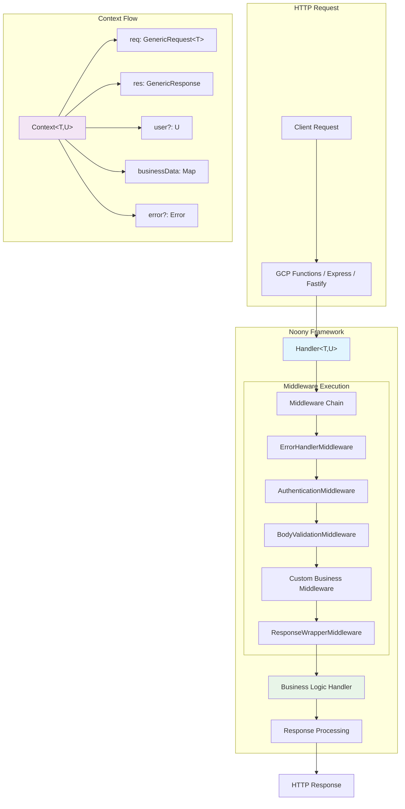
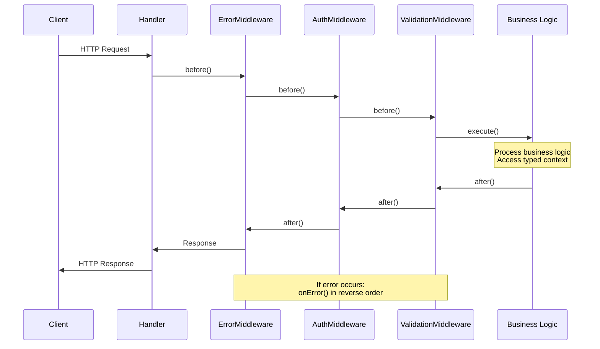
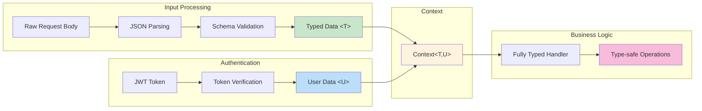
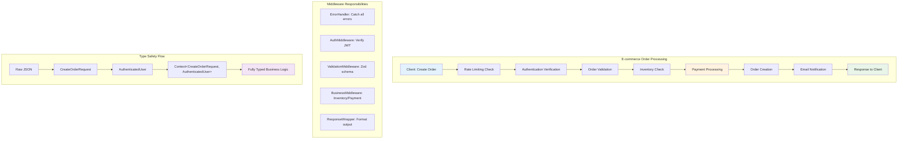
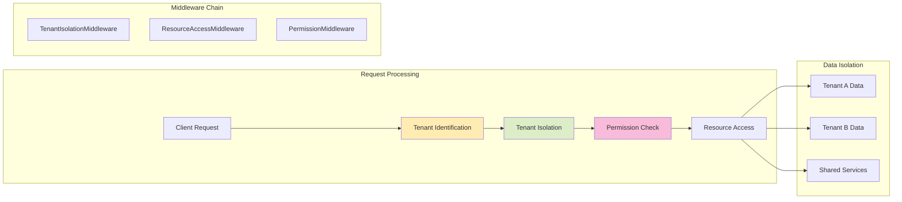

# Noony Serverless Framework - Complete Usage Guide

**Noony** is a flexible, type-safe serverless middleware framework for Google Cloud Functions that provides a Middy-like experience with full TypeScript support. The framework is designed to be framework-agnostic and supports both legacy GCP Functions and modern HTTP frameworks like Fastify and Express.

## 🎯 Quick Start

```typescript
import { Handler, ErrorHandlerMiddleware, BodyValidationMiddleware } from '@noony/core';
import { z } from 'zod';

const userSchema = z.object({
  name: z.string(),
  email: z.string().email(),
});

type CreateUserRequest = z.infer<typeof userSchema>;

const handler = new Handler<CreateUserRequest>()
  .use(new ErrorHandlerMiddleware())
  .use(new BodyValidationMiddleware(userSchema))
  .handle(async (context) => {
    const { name, email } = context.req.validatedBody!;
    // Fully typed, no casting needed!
    return { success: true, user: { name, email } };
  });

// For GCP Functions
export const createUser = http('createUser', (req, res) => 
  handler.execute(req, res)
);

// For other frameworks (Express, Fastify, etc.)
await handler.executeGeneric(genericReq, genericRes);
```

## 🏗️ Architecture Overview

### Framework Architecture Diagram



### Middleware Lifecycle Flow



### Type Safety Flow



### Core Components

#### Context with Generic Types

The `Context` interface is the central data structure that flows through your middleware chain:

```typescript
interface Context<T = unknown, U = unknown> {
  req: CustomRequest<T>;      // Enhanced request with typed data
  res: CustomResponse;        // Response object
  container?: Container;      // TypeDI dependency injection
  error?: Error | null;       // Error state
  businessData: Map<string, unknown>; // Inter-middleware data
  user?: U;                   // Authenticated user data
  requestId: string;          // Unique request identifier
  startTime: number;          // Request start timestamp
  timeoutSignal: AbortSignal; // Request timeout handling
  responseData?: unknown;     // Response data storage
}
```

**Enhanced Request Properties:**
- `req.body`: Raw request body
- `req.parsedBody`: JSON parsed body
- `req.validatedBody`: Schema validated body (typed as T)
- `req.headers`: Request headers
- `req.query`: Query parameters
- `req.params`: URL parameters

#### Handler with Full Type Safety

The `Handler` class orchestrates middleware execution with complete type safety:

```typescript
const handler = new Handler<RequestType, UserType>()
  .use(new ErrorHandlerMiddleware())
  .use(new BodyValidationMiddleware(schema))
  .use(new AuthenticationMiddleware(tokenVerifier))
  .handle(async (context) => {
    // TypeScript knows exact types - no casting!
    const userData = context.req.validatedBody!; // Type: RequestType
    const currentUser = context.user!;           // Type: UserType
  });
```

**Generic Parameters:**
- `T`: Type for validated request body
- `U`: Type for authenticated user data
- Types flow through entire middleware chain

#### BaseMiddleware Interface

Type-safe middleware interface with lifecycle hooks:

```typescript
interface BaseMiddleware<T = unknown, U = unknown> {
  before?: (context: Context<T, U>) => Promise<void>;
  after?: (context: Context<T, U>) => Promise<void>;
  onError?: (error: Error, context: Context<T, U>) => Promise<void>;
}
```

## 🧩 Middleware Types

Noony supports multiple middleware patterns for maximum flexibility:

### 1. Class-based Middleware

```typescript
class CustomMiddleware<T, U> implements BaseMiddleware<T, U> {
  async before(context: Context<T, U>): Promise<void> {
    // Pre-processing logic
    console.log('Before handler execution');
  }
  
  async after(context: Context<T, U>): Promise<void> {
    // Post-processing logic
    console.log('After handler execution');
  }
  
  async onError(error: Error, context: Context<T, U>): Promise<void> {
    // Error handling logic
    console.error('Error occurred:', error.message);
  }
}
```

### 2. Functional Middleware

```typescript
const loggingMiddleware = () => ({
  before: async (context: Context) => {
    console.log(`Request started: ${context.requestId}`);
  },
  after: async (context: Context) => {
    const duration = Date.now() - context.startTime;
    console.log(`Request completed in ${duration}ms`);
  },
  onError: async (error: Error, context: Context) => {
    console.error(`Request failed: ${error.message}`);
  }
});

// Simple functional middleware (before hook only)
const simpleMiddleware = () => async (context: Context) => {
  // This function runs in the 'before' phase
  context.businessData.set('processedAt', new Date().toISOString());
};
```

### 3. Inline Middleware

```typescript
const handler = new Handler()
  .use({
    before: async (context) => {
      context.businessData.set('startTime', Date.now());
    },
    after: async (context) => {
      const startTime = context.businessData.get('startTime') as number;
      const duration = Date.now() - startTime;
      context.responseData = { ...context.responseData, duration };
    }
  })
```

## 🔧 Built-in Middleware Ecosystem

### Middleware Architecture Pattern

```mermaid
graph TD
    subgraph "Middleware Chain Execution Order"
        A[ErrorHandlerMiddleware] --> B[SecurityHeadersMiddleware]
        B --> C[RateLimitingMiddleware]
        C --> D[AuthenticationMiddleware]
        D --> E[BodyParserMiddleware]
        E --> F[BodyValidationMiddleware]
        F --> G[Custom Business Middleware]
        G --> H[ResponseWrapperMiddleware]
    end
    
    subgraph "Lifecycle Hooks"
        I[before() - Sequential]
        J[after() - Reverse Order]
        K[onError() - Reverse Order]
    end
    
    subgraph "Data Flow"
        L[Raw Request] --> M[Parsed Data]
        M --> N[Validated Data &lt;T&gt;]
        N --> O[Business Logic]
        O --> P[Response]
    end
    
    style A fill:#ffebee
    style D fill:#e3f2fd
    style F fill:#e8f5e8
    style H fill:#fff3e0
```

### Error Handling Flow

```mermaid
graph TB
    subgraph "Normal Flow"
        A[Request] --> B[Middleware Chain]
        B --> C[Business Logic]
        C --> D[Response]
    end
    
    subgraph "Error Flow"
        E[Error Occurs] --> F[onError() Chain]
        F --> G[Error Transformation]
        G --> H[HTTP Error Response]
    end
    
    subgraph "Error Types"
        I[ValidationError - 400]
        J[AuthenticationError - 401]
        K[SecurityError - 403]
        L[BusinessError - Custom]
        M[TimeoutError - 408]
        N[TooLargeError - 413]
    end
    
    C -.-> E
    B -.-> E
    
    style E fill:#ffebee
    style I fill:#ffcdd2
    style J fill:#f8bbd9
    style K fill:#dcedc8
    style H fill:#fff3e0
```

Noony provides a comprehensive set of production-ready middlewares:

### Core Middlewares

#### 1. ErrorHandlerMiddleware
Centralized error handling with custom error types:

```typescript
class ErrorHandlerMiddleware<T, U> implements BaseMiddleware<T, U> {
  async onError(error: Error, context: Context<T, U>): Promise<void> {
    if (error instanceof ValidationError) {
      context.res.status(400).json({ error: error.message, details: error.details });
    } else if (error instanceof AuthenticationError) {
      context.res.status(401).json({ error: 'Unauthorized' });
    } else {
      context.res.status(500).json({ error: 'Internal Server Error' });
    }
  }
}
```

#### 2. BodyValidationMiddleware
Zod schema validation with TypeScript integration:

```typescript
class BodyValidationMiddleware<T> implements BaseMiddleware<T> {
  constructor(private schema: z.ZodSchema<T>) {}
  
  async before(context: Context<T>): Promise<void> {
    try {
      context.req.validatedBody = await this.schema.parseAsync(
        context.req.parsedBody
      );
    } catch (error) {
      if (error instanceof z.ZodError) {
        throw new ValidationError('Validation failed', error.errors);
      }
      throw error;
    }
  }
}
```

#### 3. AuthenticationMiddleware
JWT token verification:

```typescript
class AuthenticationMiddleware<T, U> implements BaseMiddleware<T, U> {
  constructor(private tokenVerifier: TokenVerifier<U>) {}
  
  async before(context: Context<T, U>): Promise<void> {
    const authHeader = context.req.headers.authorization;
    if (!authHeader?.startsWith('Bearer ')) {
      throw new AuthenticationError('Missing or invalid authorization header');
    }
    
    const token = authHeader.slice(7);
    context.user = await this.tokenVerifier.verify(token);
  }
}
```

#### 4. ResponseWrapperMiddleware
Standardized response format:

```typescript
class ResponseWrapperMiddleware<T, U> implements BaseMiddleware<T, U> {
  async after(context: Context<T, U>): Promise<void> {
    if (!context.error) {
      const response = {
        success: true,
        payload: context.responseData,
        timestamp: new Date().toISOString(),
        requestId: context.requestId
      };
      context.res.json(response);
    }
  }
}
```

### Security Middlewares

#### HeaderVariablesMiddleware
Validates required headers:

```typescript
const handler = new Handler()
  .use(new HeaderVariablesMiddleware([
    'authorization',
    'x-api-version',
    'content-type'
  ]))
```

#### SecurityHeadersMiddleware
Adds security headers:

```typescript
new SecurityHeadersMiddleware({
  contentSecurityPolicy: "default-src 'self'",
  xFrameOptions: 'DENY',
  xContentTypeOptions: 'nosniff'
})
```

#### RateLimitingMiddleware
Request rate limiting:

```typescript
new RateLimitingMiddleware({
  windowMs: 15 * 60 * 1000, // 15 minutes
  maxRequests: 100
})
```

### Utility Middlewares

#### DependencyInjectionMiddleware
TypeDI container setup:

```typescript
new DependencyInjectionMiddleware([
  { id: 'userService', value: new UserService() },
  { id: 'emailService', value: new EmailService() }
])
```

#### QueryParametersMiddleware
Query string processing:

```typescript
// Automatically parses and validates query parameters
new QueryParametersMiddleware()
```

#### HttpAttributesMiddleware
HTTP request attributes processing:

```typescript
// Extracts and processes HTTP-specific attributes
new HttpAttributesMiddleware()
```

## 🚀 Framework Integration Patterns

### Google Cloud Functions (Legacy)

```typescript
import { http } from '@google-cloud/functions-framework';

const handler = new Handler<CreateUserRequest, AuthenticatedUser>()
  .use(new ErrorHandlerMiddleware())
  .use(new BodyValidationMiddleware(userSchema))
  .use(new AuthenticationMiddleware(tokenVerifier))
  .handle(async (context) => {
    const userData = context.req.validatedBody!;
    const user = context.user!;
    // Your business logic
  });

// Export for GCP Functions
export const createUser = http('createUser', (req, res) => {
  return handler.execute(req, res);
});
```

### Framework Agnostic (Express, Fastify, etc.)

```typescript
// Works with any HTTP framework
const executeHandler = async (request: any, reply: any) => {
  const genericReq = {
    headers: request.headers,
    body: request.body,
    query: request.query,
    params: request.params
  };
  
  const genericRes = {
    status: (code: number) => reply.status(code),
    json: (data: any) => reply.send(data),
    send: (data: any) => reply.send(data)
  };
  
  await handler.executeGeneric(genericReq, genericRes);
};
```

### Fastify Integration Example

```typescript
import Fastify from 'fastify';

const fastify = Fastify();

fastify.post('/api/users', async (request, reply) => {
  await executeHandler(createUserHandler, request, reply);
});

fastify.get('/api/users/:id', async (request, reply) => {
  await executeHandler(getUserHandler, request, reply);
});
```

## 💡 Complete Example: User Management API

```typescript
import { z } from 'zod';
import {
  Handler,
  ErrorHandlerMiddleware,
  BodyValidationMiddleware,
  AuthenticationMiddleware,
  HeaderVariablesMiddleware,
  ResponseWrapperMiddleware,
  DependencyInjectionMiddleware
} from '@noony/core';

// Define schemas
const createUserSchema = z.object({
  name: z.string().min(2),
  email: z.string().email(),
  age: z.number().min(18).max(120)
});

// Types
type CreateUserRequest = z.infer<typeof createUserSchema>;
interface AuthenticatedUser {
  userId: string;
  role: 'admin' | 'user';
  permissions: string[];
}

// Token verifier
const tokenVerifier = {
  async verify(token: string): Promise<AuthenticatedUser> {
    // JWT verification logic
    const decoded = jwt.verify(token, process.env.JWT_SECRET!);
    return decoded as AuthenticatedUser;
  }
};

// Handler with full middleware chain
const createUserHandler = new Handler<CreateUserRequest, AuthenticatedUser>()
  .use(new ErrorHandlerMiddleware())                    // Always first
  .use(new HeaderVariablesMiddleware(['authorization'])) // Required headers
  .use(new AuthenticationMiddleware(tokenVerifier))     // JWT verification
  .use(new BodyValidationMiddleware(createUserSchema))  // Schema validation
  .use(new DependencyInjectionMiddleware([             // DI setup
    { id: 'userService', value: new UserService() }
  ]))
  .use(new ResponseWrapperMiddleware())                 // Always last
  .handle(async (context) => {
    // Fully typed context - no casting needed!
    const userData = context.req.validatedBody!; // Type: CreateUserRequest
    const currentUser = context.user!;           // Type: AuthenticatedUser
    
    // Check permissions
    if (!currentUser.permissions.includes('CREATE_USER')) {
      throw new SecurityError('Insufficient permissions');
    }
    
    // Business logic with dependency injection
    const userService = Container.get('userService') as UserService;
    const newUser = await userService.createUser(userData);
    
    // Set response data (ResponseWrapperMiddleware will format it)
    context.responseData = {
      id: newUser.id,
      name: newUser.name,
      email: newUser.email,
      createdBy: currentUser.userId
    };
  });
```

## 🚦 Error Handling System

Noony provides a comprehensive error hierarchy with proper HTTP status codes:

### Built-in Error Classes

```typescript
// Base error class
class HttpError extends Error {
  constructor(
    message: string,
    public readonly status: number,
    public readonly code?: string
  ) {
    super(message);
    this.name = 'HttpError';
  }
}

// Specific error types
class ValidationError extends HttpError {
  constructor(message: string, public readonly details?: any) {
    super(message, 400, 'VALIDATION_ERROR');
  }
}

class AuthenticationError extends HttpError {
  constructor(message: string = 'Authentication failed') {
    super(message, 401, 'AUTHENTICATION_ERROR');
  }
}

class SecurityError extends HttpError {
  constructor(message: string = 'Security violation') {
    super(message, 403, 'SECURITY_ERROR');
  }
}

class TimeoutError extends HttpError {
  constructor(message: string = 'Request timeout') {
    super(message, 408, 'TIMEOUT_ERROR');
  }
}

class TooLargeError extends HttpError {
  constructor(message: string = 'Request entity too large') {
    super(message, 413, 'TOO_LARGE_ERROR');
  }
}

class BusinessError extends HttpError {
  constructor(message: string, status: number = 422, code?: string) {
    super(message, status, code || 'BUSINESS_ERROR');
  }
}
```

### Error Usage Examples

```typescript
// In your handler or middleware
const handler = new Handler<OrderRequest>()
  .handle(async (context) => {
    const order = context.req.validatedBody!;
    
    if (order.total < 0) {
      throw new ValidationError('Order total cannot be negative');
    }
    
    if (!await hasPermission(context.user, 'CREATE_ORDER')) {
      throw new SecurityError('Insufficient permissions to create order');
    }
    
    if (!await hasInventory(order.items)) {
      throw new BusinessError(
        'Insufficient inventory', 
        422, 
        'INVENTORY_SHORTAGE'
      );
    }
  });
```

## 🎯 Best Practices & Patterns

### Production-Ready E-commerce Example Flow



### Multi-Tenant SaaS Architecture



### 1. Middleware Execution Order

The order of middleware matters! Follow this pattern:

```typescript
const handler = new Handler<RequestType, UserType>()
  .use(new ErrorHandlerMiddleware())        // 1. Always first
  .use(new SecurityHeadersMiddleware())     // 2. Security headers
  .use(new RateLimitingMiddleware())        // 3. Rate limiting
  .use(new HeaderVariablesMiddleware([...]))// 4. Required headers
  .use(new AuthenticationMiddleware(verify))// 5. Authentication
  .use(new BodyParserMiddleware())          // 6. Parse request body
  .use(new BodyValidationMiddleware(schema))// 7. Validate input
  .use(new DependencyInjectionMiddleware([...]))// 8. Setup DI
  .use(new HttpAttributesMiddleware())      // 9. Process HTTP attributes
  .use(new QueryParametersMiddleware())     // 10. Process query params
  .use(new ResponseWrapperMiddleware())     // 11. Always last
  .handle(async (context) => {
    // 12. Your business logic here
  });
```

### 2. Type Safety Patterns

```typescript
// Define schemas first
const userSchema = z.object({
  name: z.string(),
  email: z.string().email(),
  age: z.number().min(18)
});

// Infer types from schemas
type UserRequest = z.infer<typeof userSchema>;

// Use generic types throughout
const handler = new Handler<UserRequest, AuthenticatedUser>()
  .use(new BodyValidationMiddleware(userSchema))
  .handle(async (context) => {
    // TypeScript knows the exact types!
    const { name, email, age } = context.req.validatedBody!; // UserRequest
    const { userId, role } = context.user!; // AuthenticatedUser
  });
```

### 3. Business Data Sharing

```typescript
// Use typed keys for business data
const BusinessDataKeys = {
  USER_PROFILE: 'userProfile',
  CALCULATED_TOTAL: 'calculatedTotal',
  PROCESSED_ITEMS: 'processedItems'
} as const;

// In middleware
class UserProfileMiddleware implements BaseMiddleware {
  async before(context: Context): Promise<void> {
    const profile = await this.userService.getProfile(context.user!.id);
    context.businessData.set(BusinessDataKeys.USER_PROFILE, profile);
  }
}

// In handler
const profile = context.businessData.get(BusinessDataKeys.USER_PROFILE);
```

### 4. Request Tracking

```typescript
// Each request gets unique tracking
const handler = new Handler()
  .handle(async (context) => {
    console.log(`Processing request ${context.requestId}`);
    console.log(`Started at: ${new Date(context.startTime).toISOString()}`);
    
    // Use timeout signal for long operations
    const controller = new AbortController();
    context.timeoutSignal.addEventListener('abort', () => {
      controller.abort();
    });
    
    await longRunningOperation({ signal: controller.signal });
  });
```

### 5. Security Configuration

```typescript
// Built-in security configurations
const secureHandler = new Handler()
  .use(new SecurityHeadersMiddleware({
    contentSecurityPolicy: "default-src 'self'; script-src 'self' 'unsafe-inline'",
    xFrameOptions: 'DENY',
    xContentTypeOptions: 'nosniff',
    referrerPolicy: 'strict-origin-when-cross-origin'
  }))
  .use(new RateLimitingMiddleware({
    windowMs: 15 * 60 * 1000, // 15 minutes
    maxRequests: 100,
    message: 'Too many requests'
  }))
  .use(new SecurityAuditMiddleware({
    logSuspiciousActivity: true,
    blockMaliciousRequests: true
  }));
```

## 📊 Development & Testing Commands

Noony includes comprehensive development tools:

```bash
# Development
npm run build        # TypeScript compilation
npm run watch        # Watch mode for development
npm run dev          # Development server

# Testing
npm run test         # Run all tests
npm run test:coverage # Test with coverage report

# Code Quality
npm run lint         # ESLint checking
npm run lint:fix     # Auto-fix linting issues
npm run format       # Prettier formatting
npm run format:check # Check formatting
```

## 🔍 Performance & Monitoring

### Built-in Performance Monitoring

```typescript
import { PerformanceMonitor } from '@noony/core';

const handler = new Handler()
  .handle(async (context) => {
    const monitor = new PerformanceMonitor(context.requestId);
    
    monitor.mark('business-logic-start');
    await performBusinessLogic();
    monitor.mark('business-logic-end');
    
    monitor.measure('business-logic', 'business-logic-start', 'business-logic-end');
    
    // Access performance metrics
    const metrics = monitor.getMetrics();
    console.log(`Business logic took ${metrics['business-logic']}ms`);
  });
```

### Request Lifecycle Logging

```typescript
const handler = new Handler()
  .handle(async (context) => {
    const duration = Date.now() - context.startTime;
    console.log({
      requestId: context.requestId,
      duration,
      timestamp: new Date().toISOString(),
      path: context.req.path,
      method: context.req.method
    });
  });
```

## 🚀 Deployment Patterns

### Environment Configuration

```typescript
interface Config {
  jwtSecret: string;
  databaseUrl: string;
  logLevel: 'debug' | 'info' | 'warn' | 'error';
}

const config: Config = {
  jwtSecret: process.env.JWT_SECRET!,
  databaseUrl: process.env.DATABASE_URL!,
  logLevel: (process.env.LOG_LEVEL as Config['logLevel']) || 'info'
};

// Use in middleware
class ConfigurableMiddleware implements BaseMiddleware {
  constructor(private config: Config) {}
  
  async before(context: Context): Promise<void> {
    // Use configuration
  }
}
```

### Production Optimizations

```typescript
// Production-ready handler with all optimizations
const productionHandler = new Handler<RequestType, UserType>()
  .use(new ErrorHandlerMiddleware({
    includeStack: process.env.NODE_ENV === 'development'
  }))
  .use(new SecurityHeadersMiddleware(securityConfig))
  .use(new RateLimitingMiddleware(rateLimitConfig))
  .use(new CompressionMiddleware())
  .use(new CacheMiddleware({
    ttl: 300, // 5 minutes
    keyGenerator: (req) => `${req.path}-${JSON.stringify(req.query)}`
  }))
  // ... other middlewares
  .handle(async (context) => {
    // Your business logic
  });
```

## 🔗 Additional Resources

- **Type Safety Guide**: See `USE_ME_GENERICS.md` for advanced TypeScript patterns
- **Advanced Examples**: See `USE_ME_GENERICS_2.md` for complex implementation examples
- **Functional Patterns**: See `USE_ME_FUNCTIONAL.md` for functional programming approaches
- **GitHub Repository**: [noony-serverless/noony-core](https://github.com/noony-serverless/noony-core)
- **Documentation**: [https://docs.noony.dev](https://docs.noony.dev)

---

**Happy Coding with Noony! 🚀**

For questions, issues, or contributions, please visit our [GitHub repository](https://github.com/noony-serverless/noony-core).