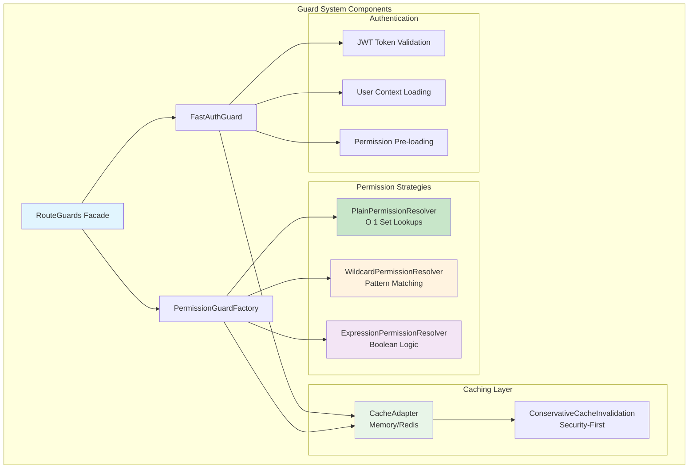
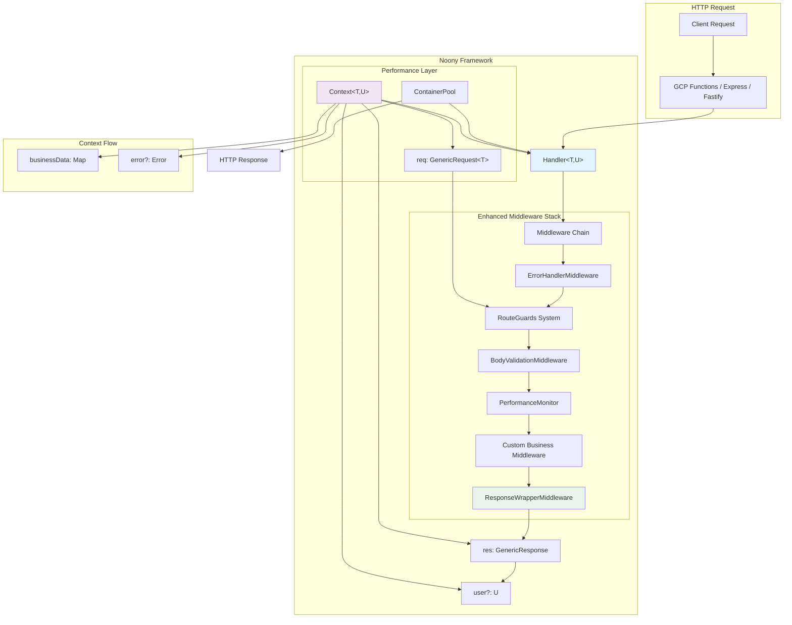
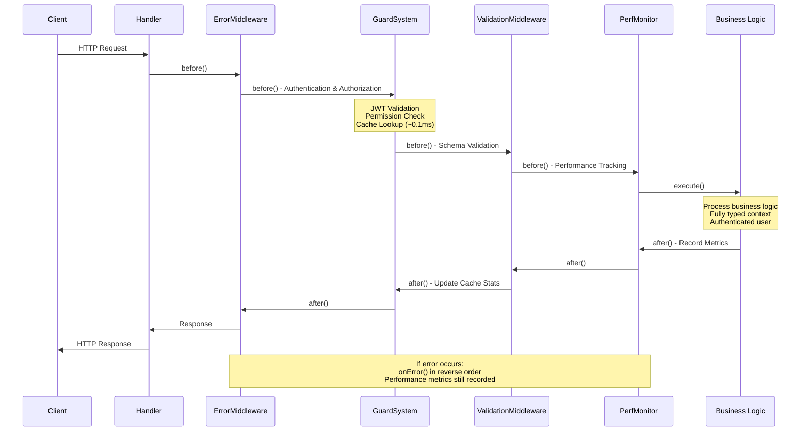
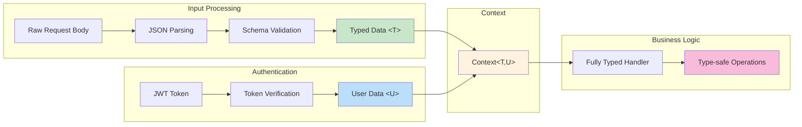
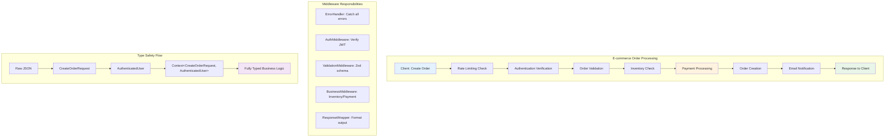
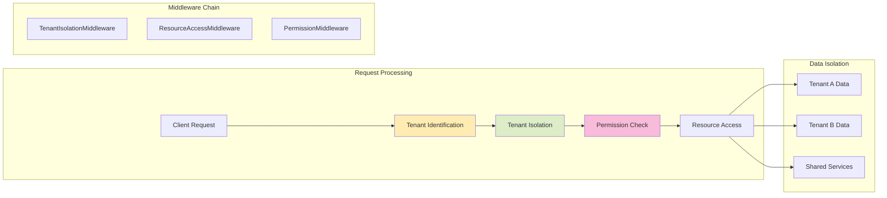

# Noony Serverless Framework - Complete Usage Guide

**Noony** is a flexible, type-safe serverless middleware framework for Google Cloud Functions that provides a Middy-like experience with full TypeScript support. The framework is designed to be framework-agnostic and supports both legacy GCP Functions and modern HTTP frameworks like Fastify and Express.

## 🚀 Key Features (Latest Version)

- **🛡️ Advanced Guard System**: Sub-millisecond cached authentication & authorization with 3 permission strategies
- **⚡ Performance Optimized**: Container pooling, object pooling, and performance monitoring
- **🔐 Enhanced Security**: Multi-layer JWT authentication with audit trails and rate limiting
- **🧪 Comprehensive Testing**: 18+ test files with guard system testing and API validation
- **🔄 Dual-Mode Development**: Fastify for fast development + GCP Functions for production parity
- **📊 Built-in Monitoring**: Performance metrics, health checks, and system statistics
- **🎯 Framework Agnostic**: Express, Fastify, Google Cloud Functions, and more
- **🔒 Type-Safe**: Full TypeScript support with automatic type inference

## 🎯 Quick Start

```typescript
import { Handler, ErrorHandlerMiddleware, BodyValidationMiddleware } from '@noony/core';
import { z } from 'zod';

const userSchema = z.object({
  name: z.string(),
  email: z.string().email(),
});

type CreateUserRequest = z.infer<typeof userSchema>;

const handler = new Handler<CreateUserRequest>()
  .use(new ErrorHandlerMiddleware())
  .use(new BodyValidationMiddleware(userSchema))
  .handle(async (context) => {
    const { name, email } = context.req.validatedBody!;
    // Fully typed, no casting needed!
    return { success: true, user: { name, email } };
  });

// For GCP Functions
export const createUser = http('createUser', (req, res) => 
  handler.execute(req, res)
);

// For other frameworks (Express, Fastify, etc.)
await handler.executeGeneric(genericReq, genericRes);
```

## 🛡️ Noony Guard System - Advanced Authentication & Authorization

The **Noony Guard System** is a high-performance authentication and authorization middleware designed for serverless environments. It provides **sub-millisecond cached permission checks** with three distinct resolution strategies, conservative cache invalidation, and comprehensive monitoring capabilities.

### 🚀 Guard System Features

- **Sub-millisecond Performance**: Cached permission checks in <1ms
- **Three Resolution Strategies**: Plain (O(1)), Wildcard, and Expression-based permissions  
- **Multi-layer Caching**: L1 memory + configurable L2 with intelligent invalidation
- **Conservative Security**: Security-first cache invalidation strategies
- **Framework Agnostic**: Works with Express, Fastify, Google Cloud Functions, and more
- **Production Ready**: Comprehensive monitoring, audit trails, and error handling
- **TypeScript Native**: Full type safety and IntelliSense support

### Guard System Architecture



### Three Permission Resolution Strategies

#### 1. Plain Permissions (Fastest - O(1))
**Performance**: ~0.1ms cached, ~1-2ms uncached  
**Use Case**: Simple permission checks with direct set membership

```typescript
import { RouteGuards } from '@noony/core';

// O(1) Set-based permission checking
const handler = new Handler<RequestType, UserType>()
  .use(RouteGuards.requirePermissions([
    'user:read', 
    'user:update'
  ]))  // OR logic - user needs ANY of these permissions
  .handle(async (context) => {
    // User has either 'user:read' OR 'user:update' permission
    const user = context.user!;
    return await userService.getProfile(user.id);
  });
```

#### 2. Wildcard Permissions (Hierarchical Patterns)
**Performance**: ~0.2ms cached (pre-expansion), ~2-5ms cached (on-demand)  
**Use Case**: Hierarchical permission systems with pattern matching

```typescript
// Hierarchical wildcard pattern matching
const handler = new Handler<RequestType, UserType>()
  .use(RouteGuards.requireWildcardPermissions([
    'admin.*',           // Matches: admin.users, admin.reports, admin.settings
    'org.reports.*',     // Matches: org.reports.view, org.reports.create
    'user.profile.own'   // Exact match
  ]))
  .handle(async (context) => {
    // User has matching wildcard permissions
    return await handleAdminOperation(context.user!);
  });
```

#### 3. Expression Permissions (Boolean Logic)
**Performance**: ~0.5ms cached, ~5-15ms uncached (depends on complexity)  
**Use Case**: Complex permission logic with AND, OR, and NOT operations

```typescript
// Complex boolean expression evaluation
const handler = new Handler<RequestType, UserType>()
  .use(RouteGuards.requireComplexPermissions({
    or: [
      { permission: 'admin.users' },
      { and: [
        { permission: 'moderator.content' },
        { permission: 'org.reports.view' }
      ]}
    ]
  }))
  .handle(async (context) => {
    // User satisfies: admin.users OR (moderator.content AND org.reports.view)
    return await handleComplexOperation(context.user!);
  });
```

### Guard System Configuration

```typescript
import { 
  RouteGuards, 
  GuardEnvironmentProfile,
  UserPermissionSource,
  TokenValidator
} from '@noony/core';

// 1. Define environment profile
const guardProfile: GuardEnvironmentProfile = {
  environment: 'production',
  cacheType: 'memory',  // or 'redis' or 'none'
  performance: {
    enableMetrics: true,
    enableAuditTrail: true
  }
};

// 2. Implement user permission source
const permissionSource: UserPermissionSource = {
  async getUserPermissions(userId: string): Promise<string[]> {
    // Your permission loading logic
    return await userService.getUserPermissions(userId);
  }
};

// 3. Implement token validator
const tokenValidator: TokenValidator = {
  async verifyToken(token: string): Promise<UserType> {
    // Your JWT validation logic
    return jwt.verify(token, process.env.JWT_SECRET!) as UserType;
  }
};

// 4. Configure guard system (call once at startup)
await RouteGuards.configure(
  guardProfile,
  permissionSource, 
  tokenValidator,
  {
    clockToleranceMs: 30000,  // 30 second clock tolerance
    enableTokenBlacklist: true,
    rateLimitConfig: {
      maxRequestsPerMinute: 100
    }
  }
);
```

### Complete Guard System Example

```typescript
import { z } from 'zod';
import { 
  Handler, 
  RouteGuards, 
  ErrorHandlerMiddleware,
  BodyValidationMiddleware,
  ResponseWrapperMiddleware 
} from '@noony/core';

// 1. Define request/user types
const createOrderSchema = z.object({
  productId: z.string().uuid(),
  quantity: z.number().min(1).max(100),
  shippingAddress: z.object({
    street: z.string().min(1),
    city: z.string().min(1), 
    zipCode: z.string().regex(/^\d{5}$/)
  })
});

type CreateOrderRequest = z.infer<typeof createOrderSchema>;

interface AuthenticatedUser {
  id: string;
  email: string;
  role: 'customer' | 'admin';
  permissions: string[];
}

// 2. Create handler with all guard strategies
const createOrderHandler = new Handler<CreateOrderRequest, AuthenticatedUser>()
  .use(new ErrorHandlerMiddleware())
  .use(RouteGuards.requirePermissions([          // Plain permissions
    'orders.create', 
    'customer.purchase'
  ]))
  .use(new BodyValidationMiddleware(createOrderSchema))
  .use(new ResponseWrapperMiddleware())
  .handle(async (context) => {
    const orderData = context.req.validatedBody!;  // Fully typed
    const user = context.user!;                    // Authenticated user
    
    // Business logic with complete type safety
    const order = await orderService.create({
      ...orderData,
      userId: user.id,
      customerEmail: user.email
    });
    
    return {
      success: true,
      orderId: order.id,
      estimatedDelivery: order.estimatedDelivery
    };
  });

// Admin-only handler with wildcard permissions
const adminReportHandler = new Handler<{}, AuthenticatedUser>()
  .use(new ErrorHandlerMiddleware())
  .use(RouteGuards.requireWildcardPermissions([  // Wildcard permissions
    'admin.*',
    'reports.*.view'
  ]))
  .handle(async (context) => {
    return await reportService.generateAdminReport(context.user!.id);
  });

// Complex permissions with boolean logic
const moderatorHandler = new Handler<{}, AuthenticatedUser>()
  .use(new ErrorHandlerMiddleware())
  .use(RouteGuards.requireComplexPermissions({   // Expression permissions
    or: [
      { permission: 'admin.users' },
      { and: [
        { permission: 'moderator.content' },
        { permission: 'moderator.active' }
      ]}
    ]
  }))
  .handle(async (context) => {
    return await contentService.moderateContent(context.user!);
  });
```

### Guard System Management

```typescript
// Invalidate user permissions when roles change
await RouteGuards.invalidateUserPermissions(
  userId, 
  'Role updated by admin'
);

// Emergency system-wide cache clear
await RouteGuards.emergencyInvalidation(
  'Security incident detected'
);

// Get comprehensive system stats
const stats = RouteGuards.getSystemStats();
console.log({
  totalGuardChecks: stats.systemHealth.totalGuardChecks,
  averageResponseTime: stats.systemHealth.averageResponseTime,
  errorRate: stats.systemHealth.errorRate,
  cacheEfficiency: stats.systemHealth.cacheEfficiency
});

// Health check for monitoring
const health = await RouteGuards.healthCheck();
if (health.status !== 'healthy') {
  console.warn('Guard system health issue:', health.details);
}
```

### Guard System Performance Characteristics

| Strategy | Cache Hit | Cache Miss | Use Case |
|----------|-----------|------------|----------|
| **Plain** | ~0.1ms | ~1-2ms | Direct permission checks, high-traffic endpoints |
| **Wildcard** | ~0.2ms | ~2-5ms | Hierarchical permissions, role-based access |
| **Expression** | ~0.5ms | ~5-15ms | Complex business rules, conditional access |

## 🏗️ Architecture Overview

### Framework Architecture Diagram



### Middleware Lifecycle Flow



### Type Safety Flow



### Core Components

#### Context with Generic Types

The `Context` interface is the central data structure that flows through your middleware chain:

```typescript
interface Context<T = unknown, U = unknown> {
  req: CustomRequest<T>;      // Enhanced request with typed data
  res: CustomResponse;        // Response object
  container?: Container;      // TypeDI dependency injection
  error?: Error | null;       // Error state
  businessData: Map<string, unknown>; // Inter-middleware data
  user?: U;                   // Authenticated user data
  requestId: string;          // Unique request identifier
  startTime: number;          // Request start timestamp
  timeoutSignal: AbortSignal; // Request timeout handling
  responseData?: unknown;     // Response data storage
}
```

**Enhanced Request Properties:**
- `req.body`: Raw request body
- `req.parsedBody`: JSON parsed body
- `req.validatedBody`: Schema validated body (typed as T)
- `req.headers`: Request headers
- `req.query`: Query parameters
- `req.params`: URL parameters

#### Handler with Full Type Safety

The `Handler` class orchestrates middleware execution with complete type safety:

```typescript
const handler = new Handler<RequestType, UserType>()
  .use(new ErrorHandlerMiddleware())
  .use(new BodyValidationMiddleware(schema))
  .use(new AuthenticationMiddleware(tokenVerifier))
  .handle(async (context) => {
    // TypeScript knows exact types - no casting!
    const userData = context.req.validatedBody!; // Type: RequestType
    const currentUser = context.user!;           // Type: UserType
  });
```

**Generic Parameters:**
- `T`: Type for validated request body
- `U`: Type for authenticated user data
- Types flow through entire middleware chain

#### BaseMiddleware Interface

Type-safe middleware interface with lifecycle hooks:

```typescript
interface BaseMiddleware<T = unknown, U = unknown> {
  before?: (context: Context<T, U>) => Promise<void>;
  after?: (context: Context<T, U>) => Promise<void>;
  onError?: (error: Error, context: Context<T, U>) => Promise<void>;
}
```

## 🧩 Middleware Types

Noony supports multiple middleware patterns for maximum flexibility:

### 1. Class-based Middleware

```typescript
class CustomMiddleware<T, U> implements BaseMiddleware<T, U> {
  async before(context: Context<T, U>): Promise<void> {
    // Pre-processing logic
    console.log('Before handler execution');
  }
  
  async after(context: Context<T, U>): Promise<void> {
    // Post-processing logic
    console.log('After handler execution');
  }
  
  async onError(error: Error, context: Context<T, U>): Promise<void> {
    // Error handling logic
    console.error('Error occurred:', error.message);
  }
}
```

### 2. Functional Middleware

```typescript
const loggingMiddleware = () => ({
  before: async (context: Context) => {
    console.log(`Request started: ${context.requestId}`);
  },
  after: async (context: Context) => {
    const duration = Date.now() - context.startTime;
    console.log(`Request completed in ${duration}ms`);
  },
  onError: async (error: Error, context: Context) => {
    console.error(`Request failed: ${error.message}`);
  }
});

// Simple functional middleware (before hook only)
const simpleMiddleware = () => async (context: Context) => {
  // This function runs in the 'before' phase
  context.businessData.set('processedAt', new Date().toISOString());
};
```

### 3. Inline Middleware

```typescript
const handler = new Handler()
  .use({
    before: async (context) => {
      context.businessData.set('startTime', Date.now());
    },
    after: async (context) => {
      const startTime = context.businessData.get('startTime') as number;
      const duration = Date.now() - startTime;
      context.responseData = { ...context.responseData, duration };
    }
  })
```

## 🔧 Built-in Middleware Ecosystem

### Middleware Architecture Pattern

```mermaid
graph TD
    subgraph "Enhanced Middleware Chain Execution Order"
        A[ErrorHandlerMiddleware] --> B[SecurityHeadersMiddleware]
        B --> C[RateLimitingMiddleware]
        C --> D[RouteGuards System]
        D --> E[PerformanceMonitor]
        E --> F[BodyParserMiddleware]
        F --> G[BodyValidationMiddleware] 
        G --> H[DependencyInjectionMiddleware]
        H --> I[Custom Business Middleware]
        I --> J[ResponseWrapperMiddleware]
    end
    
    subgraph "Guard System Components"
        K[FastAuthGuard<br/>JWT + Multi-layer Cache]
        L[PermissionGuardFactory<br/>3 Resolution Strategies]
        M[ConservativeCacheInvalidation<br/>Security-First]
        D --> K
        D --> L
        D --> M
    end
    
    subgraph "Performance Layer"
        N[ContainerPool<br/>Memory Efficiency]
        O[ObjectPoolLogger<br/>GC Optimization]
        P[CacheAdapter<br/>Memory/Redis]
    end
    
    subgraph "Lifecycle Hooks"
        Q[before() - Sequential]
        R[after() - Reverse Order]
        S[onError() - Reverse Order]
    end
    
    subgraph "Data Flow"
        T[Raw Request] --> U[Authenticated User]
        U --> V[Validated Permissions]
        V --> W[Parsed & Validated Data]
        W --> X[Business Logic]
        X --> Y[Response + Metrics]
    end
    
    style A fill:#ffebee
    style D fill:#e1f5fe
    style E fill:#fff3e0
    style G fill:#e8f5e8
    style J fill:#f3e5f5
    style K fill:#c8e6c9
    style L fill:#bbdefb
```

### Error Handling Flow

```mermaid
graph TB
    subgraph "Normal Flow"
        A[Request] --> B[Middleware Chain]
        B --> C[Business Logic]
        C --> D[Response]
    end
    
    subgraph "Error Flow"
        E[Error Occurs] --> F[onError() Chain]
        F --> G[Error Transformation]
        G --> H[HTTP Error Response]
    end
    
    subgraph "Error Types"
        I[ValidationError - 400]
        J[AuthenticationError - 401]
        K[SecurityError - 403]
        L[BusinessError - Custom]
        M[TimeoutError - 408]
        N[TooLargeError - 413]
    end
    
    C -.-> E
    B -.-> E
    
    style E fill:#ffebee
    style I fill:#ffcdd2
    style J fill:#f8bbd9
    style K fill:#dcedc8
    style H fill:#fff3e0
```

Noony provides a comprehensive set of production-ready middlewares:

### Core Middlewares

#### 1. ErrorHandlerMiddleware
Centralized error handling with custom error types:

```typescript
class ErrorHandlerMiddleware<T, U> implements BaseMiddleware<T, U> {
  async onError(error: Error, context: Context<T, U>): Promise<void> {
    if (error instanceof ValidationError) {
      context.res.status(400).json({ error: error.message, details: error.details });
    } else if (error instanceof AuthenticationError) {
      context.res.status(401).json({ error: 'Unauthorized' });
    } else {
      context.res.status(500).json({ error: 'Internal Server Error' });
    }
  }
}
```

#### 2. BodyValidationMiddleware
Zod schema validation with TypeScript integration:

```typescript
class BodyValidationMiddleware<T> implements BaseMiddleware<T> {
  constructor(private schema: z.ZodSchema<T>) {}
  
  async before(context: Context<T>): Promise<void> {
    try {
      context.req.validatedBody = await this.schema.parseAsync(
        context.req.parsedBody
      );
    } catch (error) {
      if (error instanceof z.ZodError) {
        throw new ValidationError('Validation failed', error.errors);
      }
      throw error;
    }
  }
}
```

#### 3. RouteGuards System (Advanced Authentication & Authorization)
**High-performance authentication and authorization with sub-millisecond cached permission checks:**

```typescript
import { RouteGuards } from '@noony/core';

// Configure the guard system (once at startup)
await RouteGuards.configure(
  { environment: 'production', cacheType: 'memory' },
  permissionSource,
  tokenValidator,
  { clockToleranceMs: 30000, enableTokenBlacklist: true }
);

// Use in handlers with various permission strategies
const handler = new Handler<RequestType, UserType>()
  .use(RouteGuards.requirePermissions(['user:read', 'user:update']))  // Plain O(1)
  .use(RouteGuards.requireWildcardPermissions(['admin.*', 'org.reports.*']))  // Wildcard patterns
  .use(RouteGuards.requireComplexPermissions({  // Boolean expressions
    or: [
      { permission: 'admin.users' },
      { and: [{ permission: 'moderator.content' }, { permission: 'org.reports.view' }]}
    ]
  }))
  .handle(async (context) => {
    // context.user is now populated and permissions validated
    return await processRequest(context.user!, context.req.validatedBody!);
  });

// Legacy authentication middleware (still available)
class AuthenticationMiddleware<T, U> implements BaseMiddleware<T, U> {
  constructor(private tokenVerifier: TokenVerifier<U>) {}
  
  async before(context: Context<T, U>): Promise<void> {
    const authHeader = context.req.headers.authorization;
    if (!authHeader?.startsWith('Bearer ')) {
      throw new AuthenticationError('Missing or invalid authorization header');
    }
    
    const token = authHeader.slice(7);
    context.user = await this.tokenVerifier.verify(token);
  }
}
```

#### 4. ResponseWrapperMiddleware
Standardized response format:

```typescript
class ResponseWrapperMiddleware<T, U> implements BaseMiddleware<T, U> {
  async after(context: Context<T, U>): Promise<void> {
    if (!context.error) {
      const response = {
        success: true,
        payload: context.responseData,
        timestamp: new Date().toISOString(),
        requestId: context.requestId
      };
      context.res.json(response);
    }
  }
}
```

### Security Middlewares

#### HeaderVariablesMiddleware
Validates required headers:

```typescript
const handler = new Handler()
  .use(new HeaderVariablesMiddleware([
    'authorization',
    'x-api-version',
    'content-type'
  ]))
```

#### SecurityHeadersMiddleware
Adds security headers:

```typescript
new SecurityHeadersMiddleware({
  contentSecurityPolicy: "default-src 'self'",
  xFrameOptions: 'DENY',
  xContentTypeOptions: 'nosniff'
})
```

#### RateLimitingMiddleware
Request rate limiting:

```typescript
new RateLimitingMiddleware({
  windowMs: 15 * 60 * 1000, // 15 minutes
  maxRequests: 100
})
```

### Utility Middlewares

#### DependencyInjectionMiddleware
TypeDI container setup:

```typescript
new DependencyInjectionMiddleware([
  { id: 'userService', value: new UserService() },
  { id: 'emailService', value: new EmailService() }
])
```

#### QueryParametersMiddleware
Query string processing:

```typescript
// Automatically parses and validates query parameters
new QueryParametersMiddleware()
```

#### HttpAttributesMiddleware
HTTP request attributes processing:

```typescript
// Extracts and processes HTTP-specific attributes
new HttpAttributesMiddleware()
```

### Performance & Monitoring Middlewares

#### PerformanceMonitorMiddleware
**Built-in performance tracking with decorators and health monitoring:**

```typescript
import { performanceMonitor, timed, timedSync } from '@noony/core';

// Automatic performance tracking middleware
class PerformanceMiddleware implements BaseMiddleware {
  async before(context: Context): Promise<void> {
    context.businessData.set('perfStartTime', Date.now());
  }
  
  async after(context: Context): Promise<void> {
    const startTime = context.businessData.get('perfStartTime') as number;
    const duration = Date.now() - startTime;
    
    performanceMonitor.recordMetric('request-duration', duration, {
      path: context.req.path,
      method: context.req.method
    });
  }
}

// Method decorators for service classes
class UserService {
  @timed('user-service-get-profile')
  async getProfile(userId: string): Promise<UserProfile> {
    return await this.repository.findById(userId);
  }
}
```

#### ContainerPoolMiddleware
**Memory-efficient TypeDI container reuse:**

```typescript
import { containerPool } from '@noony/core';

class ContainerPoolMiddleware implements BaseMiddleware {
  async before(context: Context): Promise<void> {
    const container = containerPool.acquire();
    context.businessData.set('container', container);
    // Container services are now available
  }
  
  async after(context: Context): Promise<void> {
    const container = context.businessData.get('container');
    if (container) {
      containerPool.release(container);
    }
  }
}
```

#### EnhancedLoggingMiddleware
**Object-pooled logger for reduced GC pressure:**

```typescript
import { logger } from '@noony/core';

class EnhancedLoggingMiddleware implements BaseMiddleware {
  async before(context: Context): Promise<void> {
    logger.info('Request started', {
      requestId: context.requestId,
      path: context.req.path,
      method: context.req.method,
      timestamp: new Date().toISOString()
    });
  }
  
  async after(context: Context): Promise<void> {
    const duration = Date.now() - context.startTime;
    
    if (duration > 1000) {  // Log slow requests
      logger.logPerformance('slow-request', duration, {
        requestId: context.requestId,
        path: context.req.path
      });
    }
  }
}
```

## 🚀 Framework Integration Patterns

### Google Cloud Functions (Legacy)

```typescript
import { http } from '@google-cloud/functions-framework';

const handler = new Handler<CreateUserRequest, AuthenticatedUser>()
  .use(new ErrorHandlerMiddleware())
  .use(new BodyValidationMiddleware(userSchema))
  .use(new AuthenticationMiddleware(tokenVerifier))
  .handle(async (context) => {
    const userData = context.req.validatedBody!;
    const user = context.user!;
    // Your business logic
  });

// Export for GCP Functions
export const createUser = http('createUser', (req, res) => {
  return handler.execute(req, res);
});
```

### Framework Agnostic (Express, Fastify, etc.)

```typescript
// Works with any HTTP framework
const executeHandler = async (request: any, reply: any) => {
  const genericReq = {
    headers: request.headers,
    body: request.body,
    query: request.query,
    params: request.params
  };
  
  const genericRes = {
    status: (code: number) => reply.status(code),
    json: (data: any) => reply.send(data),
    send: (data: any) => reply.send(data)
  };
  
  await handler.executeGeneric(genericReq, genericRes);
};
```

### Fastify Integration Example

```typescript
import Fastify from 'fastify';

const fastify = Fastify();

fastify.post('/api/users', async (request, reply) => {
  await executeHandler(createUserHandler, request, reply);
});

fastify.get('/api/users/:id', async (request, reply) => {
  await executeHandler(getUserHandler, request, reply);
});
```

## 💡 Complete Example: User Management API

```typescript
import { z } from 'zod';
import {
  Handler,
  ErrorHandlerMiddleware,
  BodyValidationMiddleware,
  AuthenticationMiddleware,
  HeaderVariablesMiddleware,
  ResponseWrapperMiddleware,
  DependencyInjectionMiddleware
} from '@noony/core';

// Define schemas
const createUserSchema = z.object({
  name: z.string().min(2),
  email: z.string().email(),
  age: z.number().min(18).max(120)
});

// Types
type CreateUserRequest = z.infer<typeof createUserSchema>;
interface AuthenticatedUser {
  userId: string;
  role: 'admin' | 'user';
  permissions: string[];
}

// Token verifier
const tokenVerifier = {
  async verify(token: string): Promise<AuthenticatedUser> {
    // JWT verification logic
    const decoded = jwt.verify(token, process.env.JWT_SECRET!);
    return decoded as AuthenticatedUser;
  }
};

// Handler with full middleware chain
const createUserHandler = new Handler<CreateUserRequest, AuthenticatedUser>()
  .use(new ErrorHandlerMiddleware())                    // Always first
  .use(new HeaderVariablesMiddleware(['authorization'])) // Required headers
  .use(new AuthenticationMiddleware(tokenVerifier))     // JWT verification
  .use(new BodyValidationMiddleware(createUserSchema))  // Schema validation
  .use(new DependencyInjectionMiddleware([             // DI setup
    { id: 'userService', value: new UserService() }
  ]))
  .use(new ResponseWrapperMiddleware())                 // Always last
  .handle(async (context) => {
    // Fully typed context - no casting needed!
    const userData = context.req.validatedBody!; // Type: CreateUserRequest
    const currentUser = context.user!;           // Type: AuthenticatedUser
    
    // Check permissions
    if (!currentUser.permissions.includes('CREATE_USER')) {
      throw new SecurityError('Insufficient permissions');
    }
    
    // Business logic with dependency injection
    const userService = Container.get('userService') as UserService;
    const newUser = await userService.createUser(userData);
    
    // Set response data (ResponseWrapperMiddleware will format it)
    context.responseData = {
      id: newUser.id,
      name: newUser.name,
      email: newUser.email,
      createdBy: currentUser.userId
    };
  });
```

## 🚦 Error Handling System

Noony provides a comprehensive error hierarchy with proper HTTP status codes:

### Built-in Error Classes

```typescript
// Base error class
class HttpError extends Error {
  constructor(
    message: string,
    public readonly status: number,
    public readonly code?: string
  ) {
    super(message);
    this.name = 'HttpError';
  }
}

// Specific error types
class ValidationError extends HttpError {
  constructor(message: string, public readonly details?: any) {
    super(message, 400, 'VALIDATION_ERROR');
  }
}

class AuthenticationError extends HttpError {
  constructor(message: string = 'Authentication failed') {
    super(message, 401, 'AUTHENTICATION_ERROR');
  }
}

class SecurityError extends HttpError {
  constructor(message: string = 'Security violation') {
    super(message, 403, 'SECURITY_ERROR');
  }
}

class TimeoutError extends HttpError {
  constructor(message: string = 'Request timeout') {
    super(message, 408, 'TIMEOUT_ERROR');
  }
}

class TooLargeError extends HttpError {
  constructor(message: string = 'Request entity too large') {
    super(message, 413, 'TOO_LARGE_ERROR');
  }
}

class BusinessError extends HttpError {
  constructor(message: string, status: number = 422, code?: string) {
    super(message, status, code || 'BUSINESS_ERROR');
  }
}
```

### Error Usage Examples

```typescript
// In your handler or middleware
const handler = new Handler<OrderRequest>()
  .handle(async (context) => {
    const order = context.req.validatedBody!;
    
    if (order.total < 0) {
      throw new ValidationError('Order total cannot be negative');
    }
    
    if (!await hasPermission(context.user, 'CREATE_ORDER')) {
      throw new SecurityError('Insufficient permissions to create order');
    }
    
    if (!await hasInventory(order.items)) {
      throw new BusinessError(
        'Insufficient inventory', 
        422, 
        'INVENTORY_SHORTAGE'
      );
    }
  });
```

## 🎯 Best Practices & Patterns

### Production-Ready E-commerce Example Flow



### Multi-Tenant SaaS Architecture



### 1. Middleware Execution Order

The order of middleware matters! Follow this pattern:

```typescript
const handler = new Handler<RequestType, UserType>()
  .use(new ErrorHandlerMiddleware())        // 1. Always first
  .use(new SecurityHeadersMiddleware())     // 2. Security headers
  .use(new RateLimitingMiddleware())        // 3. Rate limiting
  .use(new HeaderVariablesMiddleware([...]))// 4. Required headers
  .use(new AuthenticationMiddleware(verify))// 5. Authentication
  .use(new BodyParserMiddleware())          // 6. Parse request body
  .use(new BodyValidationMiddleware(schema))// 7. Validate input
  .use(new DependencyInjectionMiddleware([...]))// 8. Setup DI
  .use(new HttpAttributesMiddleware())      // 9. Process HTTP attributes
  .use(new QueryParametersMiddleware())     // 10. Process query params
  .use(new ResponseWrapperMiddleware())     // 11. Always last
  .handle(async (context) => {
    // 12. Your business logic here
  });
```

### 2. Type Safety Patterns

```typescript
// Define schemas first
const userSchema = z.object({
  name: z.string(),
  email: z.string().email(),
  age: z.number().min(18)
});

// Infer types from schemas
type UserRequest = z.infer<typeof userSchema>;

// Use generic types throughout
const handler = new Handler<UserRequest, AuthenticatedUser>()
  .use(new BodyValidationMiddleware(userSchema))
  .handle(async (context) => {
    // TypeScript knows the exact types!
    const { name, email, age } = context.req.validatedBody!; // UserRequest
    const { userId, role } = context.user!; // AuthenticatedUser
  });
```

### 3. Business Data Sharing

```typescript
// Use typed keys for business data
const BusinessDataKeys = {
  USER_PROFILE: 'userProfile',
  CALCULATED_TOTAL: 'calculatedTotal',
  PROCESSED_ITEMS: 'processedItems'
} as const;

// In middleware
class UserProfileMiddleware implements BaseMiddleware {
  async before(context: Context): Promise<void> {
    const profile = await this.userService.getProfile(context.user!.id);
    context.businessData.set(BusinessDataKeys.USER_PROFILE, profile);
  }
}

// In handler
const profile = context.businessData.get(BusinessDataKeys.USER_PROFILE);
```

### 4. Request Tracking

```typescript
// Each request gets unique tracking
const handler = new Handler()
  .handle(async (context) => {
    console.log(`Processing request ${context.requestId}`);
    console.log(`Started at: ${new Date(context.startTime).toISOString()}`);
    
    // Use timeout signal for long operations
    const controller = new AbortController();
    context.timeoutSignal.addEventListener('abort', () => {
      controller.abort();
    });
    
    await longRunningOperation({ signal: controller.signal });
  });
```

### 5. Security Configuration

```typescript
// Built-in security configurations
const secureHandler = new Handler()
  .use(new SecurityHeadersMiddleware({
    contentSecurityPolicy: "default-src 'self'; script-src 'self' 'unsafe-inline'",
    xFrameOptions: 'DENY',
    xContentTypeOptions: 'nosniff',
    referrerPolicy: 'strict-origin-when-cross-origin'
  }))
  .use(new RateLimitingMiddleware({
    windowMs: 15 * 60 * 1000, // 15 minutes
    maxRequests: 100,
    message: 'Too many requests'
  }))
  .use(new SecurityAuditMiddleware({
    logSuspiciousActivity: true,
    blockMaliciousRequests: true
  }));
```

## 🔄 Local Development & Testing

### Dual-Mode Development Architecture

Noony Framework supports **dual-mode development** where the same handlers work seamlessly in both Fastify (development) and Google Cloud Functions (production). This provides the best of both worlds: fast iteration cycles and production parity.

#### Local Development Guide

For comprehensive local development setup, see **[RUN_LOCALLY.md](./RUN_LOCALLY.md)** which includes:
- **Complete setup instructions** with prerequisites
- **Dual-mode server configuration** (Fastify + GCP Functions)
- **Environment configuration** and security setup
- **API testing examples** with authentication
- **Deployment patterns** for production

#### Development Mode Comparison

| Aspect | Fastify Mode | Functions Mode |
|--------|-------------|----------------|
| **Speed** | ⚡ Instant hot reload | 🐌 Slower, cold starts |
| **Debugging** | 🔍 Full Node.js debugger | ⚠️ Limited debugging |
| **Environment** | 🛠️ Development optimized | 🎯 Production identical |
| **Testing** | 💨 Rapid iteration | ✅ Production validation |
| **Use Case** | Daily development | Pre-deployment testing |

### Development Commands

#### Core Framework Commands
```bash
# Development
npm run build        # TypeScript compilation
npm run watch        # Watch mode for development
npm run dev          # Development server

# Testing
npm run test         # Run all tests (18+ test files)
npm run test:coverage # Test with coverage report
npm run test -- <filename> # Run specific test file

# Code Quality
npm run lint         # ESLint checking
npm run lint:fix     # Auto-fix linting issues
npm run format       # Prettier formatting
npm run format:check # Check formatting
```

#### Example API Development Commands
```bash
# Navigate to production example
cd examples/fastify-production-api

# Fast development with Fastify server
npm run dev:fastify         # http://localhost:3000

# GCP Functions emulator (production parity)
npm run dev:functions       # http://localhost:8080

# Run both simultaneously for comparison
npm run dev:both           # Fastify:3000 + Functions:8080

# Individual function testing
npm run dev:functions:createUser    # Test createUser function
npm run dev:functions:getUser       # Test getUser function
npm run dev:functions:listUsers     # Test listUsers function
```

### Guard System Testing

The framework includes comprehensive guard system testing with the `test-guards.sh` script:

```bash
# Run complete guard system tests
./test-guards.sh http://localhost:3000

# Test all three permission strategies:
# 1. Plain Permissions (O(1) Set-based lookups)
# 2. Wildcard Permissions (Pattern matching with caching)
# 3. Expression Permissions (Boolean logic evaluation)

# Test results show:
# ✅ Authentication middleware validation
# ✅ Permission resolution performance
# ✅ Cache effectiveness
# ✅ Error handling
# ✅ Security audit trails
```

### Comprehensive Test Coverage

**18+ Test Files** covering all framework components:

```bash
# Core framework tests
src/core/handler.test.ts              # Handler pipeline testing
src/core/performance.test.ts          # Performance monitor tests
src/core/logger.test.ts              # Object pool logger tests
src/core/errors.test.ts              # Error handling tests

# Middleware tests
src/middlewares/authenticationMiddleware.test.ts
src/middlewares/bodyValidationMiddleware.test.ts
src/middlewares/errorHandlerMiddleware.test.ts
src/middlewares/responseWrapperMiddleware.test.ts
# ... and 10+ more middleware tests

# Guard system tests
src/middlewares/guards/__tests__/GuardConfiguration.test.ts
src/middlewares/guards/__tests__/MemoryCacheAdapter.test.ts
src/middlewares/guards/__tests__/PlainPermissionResolver.test.ts
src/middlewares/guards/__tests__/PermissionRegistry.test.ts
```

### API Testing Patterns

#### Authentication Testing
```bash
# Get authentication token
curl -X POST http://localhost:3000/api/auth/login \
  -H "Content-Type: application/json" \
  -d '{"email": "john.doe@example.com", "password": "password123"}'

# Use token for subsequent requests
export TOKEN="your-jwt-token-here"

# Test authenticated endpoints
curl -X GET "http://localhost:3000/api/users" \
  -H "Authorization: Bearer $TOKEN"
```

#### Demo User Accounts
| Email | Password | Role | Permissions |
|-------|----------|------|-------------|
| `john.doe@example.com` | `password123` | `admin` | Full access (admin.*) |
| `jane.smith@example.com` | `password123` | `user` | User operations (user.*) |
| `bob.johnson@example.com` | `password123` | `demo` | Limited access |

#### Complete API Testing Example
```bash
# Create user (admin permission required)
curl -X POST http://localhost:3000/api/users \
  -H "Content-Type: application/json" \
  -H "Authorization: Bearer $TOKEN" \
  -d '{
    "name": "Test User",
    "email": "test@example.com",
    "age": 30,
    "department": "engineering"
  }'

# List users with filtering and pagination
curl -X GET "http://localhost:3000/api/users?page=1&limit=5&search=test&department=engineering" \
  -H "Authorization: Bearer $TOKEN"

# Get specific user (wildcard permissions)
curl -X GET http://localhost:3000/api/users/user123 \
  -H "Authorization: Bearer $TOKEN"

# Update user (complex expression permissions)
curl -X PUT http://localhost:3000/api/users/user123 \
  -H "Content-Type: application/json" \
  -H "Authorization: Bearer $TOKEN" \
  -d '{"name": "Updated Name", "department": "design"}'

# Delete user (admin wildcard required)
curl -X DELETE http://localhost:3000/api/users/demo789 \
  -H "Authorization: Bearer $TOKEN"
```

### Testing Best Practices

1. **Use Guard System Tests**: Run `./test-guards.sh` to validate all permission strategies
2. **Test Both Modes**: Compare Fastify vs Functions Framework behavior
3. **Validate Authentication**: Test with multiple user roles and permissions
4. **Performance Testing**: Monitor guard system response times and cache efficiency
5. **Error Scenarios**: Test malformed requests, invalid tokens, and insufficient permissions
6. **Security Testing**: Verify audit trails and proper error handling

## 🔍 Performance & Monitoring

Noony Framework includes advanced performance optimizations and comprehensive monitoring capabilities designed for high-performance serverless environments.

### Performance Optimizations

#### Container Pool System
**Memory-efficient TypeDI container reuse for better serverless performance:**

```typescript
import { containerPool } from '@noony/core';

// Automatic container pooling in handlers
const handler = new Handler()
  .handle(async (context) => {
    // Container is automatically acquired from pool
    // and released after request completion
    const userService = Container.get('UserService');
    return await userService.processRequest(context.req);
  });

// Manual pool management (advanced usage)
const container = containerPool.acquire();
try {
  // Use container for batch operations
  const service = container.get('BatchService');
  await service.processBatch();
} finally {
  containerPool.release(container);
}

// Pool statistics for monitoring
const poolStats = containerPool.getStats();
console.log({
  available: poolStats.available,
  created: poolStats.created,
  utilization: (poolStats.created - poolStats.available) / poolStats.created
});
```

#### Object Pool Logger
**Reduces garbage collection pressure with timestamp caching:**

```typescript
import { logger } from '@noony/core';

// Optimized logging with object pooling
logger.info('User action completed', {
  userId: 'user123',
  action: 'profile_update',
  duration: 150,
  metadata: { source: 'api' }
});

// Performance logging for slow operations
logger.logPerformance('database_query', 245, {
  query: 'SELECT * FROM users',
  rows: 50
});

// Logger automatically reuses log objects to reduce GC pressure
```

### Built-in Performance Monitor

#### Advanced Performance Tracking

```typescript
import { performanceMonitor, timed, timedSync } from '@noony/core';

// Method decorator for automatic timing
class UserService {
  @timed('user-service-get-profile')
  async getProfile(userId: string): Promise<UserProfile> {
    return await this.repository.findById(userId);
  }
  
  @timedSync('user-service-validate')
  validateUser(userData: UserData): boolean {
    return this.validator.validate(userData);
  }
}

// Manual performance tracking
const handler = new Handler()
  .handle(async (context) => {
    // Time async operations
    const userData = await performanceMonitor.timeAsync(
      'load-user-data',
      () => userService.loadUserData(context.user!.id)
    );
    
    // Time synchronous operations
    const validation = performanceMonitor.timeSync(
      'validate-request',
      () => requestValidator.validate(context.req.body)
    );
    
    // Manual timing for complex workflows
    const stopTiming = performanceMonitor.startTiming('business-workflow');
    try {
      await performComplexWorkflow(userData, validation);
    } finally {
      stopTiming();
    }
  });
```

#### Performance Metrics & Health Monitoring

```typescript
// Get detailed performance metrics
const metrics = performanceMonitor.getAllMetrics();
console.log({
  'user-service-get-profile': {
    count: metrics['user-service-get-profile']?.count,
    averageDuration: metrics['user-service-get-profile']?.averageDuration,
    p95Duration: metrics['user-service-get-profile']?.p95Duration
  }
});

// Health check integration
const healthSummary = performanceMonitor.getHealthSummary();
console.log({
  isEnabled: healthSummary.isEnabled,
  trackedOperations: healthSummary.trackedOperations,
  slowOperations: healthSummary.slowOperations.map(op => 
    `${op.name}: ${op.avgDuration.toFixed(2)}ms`
  )
});

// Dynamic monitoring control
if (process.env.NODE_ENV === 'production') {
  performanceMonitor.setEnabled(false); // Disable in production if needed
}
```

### Guard System Performance Monitoring

```typescript
// Built-in guard system statistics
const guardStats = RouteGuards.getSystemStats();
console.log({
  // Authentication performance
  authenticationChecks: guardStats.authentication,
  
  // Permission resolution performance
  plainPermissions: `${guardStats.permissionGuardFactory.plainResolverStats} avg`,
  wildcardPermissions: `${guardStats.permissionGuardFactory.wildcardResolverStats} avg`,
  expressionPermissions: `${guardStats.permissionGuardFactory.expressionResolverStats} avg`,
  
  // Cache efficiency
  cacheHitRate: `${guardStats.systemHealth.cacheEfficiency}%`,
  averageResponseTime: `${guardStats.systemHealth.averageResponseTime}ms`,
  errorRate: `${guardStats.systemHealth.errorRate}%`
});

// Health check for guard system
const guardHealth = await RouteGuards.healthCheck();
if (guardHealth.status !== 'healthy') {
  console.warn('Guard system performance issue:', {
    status: guardHealth.status,
    recommendations: guardHealth.details.recommendations
  });
}
```

### Request Lifecycle & Audit Logging

```typescript
// Enhanced request lifecycle tracking
const handler = new Handler<RequestType, UserType>()
  .use(new ErrorHandlerMiddleware())
  .use(RouteGuards.requirePermissions(['admin.users'], { 
    auditTrail: true  // Enable detailed audit logging
  }))
  .handle(async (context) => {
    // Comprehensive request tracking
    const startTime = Date.now();
    
    logger.info('Request started', {
      requestId: context.requestId,
      userId: context.user?.id,
      path: context.req.path,
      method: context.req.method,
      timestamp: new Date(context.startTime).toISOString()
    });
    
    try {
      const result = await businessService.processRequest(context.req);
      
      const duration = Date.now() - startTime;
      logger.info('Request completed', {
        requestId: context.requestId,
        duration,
        success: true,
        resultSize: JSON.stringify(result).length
      });
      
      return result;
    } catch (error) {
      const duration = Date.now() - startTime;
      logger.error('Request failed', {
        requestId: context.requestId,
        duration,
        error: error instanceof Error ? error.message : 'Unknown error',
        stack: error instanceof Error ? error.stack : undefined
      });
      throw error;
    }
  });
```

### Production Performance Monitoring

```typescript
// Production-ready monitoring setup
const productionHandler = new Handler<RequestType, UserType>()
  .use(new ErrorHandlerMiddleware({
    enablePerformanceLogging: true,
    slowRequestThreshold: 1000  // Log requests over 1 second
  }))
  .use(RouteGuards.requirePermissions(['user.access'], {
    cacheResults: true,
    auditTrail: process.env.NODE_ENV === 'development'
  }))
  .use({
    before: async (context) => {
      // Track request start
      context.businessData.set('perfStartTime', Date.now());
    },
    after: async (context) => {
      const startTime = context.businessData.get('perfStartTime') as number;
      const duration = Date.now() - startTime;
      
      // Log slow requests
      if (duration > 500) {
        logger.warn('Slow request detected', {
          requestId: context.requestId,
          duration,
          path: context.req.path,
          userId: context.user?.id
        });
      }
      
      // Update metrics
      performanceMonitor.recordMetric('total-request-time', duration, {
        path: context.req.path,
        method: context.req.method,
        statusCode: context.res.statusCode
      });
    }
  })
  .handle(async (context) => {
    return await businessService.handleRequest(context);
  });
```

### Performance Best Practices

1. **Enable Container Pooling**: Reuse TypeDI containers for better memory efficiency
2. **Use Performance Decorators**: `@timed` and `@timedSync` for automatic method timing
3. **Monitor Guard Performance**: Track authentication and authorization response times
4. **Implement Health Checks**: Use built-in health monitoring for system status
5. **Cache Aggressively**: Enable result caching for permission checks and user context
6. **Log Strategically**: Use object pooling logger to minimize GC pressure
7. **Track Slow Operations**: Monitor operations over threshold times for optimization

## 🚀 Deployment Patterns

### Environment Configuration

```typescript
interface Config {
  jwtSecret: string;
  databaseUrl: string;
  logLevel: 'debug' | 'info' | 'warn' | 'error';
}

const config: Config = {
  jwtSecret: process.env.JWT_SECRET!,
  databaseUrl: process.env.DATABASE_URL!,
  logLevel: (process.env.LOG_LEVEL as Config['logLevel']) || 'info'
};

// Use in middleware
class ConfigurableMiddleware implements BaseMiddleware {
  constructor(private config: Config) {}
  
  async before(context: Context): Promise<void> {
    // Use configuration
  }
}
```

### Production Optimizations

```typescript
// Production-ready handler with all optimizations
const productionHandler = new Handler<RequestType, UserType>()
  .use(new ErrorHandlerMiddleware({
    includeStack: process.env.NODE_ENV === 'development'
  }))
  .use(new SecurityHeadersMiddleware(securityConfig))
  .use(new RateLimitingMiddleware(rateLimitConfig))
  .use(new CompressionMiddleware())
  .use(new CacheMiddleware({
    ttl: 300, // 5 minutes
    keyGenerator: (req) => `${req.path}-${JSON.stringify(req.query)}`
  }))
  // ... other middlewares
  .handle(async (context) => {
    // Your business logic
  });
```

## 🔗 Additional Resources

### 📚 Comprehensive Documentation

- **🛡️ Guard System Guide**: [NOONY_GUARD.md](./NOONY_GUARD.md) - Complete guide to the advanced authentication & authorization system
- **🔄 Local Development**: [RUN_LOCALLY.md](./RUN_LOCALLY.md) - Comprehensive local development setup guide
- **🎯 Guard System Demo**: [examples/fastify-production-api/GUARD_SYSTEM_DEMO.md](./examples/fastify-production-api/GUARD_SYSTEM_DEMO.md) - Production example with all guard strategies
- **🧪 Guard Examples**: [examples/hello-world-simple/GUARD_EXAMPLES.md](./examples/hello-world-simple/GUARD_EXAMPLES.md) - Simple guard implementation examples

### 🚀 Advanced Guides

- **Type Safety Guide**: See `USE_ME_GENERICS.md` for advanced TypeScript patterns  
- **Advanced Examples**: See `USE_ME_GENERICS_2.md` for complex implementation examples
- **Functional Patterns**: See `USE_ME_FUNCTIONAL.md` for functional programming approaches

### 🧰 Development Tools

- **Guard System Testing**: `./test-guards.sh` - Comprehensive test script for all permission strategies
- **Production API Example**: `examples/fastify-production-api/` - Complete production-ready implementation
- **18+ Test Files**: Comprehensive test coverage for all framework components

### 🌐 Community & Support

- **GitHub Repository**: [noony-serverless/noony-core](https://github.com/noony-serverless/noony-core)
- **Documentation Site**: [https://docs.noony.dev](https://docs.noony.dev) 
- **Issues & Feature Requests**: [GitHub Issues](https://github.com/noony-serverless/noony-core/issues)

### 📊 Latest Features Summary

- ✅ **Guard System**: Sub-millisecond authentication & authorization with 3 permission strategies
- ✅ **Performance Optimizations**: Container pooling, object pooling, performance monitoring  
- ✅ **Enhanced Security**: Multi-layer JWT authentication with audit trails
- ✅ **Comprehensive Testing**: 18+ test files with guard system validation
- ✅ **Dual-Mode Development**: Fastify + GCP Functions development parity
- ✅ **Production Ready**: Complete examples with security, monitoring, and deployment patterns

---

**Happy Coding with Noony! 🚀**

**Version**: Latest (with Guard System, Performance Optimizations & Comprehensive Testing)  
**Compatibility**: Node.js 18+, TypeScript 5.0+, GCP Functions, Express, Fastify

For questions, issues, or contributions, please visit our [GitHub repository](https://github.com/noony-serverless/noony-core).