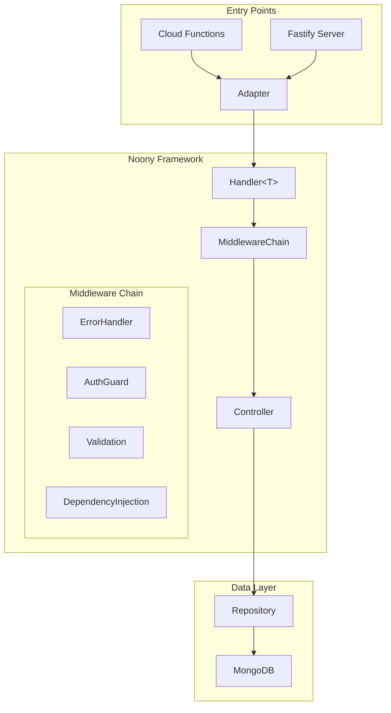

# Noony Framework API - Master Guide

**Comprehensive documentation for the API architecture, Noony Framework v0.6.0 implementation, Google Cloud Functions integration, and development workflows.**

> This guide consolidates information from the Noony Framework Guide, Cloud Functions Reference, Component Reference, Guard System Documentation, and the latest v0.6.0 type safety improvements.

---

## What's New in v0.6.0

🎉 **Major Type Safety Improvements:**

- **Dual Generics System**: `Handler<TBody, TUser>` and `Context<TBody, TUser>` for complete type safety
- **Type-Safe Middlewares**: All middlewares now support generics to preserve type information
- **ResponseWrapperMiddleware**: Now supports response type generics `ResponseWrapperMiddleware<TResponse, TBody, TUser>`
- **ErrorHandlerMiddleware**: New class-based error handler with generics support and built-in error types
- **BaseAuthenticatedUser**: New base interface for user types
- **Enhanced Utility Functions**: Query parameter helpers and container utilities

**Migration Guide:**

```typescript
// ❌ Old way (still works)
const handler = new Handler<LoginRequest>()
  .use(errorHandler())
  .handle(async (context) => {
    const body = context.req.parsedBody as LoginRequest;
    const user = context.user as any;
  });

// ✅ New way (recommended)
const handler = new Handler<LoginRequest, AuthenticatedUser>()
  .use(new ErrorHandlerMiddleware<LoginRequest, AuthenticatedUser>())
  .handle(async (context: Context<LoginRequest, AuthenticatedUser>) => {
    const body = context.req.validatedBody!; // Type: LoginRequest
    const user = context.user!; // Type: AuthenticatedUser
  });
```

---

## Table of Contents

1. [Architecture Overview](#1-architecture-overview)
2. [Project Structure](#2-project-structure)
3. [Noony Framework Core](#3-noony-framework-core)
4. [Component Reference](#4-component-reference)
5. [TypeScript Generics Patterns (NEW)](#5-typescript-generics-patterns-new)
6. [Data Validation and Zod Integration](#6-data-validation-and-zod-integration)
7. [Cloud Functions Integration](#7-cloud-functions-integration)
8. [Fastify Integration](#8-fastify-integration)
9. [The Guard System (Auth & Security)](#9-the-guard-system-auth--security)
10. [Request Lifecycle Trace](#10-request-lifecycle-trace)
11. [Best Practices](#11-best-practices)
12. [Development & Setup](#12-development--setup)

---

## 1. Architecture Overview

This project uses the **Noony Serverless Framework**, a clean architecture implementation designed for serverless environments (Google Cloud Functions) with TypeScript generics for end-to-end type safety.

### High-Level Layers

1.  **Entry Points**:
    - **Production**: Google Cloud Functions (`src/functions.ts`) using the `@google-cloud/functions-framework`.
    - **Development**: Fastify Server (`src/server.ts`) for high-performance huge local iteration.
2.  **Framework Layer (Noony)**:
    - **Handler**: Orchestrates the request flow.
    - **Context**: Carries state (Request, Response, User, Dependency Container) through the chain.
    - **Middleware**: Reusable logic blocks (Auth, Validation, Error Handling).
3.  **Controller Layer**:
    - Pure business logic functions.
    - Framework-agnostic (receives `Context`, returns `void` by writing to `context.res`).
4.  **Service/Repository Layer**:
    - **Repositories**: Direct MongoDB access.
    - **Services**: Complex business logic (optional, often merged into Controllers for simpler CRUD).
5.  **Infrastructure**:
    - **Container Pool**: Custom Dependency Injection system for singleton management.

### Architecture Diagram



---

## 2. Project Structure

```
.
├── API-AGUIDE.md               # Master documentation
├── CLAUDE.md                   # Assistant context
├── open-api-sepec.yml          # OpenAPI Specification
├── package.json                # Dependencies and scripts
├── src/
│   ├── config/                # Environment configuration
│   ├── controllers/           # Business logic
│   │   ├── auth.controllers.ts
│   │   └── config.controllers.ts
│   ├── core/                  # Core framework adapters
│   ├── guards/                # Permission guards
│   ├── handlers/              # Noony handlers (middleware chaining)
│   │   ├── auth.handlers.ts
│   │   └── config.handlers.ts
│   ├── middlewares/           # Custom middleware
│   │   ├── auth.middleware.ts
│   │   └── validation.middleware.ts
│   ├── models/                # Zod schemas and types
│   │   ├── auth/
│   │   ├── config/
│   │   └── user/
│   ├── repositories/          # Data access layer
│   │   ├── config.repository.ts
│   │   ├── refresh-token.repository.ts
│   │   └── user.repository.ts
│   ├── services/              # Shared services
│   │   ├── auth.service.ts
│   │   └── logger.service.ts
│   ├── utils/                 # Utilities
│   ├── functions.ts           # Cloud Functions entry point
│   └── server.ts              # Local Fastify server entry point
├── scripts/                   # Build and deploy scripts
└── docs/                      # Original documentation files
```

---

## 3. Noony Framework Core

The Noony framework is built around the **Chain of Responsibility** pattern with **dual generics** for complete type safety.

### Key Concepts

- **Dual Generics System**: Uses TypeScript Generics (`Handler<TBody, TUser>` and `Context<TBody, TUser>`) to ensure both request body and user context are typed correctly throughout the chain.
- **Type-Safe Middlewares**: All middlewares preserve type information through generic parameters (`BaseMiddleware<TBody, TUser>`).
- **Built-in Error Types**: `ErrorHandlerMiddleware` automatically maps error types (`NotFoundError`, `ForbiddenError`, `ConflictError`) to HTTP status codes.
- **Dependency Injection**: Uses TypeDI Container for singleton service management with type-safe helpers.
- **Response Type Safety**: `ResponseWrapperMiddleware` supports optional response type validation.

### The Middleware Pattern

Middleware in Noony implements the `BaseMiddleware<TBody, TUser>` interface:

```typescript
interface BaseMiddleware<TBody = unknown, TUser = unknown> {
  before?(context: Context<TBody, TUser>): Promise<void>; // Pre-processing
  after?(context: Context<TBody, TUser>): Promise<void>; // Post-processing
  onError?(error: Error, context: Context<TBody, TUser>): Promise<void>; // Error recovery
}
```

**Execution Flow**:

1. **`before()`**: Executed sequentially (1 → N).
2. **`Controller`**: Executed with typed context.
3. **`after()`**: Executed in reverse order (N → 1).
4. **`onError()`**: Executed if any step throws, in reverse order.

**Type Chain Preservation (CRITICAL)**:

All custom middlewares MUST use generics to preserve type information:

```typescript
// ❌ WRONG - Breaks type chain
export class MyMiddleware implements BaseMiddleware {
  async before(context: Context): Promise<void> {
    // Type information lost!
  }
}

// ✅ CORRECT - Preserves type chain
export class MyMiddleware<
  TBody = unknown,
  TUser = unknown,
> implements BaseMiddleware<TBody, TUser> {
  async before(context: Context<TBody, TUser>): Promise<void> {
    // Type information preserved!
  }
}
```

---

## 4. Component Reference

### `Handler<TBody, TUser>`

The central orchestrator with dual generics for complete type safety. Every API endpoint maps to one `Handler` instance.

**Generic Parameters:**

- `TBody`: Type of the request body (defaults to `unknown`)
- `TUser`: Type of the authenticated user (defaults to `unknown`)

**Usage Examples:**

```typescript
// Public endpoint (body only)
new Handler<LoginRequest>()
  .use(new ErrorHandlerMiddleware())
  .use(new BodyValidationMiddleware(loginSchema))
  .handle(controller);

// Protected endpoint (body + user)
new Handler<CreateOrderRequest, AuthenticatedUser>()
  .use(new ErrorHandlerMiddleware<CreateOrderRequest, AuthenticatedUser>())
  .use(new AuthenticationMiddleware(tokenVerifier))
  .use(new BodyValidationMiddleware(createOrderSchema))
  .handle(controller);

// With response typing
new Handler<CreateOrderRequest, AuthenticatedUser>()
  .use(new ErrorHandlerMiddleware<CreateOrderRequest, AuthenticatedUser>())
  .use(
    new ResponseWrapperMiddleware<
      OrderResponse,
      CreateOrderRequest,
      AuthenticatedUser
    >()
  )
  .handle(controller);
```

### `Context<TBody, TUser>`

The state container passed to every function with full type safety.

**Generic Parameters:**

- `TBody`: Type of the request body (defaults to `unknown`)
- `TUser`: Type of the authenticated user (defaults to `unknown`)

**Properties:**

| Property            | Type                                              | Description                                       |
| :------------------ | :------------------------------------------------ | :------------------------------------------------ |
| `req`               | `NoonyRequest<TBody>`                             | Request object with typed body                    |
| `req.body`          | `unknown`                                         | Raw request body                                  |
| `req.parsedBody`    | `TBody \| undefined`                              | Validated/parsed request body                     |
| `req.validatedBody` | `TBody \| undefined`                              | Alias for parsedBody (Zod validation)             |
| `req.params`        | `Record<string, string>`                          | URL path parameters                               |
| `req.headers`       | `Record<string, string \| string[] \| undefined>` | Request headers                                   |
| `req.query`         | `Record<string, string \| string[] \| undefined>` | Query parameters                                  |
| `req.ip`            | `string`                                          | Client IP address                                 |
| `res`               | `NoonyResponse`                                   | Framework-agnostic response object                |
| `user`              | `TUser \| undefined`                              | Authenticated user (populated by auth middleware) |
| `businessData`      | `Map<string, unknown>`                            | Shared state for passing data between middleware  |
| `container`         | `ContainerInstance`                               | TypeDI Container for resolving services           |
| `requestId`         | `string`                                          | Unique request identifier                         |
| `startTime`         | `number`                                          | Request start timestamp                           |

**Usage Example:**

```typescript
export async function createOrderController(
  context: Context<CreateOrderRequest, AuthenticatedUser>
): Promise<void> {
  // ✅ Full type safety
  const { productId, quantity } = context.req.validatedBody!; // Type: CreateOrderRequest
  const user = context.user!; // Type: AuthenticatedUser

  // Type-safe service resolution
  const orderService = getService(context, OrderService);

  // Business logic with complete type safety
  const order = await orderService.create({
    productId,
    quantity,
    userId: user.id,
    customerEmail: user.email,
  });

  context.res.status(201).json({ data: order });
}
```

### `NoonyRequest` & `NoonyResponse`

Framework-agnostic wrappers (aliases for `GenericRequest` and `GenericResponse`) that allow the code to run unchanged on both Express (Cloud Functions) and Fastify (Local Dev).

---

## 5. TypeScript Generics Patterns (NEW)

### Understanding Dual Generics

The Noony Framework uses **dual generics** for complete type safety:

```typescript
Handler<TBody, TUser>;
Context<TBody, TUser>;
BaseMiddleware<TBody, TUser>;
```

- **`TBody`**: Type of the request body (e.g., `CreateOrderRequest`)
- **`TUser`**: Type of the authenticated user (e.g., `AuthenticatedUser`)

This ensures type safety flows through your entire middleware chain and business logic.

### Pattern 1: Public Endpoint (Body Only)

For public endpoints that don't require authentication, use only the body generic:

```typescript
import { z } from 'zod';
import {
  Handler,
  Context,
  BodyValidationMiddleware,
  ErrorHandlerMiddleware,
} from '@noony-serverless/core';

// 1. Define Zod schema
const registerSchema = z.object({
  email: z.string().email(),
  password: z.string().min(8),
  name: z.string().min(1),
});

// 2. Infer TypeScript type
type RegisterRequest = z.infer<typeof registerSchema>;

// 3. Handler with body type only
export const registerHandler = new Handler<RegisterRequest>()
  .use(new ErrorHandlerMiddleware<RegisterRequest>())
  .use(new BodyValidationMiddleware(registerSchema))
  .handle(async (context: Context<RegisterRequest>) => {
    // ✅ Full type safety for body
    const { email, password, name } = context.req.validatedBody!;

    // Business logic
    const user = await userService.register(email, password, name);
    context.res.status(201).json({ data: user });
  });
```

### Pattern 2: Protected Endpoint (Body + User)

For protected endpoints, use both body and user generics:

```typescript
import { z } from 'zod';
import {
  Handler,
  Context,
  BaseAuthenticatedUser,
  AuthenticationMiddleware,
  BodyValidationMiddleware,
  ErrorHandlerMiddleware,
} from '@noony-serverless/core';

// 1. Define user type extending BaseAuthenticatedUser
interface AuthenticatedUser extends BaseAuthenticatedUser {
  id: string;
  email: string;
  role: 'user' | 'admin';
  permissions: string[];
}

// 2. Define request schema
const createOrderSchema = z.object({
  productId: z.string().uuid(),
  quantity: z.number().min(1).max(100),
  shippingAddress: z.object({
    street: z.string().min(1),
    city: z.string().min(1),
    zipCode: z.string(),
  }),
});

type CreateOrderRequest = z.infer<typeof createOrderSchema>;

// 3. Handler with both generics
export const createOrderHandler = new Handler<
  CreateOrderRequest,
  AuthenticatedUser
>()
  .use(new ErrorHandlerMiddleware<CreateOrderRequest, AuthenticatedUser>())
  .use(new AuthenticationMiddleware(tokenVerifier))
  .use(new BodyValidationMiddleware(createOrderSchema))
  .handle(async (context: Context<CreateOrderRequest, AuthenticatedUser>) => {
    // ✅ Full type safety for both body and user
    const body = context.req.validatedBody!; // Type: CreateOrderRequest
    const user = context.user!; // Type: AuthenticatedUser

    // Business logic with complete type safety
    const order = await orderService.create({
      productId: body.productId,
      quantity: body.quantity,
      userId: user.id,
      customerEmail: user.email,
      shippingAddress: body.shippingAddress,
    });

    context.res.status(201).json({ data: order });
  });
```

### Pattern 3: GET Endpoint with User (No Body)

For GET requests with authentication but no body:

```typescript
import {
  Handler,
  Context,
  AuthenticationMiddleware,
  ErrorHandlerMiddleware,
} from '@noony-serverless/core';

// Handler with user type only (body is unknown)
export const getUserProfileHandler = new Handler<unknown, AuthenticatedUser>()
  .use(new ErrorHandlerMiddleware<unknown, AuthenticatedUser>())
  .use(new AuthenticationMiddleware(tokenVerifier))
  .handle(async (context: Context<unknown, AuthenticatedUser>) => {
    // ✅ Type-safe user access
    const user = context.user!; // Type: AuthenticatedUser

    // Access query parameters with helpers
    const includeOrders = asBoolean(context.req.query.includeOrders);

    const profile = await userService.getProfile(user.id, { includeOrders });
    context.res.status(200).json({ data: profile });
  });
```

### Pattern 4: Response Type Safety (All Three Generics)

For complete type safety including response validation:

```typescript
import {
  Handler,
  Context,
  ResponseWrapperMiddleware,
  AuthenticationMiddleware,
  BodyValidationMiddleware,
  ErrorHandlerMiddleware,
} from '@noony-serverless/core';

// 1. Define response type
interface OrderResponse {
  orderId: string;
  status: 'pending' | 'confirmed';
  estimatedDelivery: string;
  totalAmount: number;
}

// 2. Handler with response, body, and user types
export const createOrderHandler = new Handler<
  CreateOrderRequest,
  AuthenticatedUser
>()
  .use(new ErrorHandlerMiddleware<CreateOrderRequest, AuthenticatedUser>())
  .use(new AuthenticationMiddleware(tokenVerifier))
  .use(new BodyValidationMiddleware(createOrderSchema))
  .use(
    new ResponseWrapperMiddleware<
      OrderResponse,
      CreateOrderRequest,
      AuthenticatedUser
    >()
  )
  .handle(async (context: Context<CreateOrderRequest, AuthenticatedUser>) => {
    const body = context.req.validatedBody!;
    const user = context.user!;

    const order = await orderService.create({ ...body, userId: user.id });

    // ✅ Type-safe response
    const response: OrderResponse = {
      orderId: order.id,
      status: order.status,
      estimatedDelivery: order.estimatedDelivery.toISOString(),
      totalAmount: order.totalAmount,
    };

    context.res.status(201).json({ data: response });
  });
```

### Type-Safe Custom Middleware

**CRITICAL:** Always preserve the type chain when creating custom middleware:

```typescript
import { BaseMiddleware, Context } from '@noony-serverless/core';

// ❌ WRONG - Breaks type chain
export class LoggingMiddleware implements BaseMiddleware {
  async before(context: Context): Promise<void> {
    // Type information lost!
  }
}

// ✅ CORRECT - Preserves type chain
export class LoggingMiddleware<
  TBody = unknown,
  TUser = unknown,
> implements BaseMiddleware<TBody, TUser> {
  async before(context: Context<TBody, TUser>): Promise<void> {
    // Type information preserved!
    console.log('Request received', {
      requestId: context.requestId,
      hasBody: !!context.req.parsedBody,
      hasUser: !!context.user,
    });
  }
}

// Usage with full type safety
const handler = new Handler<CreateOrderRequest, AuthenticatedUser>()
  .use(new LoggingMiddleware<CreateOrderRequest, AuthenticatedUser>())
  .use(new ErrorHandlerMiddleware<CreateOrderRequest, AuthenticatedUser>())
  .handle(controller);
```

### Common Type Patterns

#### 1. Extending BaseAuthenticatedUser

```typescript
import { BaseAuthenticatedUser } from '@noony-serverless/core';

interface AuthenticatedUser extends BaseAuthenticatedUser {
  id: string;
  email: string;
  role: 'user' | 'admin' | 'superadmin';
  permissions: string[];
  organizationId?: string;
  // JWT standard claims inherited from BaseAuthenticatedUser
  sub: string;
  iat: number;
  exp: number;
}
```

#### 2. Zod Schema + Type Inference

```typescript
const userSchema = z.object({
  name: z.string().min(1),
  email: z.string().email(),
  age: z.number().min(18).optional(),
  preferences: z.object({
    newsletter: z.boolean().default(false),
    notifications: z.boolean().default(true),
  }),
});

// TypeScript type automatically inferred
type UserRequest = z.infer<typeof userSchema>;
// Type: { name: string; email: string; age?: number; preferences: { newsletter: boolean; notifications: boolean } }
```

#### 3. Type-Safe Service Resolution

```typescript
import { getService } from '@noony-serverless/core';

export async function controller(
  context: Context<CreateOrderRequest, AuthenticatedUser>
) {
  // ✅ Type-safe service resolution
  const orderService = getService(context, OrderService); // Type: OrderService
  const paymentService = getService(context, PaymentService); // Type: PaymentService

  // No manual casting needed!
}
```

### Type Safety Best Practices

1. **Always use both generics for protected endpoints**: `Handler<TBody, TUser>` ensures complete type safety
2. **Preserve type chain in custom middleware**: Use `BaseMiddleware<TBody, TUser>` with generics
3. **Use Zod for runtime validation**: Let `z.infer<>` generate TypeScript types automatically
4. **Extend BaseAuthenticatedUser**: Provides JWT standard claims out of the box
5. **Use getService() helper**: Eliminates manual container casting
6. **Reference implementation**: Use `BodyValidationMiddleware` as a pattern for writing type-safe middleware

---

## 6. Data Validation and Zod Integration

The API relies on **Zod** as the single source of truth for both runtime validation and static type definitions. This eliminates drift between the API contract and the TypeScript types.

### 1. Request Body Validation

Validation occurs automatically at the middleware layer before reaching the controller.

**Key Components:**

- **Middleware**: `BodyValidationMiddleware` validates `req.body` against Zod schema
- **Type Inference**: Controllers receive fully typed `context.req.validatedBody` from `z.infer<typeof Schema>`
- **Error Handling**: Automatically throws `ValidationError` (400) for invalid requests with detailed Zod error messages

### 2. Domain Entity Validation

Zod is used to define the shape of core domain entities (e.g., `UserEntity`, `AppConfig`) to ensure database consistency.

**Example**: `UserEntity` validates ULID formats, Enums (Roles/Status), and default values.

**Benefit**: The database repository guarantees that only valid data is persisted.

### 3. Complete Zod Integration Pattern

**Step 1: Define Zod Schema**

```typescript
import { z } from 'zod';

export const createSectionSchema = z.object({
  title: z.string().min(1).max(100),
  description: z.string().optional(),
  order: z.number().int().min(0),
  enabled: z.boolean().default(true),
  metadata: z
    .object({
      tags: z.array(z.string()),
      priority: z.enum(['low', 'medium', 'high']),
    })
    .optional(),
});
```

**Step 2: Infer TypeScript Type**

```typescript
export type CreateSectionRequest = z.infer<typeof createSectionSchema>;
// Type automatically inferred:
// {
//   title: string;
//   description?: string;
//   order: number;
//   enabled: boolean;
//   metadata?: {
//     tags: string[];
//     priority: 'low' | 'medium' | 'high';
//   };
// }
```

**Step 3: Use in Handler with Type Safety**

```typescript
import {
  Handler,
  Context,
  BodyValidationMiddleware,
  ErrorHandlerMiddleware,
} from '@noony-serverless/core';

export const createSectionHandler = new Handler<
  CreateSectionRequest,
  AuthenticatedUser
>()
  .use(new ErrorHandlerMiddleware<CreateSectionRequest, AuthenticatedUser>())
  .use(new AuthenticationMiddleware(tokenVerifier))
  .use(new BodyValidationMiddleware(createSectionSchema)) // Validates against Zod schema
  .handle(async (context: Context<CreateSectionRequest, AuthenticatedUser>) => {
    // ✅ Full type safety - validatedBody is typed as CreateSectionRequest
    const { title, description, order, enabled, metadata } =
      context.req.validatedBody!;

    const section = await sectionService.create({
      title,
      description,
      order,
      enabled,
      metadata,
      createdBy: context.user!.id,
    });

    context.res.status(201).json({ data: section });
  });
```

### 4. Advanced Zod Patterns

**Nested Object Validation:**

```typescript
const addressSchema = z.object({
  street: z.string().min(1),
  city: z.string().min(1),
  state: z.string().length(2),
  zipCode: z.string().regex(/^\d{5}(-\d{4})?$/),
});

const orderSchema = z.object({
  items: z
    .array(
      z.object({
        productId: z.string().uuid(),
        quantity: z.number().min(1),
      })
    )
    .min(1),
  shippingAddress: addressSchema,
  billingAddress: addressSchema.optional(),
});

type OrderRequest = z.infer<typeof orderSchema>;
```

**Custom Validation with .refine():**

```typescript
const updatePasswordSchema = z
  .object({
    currentPassword: z.string().min(1),
    newPassword: z.string().min(8),
    confirmPassword: z.string().min(8),
  })
  .refine((data) => data.newPassword === data.confirmPassword, {
    message: "Passwords don't match",
    path: ['confirmPassword'],
  });
```

**Conditional Validation:**

```typescript
const paymentSchema = z.discriminatedUnion('method', [
  z.object({
    method: z.literal('credit_card'),
    cardNumber: z.string().regex(/^\d{16}$/),
    cvv: z.string().regex(/^\d{3,4}$/),
  }),
  z.object({
    method: z.literal('paypal'),
    email: z.string().email(),
  }),
]);
```

---

## 7. Cloud Functions Integration

The integration logic resides in `src/functions.ts`. This file adapts the Noony `Handler` to the Google Cloud `HttpFunction` signature with full type safety support.

### Lifecycle Management

1.  **Cold Start**:
    - The module loads. Global state (`initialized`) is `false`.
    - First request triggers `initializeDependencies()`.
    - **Connecting to DB**: MongoDB connection is established.
    - **DI Setup**: Repositories/Services are instantiated and cached in the singleton pool.
    - `initialized` set to `true`.
2.  **Warm Start**:
    - Subsequent requests skip initialization and reuse the DB connection/Container.

### Implementation Pattern with Type Safety

Each exported function wraps a type-safe Noony handler:

```typescript
// src/functions.ts
import {
  Handler,
  Context,
  ErrorHandlerMiddleware,
  AuthenticationMiddleware,
} from '@noony-serverless/core';
import { http, HttpFunction } from '@google-cloud/functions-framework';

// 1. Define handler with full type safety
const createOrderHandler = new Handler<CreateOrderRequest, AuthenticatedUser>()
  .use(new ErrorHandlerMiddleware<CreateOrderRequest, AuthenticatedUser>())
  .use(new AuthenticationMiddleware(tokenVerifier))
  .use(new BodyValidationMiddleware(createOrderSchema))
  .handle(async (context: Context<CreateOrderRequest, AuthenticatedUser>) => {
    const { productId, quantity } = context.req.validatedBody!;
    const user = context.user!;

    const order = await orderService.create({
      productId,
      quantity,
      userId: user.id,
    });

    context.res.status(201).json({ data: order });
  });

// 2. Export as Cloud Function
export const createOrder = http('createOrder', async (req, res) => {
  // Lazy initialization on first request
  await initializeDependencies();

  // Execute type-safe Noony handler
  await createOrderHandler.execute(req, res);
});
```

**Benefits:**

- **Type Safety**: Full TypeScript typing flows through to Cloud Functions
- **Lazy Initialization**: DB connections only established when needed
- **Framework Agnostic**: Same handler works in local dev (Fastify) and production (GCP)
- **Cold Start Optimization**: Fast failures don't wait for DB initialization

---

## 8. Fastify Integration

Noony Framework provides seamless integration with **Fastify** for high-performance local development. The same handler code runs in both local development (Fastify) and production (Cloud Functions) without modification.

### Adapter Functions

#### `adaptFastifyRequest<T>(req: FastifyRequest): GenericRequest<T>`

Converts Fastify's request format to Noony's framework-agnostic `GenericRequest`:

```typescript
import { adaptFastifyRequest } from '@noony-serverless/core';

const genericReq = adaptFastifyRequest<CreateUserRequest>(fastifyRequest);
// Returns: GenericRequest<CreateUserRequest> with normalized headers, query, params, body
```

**Features:**
- Normalizes headers, query parameters, and path parameters
- Stores original Fastify request in WeakMap for middleware access
- Pre-allocated empty objects for optimal performance
- Zero-copy path extraction

**Returned Structure:**

```typescript
interface GenericRequest<T> {
  method: string;              // HTTP method (GET, POST, etc.)
  url: string;                 // Full URL path
  path: string;                // Route path (e.g., '/api/users/:userId')
  headers: Record<string, string | string[] | undefined>;
  query: Record<string, string | string[] | undefined>;
  params: Record<string, string>;  // Path parameters
  body: unknown;               // Raw body
  parsedBody: T;               // Typed parsed body
  ip?: string;                 // Client IP address
  userAgent?: string;          // User-Agent header value
}
```

---

#### `adaptFastifyResponse(reply: FastifyReply): GenericResponse`

Converts Fastify's reply object to Noony's `GenericResponse`:

```typescript
import { adaptFastifyResponse } from '@noony-serverless/core';

const genericRes = adaptFastifyResponse(fastifyReply);
// Returns: GenericResponse with chainable methods
```

**Methods:**
- `status(code: number)`: Set HTTP status code
- `json(data: unknown)`: Send JSON response
- `send(data: unknown)`: Send response (any format)
- `header(name: string, value: string)`: Set single header
- `headers(headers: Record<string, string>)`: Set multiple headers
- `end()`: End response

**Safety Features:**
- Duplicate send prevention
- Header tracking (`headersSent` property)
- Chainable API for fluent usage

---

#### `createFastifyHandler()` - Primary Integration Function

The main function for integrating Noony handlers with Fastify routes:

```typescript
function createFastifyHandler(
  noonyHandler: Handler<unknown>,
  functionName: string,
  initializeDependencies: () => Promise<void>
): (req: FastifyRequest, reply: FastifyReply) => Promise<void>
```

**Parameters:**
| Parameter | Type | Description |
| --- | --- | --- |
| `noonyHandler` | `Handler<unknown>` | The Noony handler (with middleware chain and controller) |
| `functionName` | `string` | Name for error logging and debugging |
| `initializeDependencies` | `() => Promise<void>` | Async function that initializes dependencies (singleton pattern) |

**Returns:** Fastify route handler function

**What it does:**
1. Ensures dependencies are initialized (singleton pattern)
2. Adapts Fastify req/reply to GenericRequest/GenericResponse
3. Executes Noony handler via `noonyHandler.executeGeneric()`
4. Handles errors gracefully:
   - Ignores `RESPONSE_SENT` errors
   - Returns 500 for real errors
   - Checks `reply.sent` to prevent double responses

---

### Complete Fastify Server Example

```typescript
import Fastify from 'fastify';
import { createFastifyHandler } from '@noony-serverless/core';
import { databaseService } from './services/database.service';
import { initializeServices } from './services/init.service';
import { containerPool, logger } from '@noony-serverless/core';

// Import Noony handlers
import { loginHandler, logoutHandler } from './handlers/auth.handlers';
import { getUserHandler, updateUserHandler } from './handlers/user.handlers';

// ============================================================================
// DEPENDENCY INITIALIZATION (Singleton Pattern)
// ============================================================================

let initialized = false;
let initializationPromise: Promise<void> | null = null;

async function initializeDependencies(): Promise<void> {
  if (initialized && containerPool.isInitialized()) {
    logger.debug('[Fastify] Reusing initialized dependencies');
    return;
  }

  if (initializationPromise) {
    await initializationPromise;
    return;
  }

  initializationPromise = (async () => {
    try {
      logger.info('[Fastify] Initializing dependencies');
      const db = await databaseService.connect();
      await initializeServices(db);
      containerPool.setInitialized();
      initialized = true;
      logger.info('[Fastify] Dependencies initialized successfully');
    } catch (error) {
      logger.error('[Fastify] Failed to initialize dependencies', { error });
      throw error;
    } finally {
      initializationPromise = null;
    }
  })();

  await initializationPromise;
}

// ============================================================================
// FASTIFY SERVER SETUP
// ============================================================================

const server = Fastify({ logger: true });

// Helper shorthand
const adapt = (handler: Handler<unknown>, name: string) =>
  createFastifyHandler(handler, name, initializeDependencies);

// ============================================================================
// ROUTE REGISTRATION
// ============================================================================

// Auth routes
server.post('/api/auth/login', adapt(loginHandler, 'login'));
server.post('/api/auth/logout', adapt(logoutHandler, 'logout'));

// User routes (with path parameters)
server.get('/api/users/:userId', adapt(getUserHandler, 'getUser'));
server.patch('/api/users/:userId', adapt(updateUserHandler, 'updateUser'));

// Health check
server.get('/health', async (request, reply) => {
  reply.send({ status: 'ok', timestamp: new Date().toISOString() });
});

// ============================================================================
// SERVER STARTUP
// ============================================================================

const PORT = Number(process.env.PORT) || 3000;

server.listen({ port: PORT, host: '0.0.0.0' }, (err, address) => {
  if (err) {
    logger.error('[Fastify] Server failed to start', { error: err.message });
    process.exit(1);
  }
  logger.info(`[Fastify] Server listening at ${address}`);
});

// Graceful shutdown
const gracefulShutdown = async () => {
  logger.info('[Fastify] Shutting down gracefully...');
  await server.close();
  await databaseService.disconnect();
  process.exit(0);
};

process.on('SIGTERM', gracefulShutdown);
process.on('SIGINT', gracefulShutdown);
```

---

### Type Safety with Fastify

Full type safety is preserved through the Fastify integration:

```typescript
import { z } from 'zod';
import { Handler, Context } from '@noony-serverless/core';

// Define schema and type
const createUserSchema = z.object({
  name: z.string().min(1).max(100),
  email: z.string().email(),
  role: z.enum(['user', 'admin']).default('user'),
});

type CreateUserRequest = z.infer<typeof createUserSchema>;

interface AuthenticatedUser {
  id: string;
  email: string;
  role: 'admin' | 'user';
}

// Create type-safe Noony handler
const createUserHandler = new Handler<CreateUserRequest, AuthenticatedUser>()
  .use(new ErrorHandlerMiddleware<CreateUserRequest, AuthenticatedUser>())
  .use(new AuthenticationMiddleware<CreateUserRequest, AuthenticatedUser>(tokenVerifier))
  .use(new BodyValidationMiddleware<CreateUserRequest, AuthenticatedUser>(createUserSchema))
  .use(new ResponseWrapperMiddleware<CreateUserRequest, AuthenticatedUser>())
  .handle(async (context: Context<CreateUserRequest, AuthenticatedUser>) => {
    // ✅ Full type safety!
    const { name, email, role } = context.req.validatedBody!;  // Type: CreateUserRequest
    const currentUser = context.user!;  // Type: AuthenticatedUser

    const newUser = await userService.create({ name, email, role });
    return { userId: newUser.id };
  });

// Register with Fastify - full type safety preserved!
server.post('/api/users', adapt(createUserHandler, 'createUser'));
```

---

### Path Parameters

Path parameters work seamlessly with Fastify:

```typescript
const getUserHandler = new Handler<void, AuthenticatedUser>()
  .use(new ErrorHandlerMiddleware<void, AuthenticatedUser>())
  .use(new AuthenticationMiddleware<void, AuthenticatedUser>(tokenVerifier))
  .handle(async (context: Context<void, AuthenticatedUser>) => {
    // Access path parameters
    const userId = context.req.params.userId;  // Type: string

    const user = await userService.getById(userId);
    if (!user) {
      throw new NotFoundError('User not found');
    }

    return { user };
  });

// Fastify path parameter syntax
server.get('/api/users/:userId', adapt(getUserHandler, 'getUser'));

// Multiple path parameters
server.get('/api/sections/:sectionId/items/:itemId',
  adapt(getItemHandler, 'getItem')
);
```

---

### Local Development vs Production

The same handler code works in both environments:

```typescript
// ============================================================================
// HANDLER DEFINITION (Write once!)
// ============================================================================

const loginHandler = new Handler<LoginRequest, void>()
  .use(new ErrorHandlerMiddleware<LoginRequest, void>())
  .use(new BodyValidationMiddleware<LoginRequest, void>(loginSchema))
  .handle(async (context: Context<LoginRequest, void>) => {
    const { email, password } = context.req.validatedBody!;
    const token = await authService.login(email, password);
    return { token };
  });

// ============================================================================
// LOCAL DEVELOPMENT (Fastify) - src/server.ts
// ============================================================================

import { createFastifyHandler } from '@noony-serverless/core';

const server = Fastify();
const adapt = (handler, name) =>
  createFastifyHandler(handler, name, initializeDependencies);

server.post('/api/auth/login', adapt(loginHandler, 'login'));

server.listen({ port: 3000 });

// ============================================================================
// PRODUCTION (Cloud Functions) - src/functions.ts
// ============================================================================

import { http } from '@google-cloud/functions-framework';
import { createHttpFunction } from '@noony-serverless/core';

const loginFunction = createHttpFunction(loginHandler, 'login', initializeDependencies);
http('login', loginFunction);
export const login = loginFunction;
```

**Development Workflow:**

```bash
# Local development with Fastify
npm run dev  # Server on http://localhost:3000

# Deploy to Cloud Functions (same handler code!)
npm run deploy
```

---

### Performance Optimizations

The Fastify integration includes several performance optimizations:

1. **Pre-allocated Empty Objects**: Avoids allocations for empty query/params
2. **WeakMap for Request Storage**: Zero memory leak risk
3. **Inline Path Extraction**: Avoids optional chaining overhead
4. **Pre-allocated Error Response**: Reduces allocations in error path
5. **Fast Path Error Checking**: `RESPONSE_SENT` checked first
6. **Singleton Dependency Initialization**: Prevents redundant DB connections

**Benchmark:**
- Fastify + Noony: ~30,000 req/s (local development)
- Express + Noony: ~15,000 req/s (Cloud Functions)
- Performance gain: ~2x faster for local testing

---

### Best Practices

**✅ DO:**
- Use `createFastifyHandler()` for all Fastify routes
- Implement singleton pattern for `initializeDependencies()`
- Use same handler code for local dev and production
- Create helper shorthand: `const adapt = (handler, name) => createFastifyHandler(handler, name, initDeps)`
- Test locally with Fastify before deploying to Cloud Functions

**❌ DON'T:**
- Call `adaptFastifyRequest()` or `adaptFastifyResponse()` directly
- Re-initialize dependencies on every request
- Create different handler implementations for Fastify vs Cloud Functions
- Forget to handle graceful shutdown (SIGTERM/SIGINT)

---

## 9. The Guard System (Auth & Security)

The **Noony Guard System** is a high-performance authentication/authorization layer with full type safety support, located in `src/middlewares/` and `src/services/auth.service.ts`.

### Architecture

```mermaid
graph TD
    Request --> RouteGuards
    RouteGuards --> FastAuthGuard[Authentication]
    FastAuthGuard --> TokenValidator[JWT Check]

    RouteGuards --> PermissionCheck
    PermissionCheck --> Strategy[Resolution Strategy]

    subgraph "Strategies"
        Strategy --> Plain[Plain List O(1)]
        Strategy --> Wildcard[Wildcard admin.*]
        Strategy --> Expr[Expression Logic]
    end
```

### 1. FastAuthGuard (Authentication)

- **Responsibility**: Validates JWTs.
- **Caching**: Uses L1 (Memory) and L2 (Redis, optional) caching for token validation results (~0.1ms latency).
- **Security**: Checks token expiration, signature, and user status (active/suspended).

### 2. Permission Resolution Strategies

The system supports three ways to check permissions:

1.  **Plain Permissions** (`RouteGuards.requirePermissions`):
    - **Speed**: Fastest (O(1)).
    - **Logic**: Checks if user has _any_ of the listed permission strings.
    - **Use Case**: High-traffic endpoints.
2.  **Wildcard Permissions** (`RouteGuards.requireWildcardPermissions`):
    - **Logic**: Matches patterns like `admin.*` or `sections:read`.
    - **Use Case**: Role-based hierarchical access.
3.  **Expression Permissions** (`RouteGuards.requireComplexPermissions`):
    - **Logic**: Complex Boolean logic (`{ OR: [ { AND: [...] } ] }`).
    - **Use Case**: Complex business rules.

### 3. Security Features

- **Conservative Cache Invalidation**: Changing a user's role/permissions immediately invalidates their cached context.
- **Audit**: Logs security events (blocking tokens, failed auth).

### 4. Type-Safe Guard Implementation

The Guard System integrates seamlessly with the dual generics type system:

```typescript
import {
  Handler,
  Context,
  ErrorHandlerMiddleware,
  AuthenticationMiddleware,
  BodyValidationMiddleware,
} from '@noony-serverless/core';

// Define authenticated user with permissions
interface AuthenticatedUser extends BaseAuthenticatedUser {
  id: string;
  email: string;
  role: 'user' | 'admin';
  permissions: string[]; // e.g., ['sections:read', 'sections:write', 'admin:*']
}

// Custom permission guard middleware
export class PermissionGuard<
  TBody = unknown,
  TUser extends AuthenticatedUser = AuthenticatedUser,
> implements BaseMiddleware<TBody, TUser> {
  constructor(private requiredPermissions: string[]) {}

  async before(context: Context<TBody, TUser>): Promise<void> {
    const user = context.user;

    if (!user) {
      throw new UnauthorizedError('Authentication required');
    }

    const hasPermission = this.requiredPermissions.some((perm) =>
      user.permissions.includes(perm)
    );

    if (!hasPermission) {
      throw new ForbiddenError('Insufficient permissions');
    }
  }
}

// Usage in handler with full type safety
export const createSectionHandler = new Handler<
  CreateSectionRequest,
  AuthenticatedUser
>()
  .use(new ErrorHandlerMiddleware<CreateSectionRequest, AuthenticatedUser>())
  .use(new AuthenticationMiddleware(tokenVerifier))
  .use(
    new PermissionGuard<CreateSectionRequest, AuthenticatedUser>([
      'sections:write',
      'admin:*',
    ])
  )
  .use(new BodyValidationMiddleware(createSectionSchema))
  .handle(async (context: Context<CreateSectionRequest, AuthenticatedUser>) => {
    // ✅ Type-safe access - user is guaranteed to have permissions
    const { title, order } = context.req.validatedBody!;
    const user = context.user!; // Type: AuthenticatedUser

    const section = await sectionService.create({
      title,
      order,
      createdBy: user.id,
    });

    context.res.status(201).json({ data: section });
  });
```

**Key Benefits:**

- **Type Safety**: User type flows through guard middleware with full autocomplete
- **Reusable Guards**: Generic permission guards work with any endpoint
- **Early Validation**: Permission checks occur before business logic
- **Clear Error Messages**: Automatic 401/403 responses with descriptive messages

---

## 10. Request Lifecycle Trace

Complete trace of a type-safe request to `POST /api/orders`:

### 1. Entry Point

```typescript
// src/functions.ts - Cloud Function entry
export const createOrder = http('createOrder', async (req, res) => {
  await initializeDependencies(); // Cold start: DB + DI container
  await createOrderHandler.execute(req, res);
});
```

### 2. Handler Initialization

```typescript
// Type-safe handler with dual generics
const createOrderHandler = new Handler<CreateOrderRequest, AuthenticatedUser>()
  .use(new ErrorHandlerMiddleware<CreateOrderRequest, AuthenticatedUser>())
  .use(new AuthenticationMiddleware(tokenVerifier))
  .use(new PermissionGuard(['orders:write']))
  .use(new BodyValidationMiddleware(createOrderSchema))
  .use(
    new ResponseWrapperMiddleware<
      OrderResponse,
      CreateOrderRequest,
      AuthenticatedUser
    >()
  )
  .handle(createOrderController);
```

### 3. Middleware Execution (Sequential)

**Step 1: ErrorHandlerMiddleware.before()**

- Sets up try/catch context for entire request
- Captures any errors from subsequent middleware or controller

**Step 2: AuthenticationMiddleware.before()**

- Extracts JWT from `Authorization: Bearer <token>` header
- Validates token signature and expiration
- Populates `context.user` with typed `AuthenticatedUser`

**Step 3: PermissionGuard.before()**

- Checks if `context.user.permissions` includes `'orders:write'`
- Throws `ForbiddenError` (403) if permission denied

**Step 4: BodyValidationMiddleware.before()**

- Validates `req.body` against `createOrderSchema` (Zod)
- Populates `context.req.validatedBody` with typed `CreateOrderRequest`
- Throws `ValidationError` (400) if validation fails

**Step 5: ResponseWrapperMiddleware.before()**

- Prepares standardized response format

### 4. Controller Execution

```typescript
// src/controllers/order.controllers.ts
export async function createOrderController(
  context: Context<CreateOrderRequest, AuthenticatedUser>
): Promise<void> {
  // ✅ Full type safety - all data is validated and typed
  const { productId, quantity, shippingAddress } = context.req.validatedBody!;
  const user = context.user!;

  // Type-safe service resolution
  const orderService = getService(context, OrderService);

  // Business logic
  const order = await orderService.create({
    productId,
    quantity,
    userId: user.id,
    customerEmail: user.email,
    shippingAddress,
  });

  // Set response
  context.res.status(201).json({ data: order });
}
```

### 5. Service Layer

```typescript
// src/services/order.service.ts
export class OrderService {
  async create(data: CreateOrderData): Promise<Order> {
    // Repository call
    const order = await this.orderRepository.create(data);

    // Pub/Sub notification
    await this.publishOrderCreatedEvent(order);

    return order;
  }
}
```

### 6. Response (Reverse Order)

**Step 6: ResponseWrapperMiddleware.after()**

- Wraps response in standard envelope: `{ success: true, data: {...} }`

**Step 7-4: Other middlewares.after()** (in reverse order)

- Execute any cleanup logic

### 7. Error Handling (If Any Step Fails)

**ErrorHandlerMiddleware.onError()**

- Catches error from any middleware or controller
- Maps error type to HTTP status:
  - `ValidationError` → 400
  - `UnauthorizedError` → 401
  - `ForbiddenError` → 403
  - `NotFoundError` → 404
  - `ConflictError` → 409
  - `InternalServerError` → 500
- Returns standardized error response: `{ success: false, error: {...} }`

---

## 11. Best Practices

### 1. Always Use Dual Generics for Protected Endpoints

```typescript
// ✅ CORRECT - Full type safety
const handler = new Handler<CreateOrderRequest, AuthenticatedUser>()
  .use(new ErrorHandlerMiddleware<CreateOrderRequest, AuthenticatedUser>())
  .use(new AuthenticationMiddleware(tokenVerifier))
  .handle(async (context: Context<CreateOrderRequest, AuthenticatedUser>) => {
    const body = context.req.validatedBody!; // Type: CreateOrderRequest
    const user = context.user!; // Type: AuthenticatedUser
  });

// ❌ WRONG - Type safety lost
const handler = new Handler()
  .use(new ErrorHandlerMiddleware())
  .handle(async (context) => {
    const body = context.req.parsedBody as any; // Manual casting needed
    const user = context.user as any; // Manual casting needed
  });
```

### 2. Preserve Type Chain in Custom Middleware

```typescript
// ✅ CORRECT - Preserves type information
export class LoggingMiddleware<
  TBody = unknown,
  TUser = unknown,
> implements BaseMiddleware<TBody, TUser> {
  async before(context: Context<TBody, TUser>): Promise<void> {
    // Type information flows through
  }
}

// ❌ WRONG - Breaks type chain
export class LoggingMiddleware implements BaseMiddleware {
  async before(context: Context): Promise<void> {
    // Type information lost!
  }
}
```

### 3. Use Zod for Runtime Validation + Type Inference

```typescript
// ✅ CORRECT - Single source of truth
const userSchema = z.object({
  name: z.string().min(1),
  email: z.string().email(),
});

type UserRequest = z.infer<typeof userSchema>; // Type automatically inferred

const handler = new Handler<UserRequest>()
  .use(new BodyValidationMiddleware(userSchema))
  .handle(async (context) => {
    const { name, email } = context.req.validatedBody!; // Fully typed!
  });

// ❌ WRONG - Duplicate definitions
interface UserRequest {
  name: string;
  email: string;
}

const handler = new Handler<UserRequest>().handle(async (context) => {
  // No runtime validation! Types can drift from actual data
  const { name, email } = context.req.body as UserRequest;
});
```

### 4. Extend BaseAuthenticatedUser for User Types

```typescript
// ✅ CORRECT - Includes JWT standard claims
interface AuthenticatedUser extends BaseAuthenticatedUser {
  id: string;
  email: string;
  role: 'user' | 'admin';
  // sub, iat, exp inherited from BaseAuthenticatedUser
}

// ❌ WRONG - Missing standard JWT claims
interface AuthenticatedUser {
  id: string;
  email: string;
  role: 'user' | 'admin';
  // Missing: sub, iat, exp, nbf, iss, aud
}
```

### 5. Use Built-in Error Types

```typescript
// ✅ CORRECT - Automatic HTTP status mapping
import {
  NotFoundError,
  ForbiddenError,
  ConflictError,
} from '@noony-serverless/core';

const user = await userService.getById(userId);
if (!user) {
  throw new NotFoundError('User not found'); // Auto 404
}

if (!canAccess(user, resource)) {
  throw new ForbiddenError('Access denied'); // Auto 403
}

const existing = await userService.findByEmail(email);
if (existing) {
  throw new ConflictError('Email already exists'); // Auto 409
}

// ❌ WRONG - Manual error handling
if (!user) {
  context.res.status(404).json({ error: 'User not found' });
  return;
}
```

### 6. Use getService() Helper for Type-Safe DI

```typescript
// ✅ CORRECT - Type-safe service resolution
import { getService } from '@noony-serverless/core';

const orderService = getService(context, OrderService); // Type: OrderService
const paymentService = getService(context, PaymentService); // Type: PaymentService

// ❌ WRONG - Manual casting
const orderService = (context.container as ContainerInstance).get(
  OrderService
) as OrderService;
```

### 7. Middleware Ordering

Always follow this order for optimal security and error handling:

```typescript
const handler = new Handler<TBody, TUser>()
  .use(new ErrorHandlerMiddleware<TBody, TUser>()) // 1. Always first - catches all errors
  .use(new AuthenticationMiddleware(tokenVerifier)) // 2. JWT validation
  .use(new PermissionGuard(['resource:write'])) // 3. Authorization
  .use(new BodyValidationMiddleware(schema)) // 4. Input validation
  .use(new ResponseWrapperMiddleware<TResponse, TBody, TUser>()) // 5. Always last - wraps response
  .handle(controller);
```

### 8. Query Parameter Safety

```typescript
// ✅ CORRECT - Type-safe query parameter parsing
import {
  asString,
  asNumber,
  asBoolean,
  asStringArray,
} from '@noony-serverless/core';

export async function listUsersController(
  context: Context<unknown, AuthenticatedUser>
) {
  const query = {
    search: asString(context.req.query.search), // string | undefined
    page: asNumber(context.req.query.page) || 1, // number with default
    limit: asNumber(context.req.query.limit) || 10, // number with default
    active: asBoolean(context.req.query.active), // boolean | undefined
    tags: asStringArray(context.req.query.tags), // string[] | undefined
  };

  const users = await userService.list(query);
  context.res.status(200).json({ data: users });
}

// ❌ WRONG - Unsafe direct access
const page = Number(context.req.query.page); // NaN if not provided or invalid!
```

### 9. Use ResponseWrapperMiddleware for Type-Safe Responses

```typescript
// ✅ CORRECT - Response type validation
interface OrderResponse {
  orderId: string;
  status: 'pending' | 'confirmed';
  totalAmount: number;
}

const handler = new Handler<CreateOrderRequest, AuthenticatedUser>()
  .use(
    new ResponseWrapperMiddleware<
      OrderResponse,
      CreateOrderRequest,
      AuthenticatedUser
    >()
  )
  .handle(async (context) => {
    const order = await orderService.create(context.req.validatedBody!);

    // Type-checked response
    const response: OrderResponse = {
      orderId: order.id,
      status: order.status,
      totalAmount: order.totalAmount,
    };

    context.res.status(201).json({ data: response });
  });
```

### 10. Reference BodyValidationMiddleware for Custom Middleware

When creating type-safe middleware, use [BodyValidationMiddleware](src/middlewares/bodyValidationMiddleware.ts) as the gold standard reference implementation for:

- Proper generic parameter usage
- Type chain preservation
- Error handling patterns

---

## 12. Development & Setup

### Running Locally

**Option A: Fastify Server (Recommended for Logic)**
Runs a standard Node.js server. Fast hot-reload.

```bash
npm run dev
# URL: http://localhost:8080
```

**Option B: Cloud Functions Emulator (Recommended for Integration)**
Simulates the exact GCF environment, including the cold-start logic.

```bash
npm run dev:functions
# URL: http://localhost:8080
```

### Deployment

Usage of `scripts/deploy.sh`:

```bash
# Deploy to DEV
npm run deploy:dev

# Deploy to PROD
npm run deploy:prod
```

This script:

1.  Builds the project (`npm run build`).
2.  Packages the functions using `scripts/build-functions-package.js`.
3.  Deploys each exported function in `src/functions.ts` as a separate Google Cloud Function using the `gcloud` CLI.
