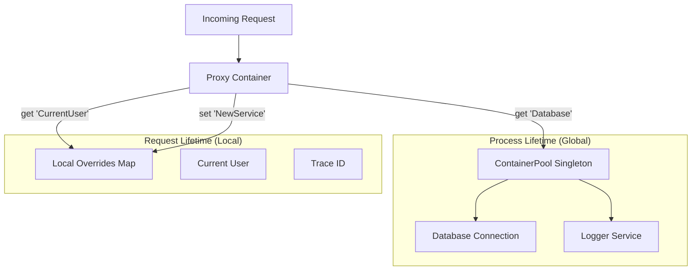

# Improving Noony Container: Hybrid Lifetime Architecture

## Anti-Patterns

> ❌ Avoid these common mistakes:

- **Don't treat the global container as writable during request processing** — the global scope is sealed after initialization; write only to the local (request) scope.
- **Don't clone the entire container per request** — cloning is expensive in serverless; the Hybrid Proxy pattern avoids this by design.
- **Don't mix request-lifetime and process-lifetime dependencies without explicit scoping** — services that hold request state must be registered in the local scope, not the global scope.

## Overview
This document details the architectural improvements to the `ContainerPool` to fully integrate it with the Noony Framework. The goal is to provide a high-performance, memory-efficient Dependency Injection system that supports both **Process Lifetime** (Singletons) and **Request Lifetime** (Scoped) dependencies without the overhead of cloning containers.

## The Challenge
Serverless environments require fast cold starts. Traditional DI frameworks often build a new container for every request, which is expensive.
- **Process Lifetime**: Services initialized once (e.g., DB connections) and reused. Fast, but dangerous if state is shared.
- **Request Lifetime**: Services isolated per request (e.g., generic trace IDs, current user). Safe, but expensive to recreate the entire graph.

## The Solution: Hybrid Proxy Container

We introduce a **Virtual Container Proxy** pattern. Instead of creating a new container for every request (which copies all services), we create a lightweight JavaScript `Proxy` that wraps the global singleton container.

### Architecture



### Deep Dive: Performance & Safety Strategies

#### 1. Size (Memory): The Zero-Copy Promise
In traditional DI frameworks, "scoping" usually means cloning the entire container or creating a child container that holds a reference to the parent. While efficient in long-running processes, in serverless, even micro-optimizations matter.

- **Native JS Proxy**: We utilize standard ES6 `Proxy` objects.
- **No Cloning**: The global container is never cloned. The `Proxy` is merely a lens through which we view the global container.
- **Overhead**: The memory cost is essentially zero (< 1KB). We only allocate memory for the `localOverrides` Map, and *only* if you actually override a service. If a request uses 100 global services and overrides 0, the memory cost is literally just the empty Map and the Proxy wrapper.

#### 2. Concurrency: Read-Only Global State
The "Global Container" (managed by `ContainerPool`) is treated as effectively **Read-Only** during the request processing phase.
- **Thread Safety**: specific to Node.js single-threaded nature, but relevant for logical concurrency (async/await interleaving).
- **Simultaneous Access**: Multiple requests can read from the global container simultaneously without locking or race conditions because they are strictly forbidden from writing to it via the Proxy.

#### 3. Immutability: Copy-On-Write (COW/Shadowing)
This is the critical safety feature. How do we prevent "Request A" from accidentally mocking a service that "Request B" relies on?

- **Interception**: The Proxy intercepts all `set()`, `remove()`, and `reset()` calls.
- **Local Shadowing**: When `container.set('id', value)` is called within a request:
    1. The Proxy catches this call.
    2. It writes the `value` to the request-local `Map`.
    3. It returns successfully, **pretending** it modified the container.
- **Pollution Proof**: The underlying Global Container is untouched. Request B, asking for the same 'id', will still get the original global value (unless it also overwrote it locally).

### Dynamic Dependency Management

The Proxy handles dynamic lifecycle operations transparently:

#### Adding Dependencies
```typescript
// Inside a handler
ctx.container.set('MyTempService', new TempService());
```
- **Behavior**: 'MyTempService' is added to the **local scope only**.
- **Visibility**: Only visible to this specific request context. Disappears when request ends.

#### Removing Dependencies
```typescript
ctx.container.remove('GlobalService');
```
- **Behavior**: The Proxy marks 'GlobalService' as "deleted" in the **local scope**.
- **Result**: Subsequent `get('GlobalService')` calls in this request will throw a ServiceNotFound error (or return null), effectively hiding the global service. The global service itself remains alive for other requests.

#### Resetting
```typescript
ctx.container.reset();
```
- **Behavior**: Clears the **local** overrides Map.
- **Result**: The container "reverts" to the pure Global state for that request. It does **not** reset the global container itself.


### Compatibility

This system is designed to be a drop-in integration for Noony.

- **Developer Usage (Standard)**:
  ```typescript
  // Uses Global Pool (Process Lifetime)
  handler.use(containerPool.asMiddleware());
  ```

- **Developer Usage (With Overrides)**:
  ```typescript
  // Uses Request Scope + Global Fallback
  handler.use(containerPool.asMiddleware([
    { token: 'RequestTraceId', value: 'uuid-123' },
    { token: 'CurrentUser', value: userObj }
  ]));
  ```

- **In Handlers**:
  ```typescript
  handle(async (ctx) => {
    // Works transparently!
    const db = ctx.container.get(Database); // From Global
    const user = ctx.container.get('CurrentUser'); // From Request Scope
    
    // Safe mutation
    ctx.container.set('MyTempData', 123); // Only exists for this request
  });
  ```

## Performance Impact
| Metric | Traditional (Clone) | Hybrid Proxy | Improvement |
|--------|---------------------|--------------|-------------|
| **Setup Time** | O(N) services | O(1) | **Instant** |
| **Memory** | O(N) duplication | O(1) pointer | **~99% Reduction** |
| **Safety** | High | High | Same |

This architecture ensures the Noony Framework remains lightweight and scalable for serverless deployments.
