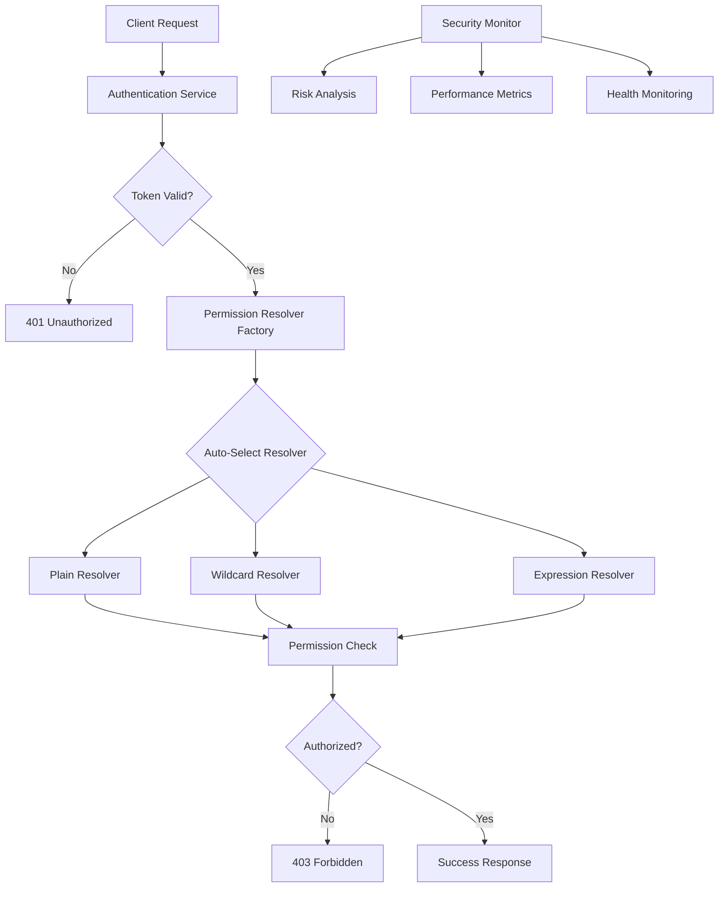

# 🛡️ Guard System Showcase

A comprehensive demonstration of the **Noony Serverless Framework's** advanced authentication and authorization capabilities, featuring multiple permission resolution strategies, security monitoring, and production-ready patterns.

[](https://nodejs.org/)
[](https://www.typescriptlang.org/)
[](https://opensource.org/licenses/MIT)

## 📋 Table of Contents

- [🎯 Overview](#-overview)
- [✨ Key Features](#-key-features)
- [🏗️ Architecture](#️-architecture)
- [🚀 Quick Start](#-quick-start)
- [🔐 Authentication System](#-authentication-system)
- [🎛️ Permission Resolvers](#️-permission-resolvers)
- [📡 API Endpoints](#-api-endpoints)
- [🧪 Testing & Demo](#-testing--demo)
- [⚙️ Configuration](#️-configuration)
- [🐳 Deployment](#-deployment)
- [📊 Monitoring & Analytics](#-monitoring--analytics)
- [🔧 Development](#-development)
- [🤝 Contributing](#-contributing)

## 🎯 Overview

The Guard System Showcase demonstrates a production-ready authentication and authorization system with:

- **Multi-provider authentication** (JWT, Firebase, Auth0, Custom)
- **Three permission resolution strategies** with automatic selection
- **Real-time security monitoring** and incident response
- **Performance optimization** with intelligent caching
- **Health monitoring** and circuit breaker patterns
- **Comprehensive API** for testing and integration

### Use Cases

- 🏢 **Enterprise Applications**: Role-based access control with complex permissions
- 🌐 **Multi-tenant SaaS**: Dynamic permission resolution with tenant isolation
- 🔒 **High-Security Systems**: Advanced authentication with security monitoring
- ⚡ **Performance-Critical Apps**: Optimized permission checking with sub-millisecond response times
- 🧪 **Development & Testing**: Comprehensive examples and benchmarking tools

## ✨ Key Features

### 🔐 Advanced Authentication

- **Multi-Provider Support**: JWT, Firebase, Auth0, and custom token validators
- **Automatic Failover**: Circuit breaker pattern with health monitoring
- **Security Analysis**: Real-time threat detection and risk scoring
- **Token Caching**: Intelligent caching with TTL and invalidation strategies

### 🎛️ Intelligent Permission Resolution

#### Plain Resolver (O(1) Performance)
```typescript
// Exact string matching - fastest for simple permissions
permissions: ["users.read", "posts.write"]
```

#### Wildcard Resolver (Pattern Matching)
```typescript
// Glob-style patterns for flexible permissions
permissions: ["users.*", "posts.{read,write}", "admin.reports.**"]
```

#### Expression Resolver (Boolean Logic)
```typescript
// Complex boolean expressions with logical operators
permission: "(users.read AND posts.write) OR admin.access"
```

### 🚨 Security & Monitoring

- **Real-time Security Analysis**: Risk scoring and threat detection
- **Performance Monitoring**: Sub-millisecond resolution time tracking
- **Health Checks**: Automated service health monitoring
- **Incident Response**: Automated security incident logging and analysis

## 🏗️ Architecture



### Core Components

1. **Authentication Service** - Multi-provider token validation
2. **Permission Resolver Factory** - Intelligent resolver selection
3. **Guard Service** - Orchestrates authentication + authorization
4. **Security Monitor** - Real-time threat detection
5. **Cache Layer** - Performance optimization
6. **Health Monitor** - Service reliability

## 🚀 Quick Start

### Prerequisites

- **Node.js** 18.0.0 or higher
- **npm** 9.0.0 or higher
- **TypeScript** knowledge recommended

### Installation

```bash
# Clone the repository
git clone https://github.com/noony-serverless/core.git
cd core/examples/guard-system-showcase

# Install dependencies
npm install

# Build the project
npm run build

# Start development server
npm run dev
```

The server will start on `http://localhost:3000` with the following services:

✅ **Authentication Service** with JWT and Firebase providers  
✅ **Permission Resolvers** (Plain, Wildcard, Expression)  
✅ **Security Monitoring** with real-time threat detection  
✅ **Health Monitoring** with automatic failover  
✅ **Demo Data** with 2 users, 7 roles, 16 permissions  

### First Test

```bash
# Check system health
curl http://localhost:3000/health

# Test authentication (using demo JWT)
curl -X POST http://localhost:3000/api/auth/authenticate \
  -H "Content-Type: application/json" \
  -d '{"token": "demo.jwt.token"}'
```

## 🔐 Authentication System

### Supported Providers

#### 1. JWT (Primary Provider)
```typescript
// Configuration
{
  algorithm: 'HS256',
  issuer: 'guard-system-showcase',
  audience: 'demo-users',
  secret: process.env.JWT_SECRET,
  enableCaching: true,
  cacheTTL: 300000, // 5 minutes
}
```

#### 2. Firebase (Fallback Provider)
```typescript
// Configuration
{
  projectId: process.env.FIREBASE_PROJECT_ID,
  privateKey: process.env.FIREBASE_PRIVATE_KEY,
  clientEmail: process.env.FIREBASE_CLIENT_EMAIL,
  enableCaching: true,
  requireEmailVerified: false,
}
```

### Authentication Flow

```bash
# 1. Authenticate with token
curl -X POST http://localhost:3000/api/auth/authenticate \
  -H "Content-Type: application/json" \
  -d '{
    "token": "eyJhbGciOiJIUzI1NiIsInR5cCI6IkpXVCJ9..."
  }'

# 2. Response includes user context and security analysis
{
  "authenticated": true,
  "user": {
    "userId": "user123",
    "roles": ["editor", "reviewer"],
    "permissions": ["posts.read", "posts.write"]
  },
  "security": {
    "riskScore": 15,
    "warnings": [],
    "blocked": false
  },
  "performance": {
    "totalTimeUs": 1250,
    "validationTimeUs": 800
  }
}
```

### Security Features

- **Risk Scoring**: 0-100 scale based on request patterns
- **Threat Detection**: Suspicious activity monitoring
- **Rate Limiting**: Automatic protection against abuse
- **Circuit Breaker**: Automatic failover during outages

## 🎛️ Permission Resolvers

### 1. Plain Resolver (Fastest - O(1))

Perfect for exact permission matching with optimal performance.

```bash
# Test exact permission matching
curl -X POST http://localhost:3000/api/permissions/user/user123 \
  -H "Authorization: Bearer YOUR_JWT_TOKEN" \
  -H "Content-Type: application/json" \
  -d '{
    "permissions": ["posts.read", "users.write"],
    "resolver": "plain"
  }'
```

**Use Cases:**
- Simple role-based permissions
- High-performance requirements
- Exact string matching needs

### 2. Wildcard Resolver (Flexible)

Supports glob-style patterns for flexible permission structures.

```bash
# Test wildcard patterns
curl -X POST http://localhost:3000/api/permissions/user/user123 \
  -H "Authorization: Bearer YOUR_JWT_TOKEN" \
  -H "Content-Type: application/json" \
  -d '{
    "permissions": ["posts.*", "users.{read,write}"],
    "resolver": "wildcard"
  }'
```

**Supported Patterns:**
- `*` - Match anything
- `**` - Match anything including separators
- `{a,b,c}` - Match any of the options
- `[abc]` - Match any character in brackets

### 3. Expression Resolver (Most Powerful)

Boolean logic expressions with AND, OR, NOT operators.

```bash
# Test complex expressions
curl -X POST http://localhost:3000/api/permissions/user/user123 \
  -H "Authorization: Bearer YOUR_JWT_TOKEN" \
  -H "Content-Type: application/json" \
  -d '{
    "expression": "(posts.read AND posts.write) OR admin.access",
    "resolver": "expression"
  }'
```

**Expression Syntax:**
```typescript
// Basic operators
"posts.read AND users.write"
"admin.access OR moderator.access"
"NOT banned.user"

// Grouped expressions
"(posts.read AND users.write) OR admin.access"
"posts.* AND NOT posts.admin"

// Complex combinations
"((users.read OR posts.read) AND active.user) OR admin.super"
```

### Automatic Resolver Selection

The system automatically selects the optimal resolver based on permission complexity:

```typescript
// Automatic selection logic
const analysis = analyzeRequirement(permissions);

if (analysis.type === 'simple') {
  return PermissionResolverType.PLAIN;        // O(1)
} else if (analysis.hasWildcards) {
  return PermissionResolverType.WILDCARD;     // Pattern matching
} else if (analysis.hasLogicalOperators) {
  return PermissionResolverType.EXPRESSION;   // Boolean logic
}
```

## 📡 API Endpoints

### Authentication Endpoints

#### POST `/api/auth/authenticate`
Authenticate user with token and get user context.

```bash
curl -X POST http://localhost:3000/api/auth/authenticate \
  -H "Content-Type: application/json" \
  -d '{
    "token": "eyJhbGciOiJIUzI1NiIsInR5cCI6IkpXVCJ9...",
    "clientIp": "192.168.1.100",
    "userAgent": "MyApp/1.0"
  }'
```

#### POST `/api/auth/validate`
Validate token without full authentication context.

```bash
curl -X POST http://localhost:3000/api/auth/validate \
  -H "Content-Type: application/json" \
  -d '{"token": "eyJhbGciOiJIUzI1NiIsInR5cCI6IkpXVCJ9..."}'
```

#### GET `/api/auth/user`
Get current authenticated user information.

```bash
curl -X GET http://localhost:3000/api/auth/user \
  -H "Authorization: Bearer YOUR_JWT_TOKEN"
```

### Permission Endpoints

#### GET `/api/permissions/user/:userId`
Get user permissions with optional resolver selection.

```bash
curl -X GET "http://localhost:3000/api/permissions/user/user123?resolver=wildcard" \
  -H "Authorization: Bearer YOUR_JWT_TOKEN"
```

### Monitoring Endpoints

#### GET `/api/auth/stats`
Get comprehensive authentication statistics.

```bash
curl -X GET http://localhost:3000/api/auth/stats \
  -H "Authorization: Bearer YOUR_JWT_TOKEN"
```

**Response Example:**
```json
{
  "totalOperations": 1547,
  "successfulOperations": 1523,
  "failedOperations": 24,
  "averageResponseTime": "1.2ms",
  "providers": {
    "jwt": {"success": 1450, "failures": 12},
    "firebase": {"success": 73, "failures": 12}
  },
  "performance": {
    "p50": "0.8ms",
    "p95": "2.1ms",
    "p99": "4.5ms"
  }
}
```

#### GET `/api/security/incidents`
Get security incident reports and analysis.

```bash
curl -X GET http://localhost:3000/api/security/incidents \
  -H "Authorization: Bearer YOUR_JWT_TOKEN"
```

### Health Endpoints

#### GET `/health`
System health check with service status.

```bash
curl -X GET http://localhost:3000/health
```

## 🧪 Testing & Demo

### Demo Users

The system includes pre-configured demo users for testing:

| User ID | Roles | Key Permissions |
|---------|-------|----------------|
| `demo-admin` | `admin`, `editor` | `admin.access`, `users.*`, `posts.*` |
| `demo-editor` | `editor`, `reviewer` | `posts.write`, `posts.read`, `comments.moderate` |

### Generate Demo JWT Token

```bash
# Use the built-in token generator (development only)
npm run demo:token

# Or create manually with the demo secret
node -e "
const jwt = require('jsonwebtoken');
const token = jwt.sign(
  { userId: 'demo-admin', roles: ['admin', 'editor'] },
  'demo-secret-key-for-development',
  { issuer: 'guard-system-showcase', audience: 'demo-users' }
);
console.log(token);
"
```

### Test Different Resolvers

#### 1. Plain Resolver Performance Test
```bash
# Test exact matching performance
time curl -X GET "http://localhost:3000/api/permissions/user/demo-admin?resolver=plain" \
  -H "Authorization: Bearer YOUR_JWT_TOKEN" \
  -H "X-Test-Permissions: posts.read,users.write,admin.access"
```

#### 2. Wildcard Resolver Pattern Test
```bash
# Test pattern matching
curl -X GET "http://localhost:3000/api/permissions/user/demo-admin?resolver=wildcard" \
  -H "Authorization: Bearer YOUR_JWT_TOKEN" \
  -H "X-Test-Patterns: posts.*,users.{read,write,delete},admin.**"
```

#### 3. Expression Resolver Logic Test
```bash
# Test complex boolean expressions
curl -X GET "http://localhost:3000/api/permissions/user/demo-admin?resolver=expression" \
  -H "Authorization: Bearer YOUR_JWT_TOKEN" \
  -H "X-Test-Expression: (posts.read AND posts.write) OR admin.access"
```

### Performance Benchmarking

```bash
# Run performance tests
npm run demo:performance

# Load testing with Artillery
npm install -g artillery
artillery run tests/load-test.yml

# Custom benchmark script
npm run demo:benchmark
```

### Security Testing

```bash
# Test rate limiting
for i in {1..100}; do
  curl -s -o /dev/null -w "%{http_code}\n" http://localhost:3000/api/auth/authenticate
done

# Test invalid tokens
curl -X POST http://localhost:3000/api/auth/authenticate \
  -H "Content-Type: application/json" \
  -d '{"token": "invalid.jwt.token"}'

# Test security incidents
npm run demo:security
```

## ⚙️ Configuration

### Environment Variables

Create a `.env` file in the project root:

```bash
# JWT Configuration
JWT_SECRET=your-super-secure-jwt-secret-key
JWT_ISSUER=your-app-name
JWT_AUDIENCE=your-app-users

# Firebase Configuration (optional)
FIREBASE_PROJECT_ID=your-firebase-project
FIREBASE_PRIVATE_KEY=your-firebase-private-key
FIREBASE_CLIENT_EMAIL=your-firebase-client-email

# Auth0 Configuration (optional)
AUTH0_DOMAIN=your-tenant.auth0.com
AUTH0_CLIENT_ID=your-client-id
AUTH0_CLIENT_SECRET=your-client-secret
AUTH0_AUDIENCE=your-api-identifier

# Cache Configuration
REDIS_URL=redis://localhost:6379
CACHE_TTL=300000

# Security Configuration
ENABLE_SECURITY_MONITORING=true
MAX_CONCURRENT_OPERATIONS=100
RATE_LIMIT_REQUESTS=1000
RATE_LIMIT_WINDOW=900000

# Performance Configuration
ENABLE_PROFILING=true
ENABLE_PERFORMANCE_COMPARISON=true
HEALTH_CHECK_INTERVAL=30000

# Development
NODE_ENV=development
LOG_LEVEL=debug
PORT=3000
```

### Guard Service Configuration

The system supports comprehensive configuration through `src/config/guard.config.ts`:

```typescript
export const guardConfig = {
  authentication: {
    primaryProvider: AuthProviderType.JWT,
    fallbackProviders: [AuthProviderType.FIREBASE],
    settings: {
      enableFailover: true,
      maxFailoverAttempts: 3,
      circuitBreakerThreshold: 5,
      enableHealthMonitoring: true,
    }
  },
  
  permissions: {
    defaultStrategy: PermissionResolverType.PLAIN,
    enableAutoSelection: true,
    enablePerformanceComparison: true,
    enableABTesting: false,
    abTestingTrafficSplit: 10,
  },
  
  guard: {
    enableResultCaching: true,
    resultCacheTTL: 300000,
    enableSecurityMonitoring: true,
    maxConcurrentOperations: 100,
  }
};
```

### Provider-Specific Configuration

#### JWT Provider
```typescript
{
  algorithm: 'HS256' | 'RS256' | 'ES256',
  issuer: string,
  audience: string,
  secret?: string,          // For HMAC algorithms
  publicKey?: string,       // For RSA/ECDSA algorithms
  enableCaching: boolean,
  cacheTTL: number,
  clockTolerance: number,
  requireIssuedAt: boolean,
}
```

#### Firebase Provider
```typescript
{
  projectId: string,
  privateKey: string,
  clientEmail: string,
  enableCaching: boolean,
  cacheTTL: number,
  requireEmailVerified: boolean,
  clockTolerance: number,
}
```

## 🐳 Deployment

### Google Cloud Functions

```bash
# Build for deployment
npm run build

# Deploy individual functions
npm run deploy:functions

# Deploy all functions
gcloud functions deploy guard-demo \
  --runtime nodejs20 \
  --trigger-http \
  --allow-unauthenticated \
  --source=dist
```

### Google Cloud Run

```bash
# Deploy to Cloud Run
npm run deploy:run

# Or manually
gcloud run deploy guard-showcase \
  --source . \
  --port 3000 \
  --allow-unauthenticated \
  --region us-central1
```

### Docker

```bash
# Build Docker image
docker build -t guard-system-showcase .

# Run with Docker Compose
npm run docker:dev

# Production deployment
docker run -p 3000:3000 \
  -e JWT_SECRET=your-secret \
  -e NODE_ENV=production \
  guard-system-showcase
```

**Dockerfile:**
```dockerfile
FROM node:18-alpine
WORKDIR /app
COPY package*.json ./
RUN npm ci --only=production
COPY dist/ ./dist/
EXPOSE 3000
CMD ["node", "dist/server.js"]
```

### Kubernetes

```yaml
# k8s/deployment.yaml
apiVersion: apps/v1
kind: Deployment
metadata:
  name: guard-showcase
spec:
  replicas: 3
  selector:
    matchLabels:
      app: guard-showcase
  template:
    metadata:
      labels:
        app: guard-showcase
    spec:
      containers:
      - name: guard-showcase
        image: guard-system-showcase:latest
        ports:
        - containerPort: 3000
        env:
        - name: JWT_SECRET
          valueFrom:
            secretKeyRef:
              name: guard-secrets
              key: jwt-secret
```

## 📊 Monitoring & Analytics

### Health Monitoring

The system provides comprehensive health monitoring:

```bash
# Get overall system health
curl http://localhost:3000/health

# Get detailed component health
curl http://localhost:3000/api/health/detailed
```

**Health Response:**
```json
{
  "status": "healthy",
  "timestamp": "2024-01-15T10:30:45.123Z",
  "services": {
    "authentication": "healthy",
    "permissions": "healthy", 
    "cache": "healthy",
    "database": "healthy"
  },
  "metrics": {
    "uptime": "2h 15m 32s",
    "memoryUsage": "145MB / 512MB",
    "cpuUsage": "12%",
    "responseTime": {
      "avg": "1.2ms",
      "p95": "2.1ms"
    }
  }
}
```

### Performance Metrics

Built-in performance tracking and optimization:

```typescript
// Automatic performance tracking
{
  "totalOperations": 15407,
  "averageResponseTime": 1.2,
  "resolverPerformance": {
    "plain": { "avgTimeUs": 45, "operations": 8234 },
    "wildcard": { "avgTimeUs": 156, "operations": 4892 },
    "expression": { "avgTimeUs": 423, "operations": 2281 }
  },
  "cacheHitRate": 0.87,
  "securityEvents": {
    "blocked": 23,
    "warnings": 156,
    "incidents": 2
  }
}
```

### Custom Metrics

Integrate with your monitoring stack:

```typescript
// Prometheus metrics
import client from 'prom-client';

const authCounter = new client.Counter({
  name: 'guard_authentication_total',
  help: 'Total authentication attempts',
  labelNames: ['provider', 'result']
});

const permissionHistogram = new client.Histogram({
  name: 'guard_permission_duration_seconds',
  help: 'Permission check duration',
  labelNames: ['resolver', 'result']
});
```

## 🔧 Development

### Available Scripts

```bash
# Development
npm run dev              # Start dev server with hot reload
npm run dev:server       # Start only Express server
npm run dev:functions    # Start only Cloud Functions
npm run dev:both         # Start both server and functions

# Building
npm run build           # Build TypeScript to JavaScript
npm run watch           # Build with file watching

# Testing
npm run test            # Run all tests
npm run test:watch      # Run tests in watch mode
npm run test:coverage   # Run tests with coverage
npm run test:security   # Run security-focused tests
npm run test:performance # Run performance benchmarks

# Code Quality
npm run lint            # Check code style
npm run lint:fix        # Fix code style issues
npm run format          # Format code with Prettier
npm run format:check    # Check code formatting

# Demo & Testing
npm run demo:all        # Run all demo scenarios
npm run demo:performance # Performance benchmarking
npm run demo:security   # Security testing scenarios
npm run demo:cache      # Cache optimization demos

# Database
npm run seed            # Seed demo data
npm run reset           # Reset demo data

# Deployment
npm run deploy:functions # Deploy to Google Cloud Functions
npm run deploy:run      # Deploy to Google Cloud Run
npm run docker:dev      # Start with Docker Compose
```

### Project Structure

```
src/
├── api/
│   └── handlers/         # API endpoint handlers
├── auth/
│   ├── token-validators/ # Token validation implementations
│   ├── authentication-service.ts
│   ├── user-context-manager.ts
│   └── token-validator-factory.ts
├── config/
│   ├── environment.config.ts
│   └── guard.config.ts   # Guard service configuration
├── functions/
│   └── index.ts         # Google Cloud Functions
├── permissions/
│   ├── resolvers/       # Permission resolution strategies
│   ├── demo-permission-source.ts
│   ├── permission-resolver-factory.ts
│   └── permission-source.ts
├── services/
│   └── guard-service.ts # Main orchestration service
├── types/
│   └── auth.types.ts    # Type definitions
├── utils/
│   └── demo-data.ts     # Demo data generation
└── server.ts           # Express development server
```

### Adding New Features

#### 1. Create New Permission Resolver

```typescript
// src/permissions/resolvers/custom-resolver.ts
import { BasePermissionResolver } from './base-permission-resolver';

export class CustomPermissionResolver extends BasePermissionResolver {
  async checkPermission(
    userId: string,
    requirement: string,
    context?: Record<string, unknown>
  ): Promise<PermissionCheckResult> {
    // Your custom logic here
    return {
      allowed: true,
      resolverType: PermissionResolverType.CUSTOM,
      resolutionTimeUs: 100,
      cached: false
    };
  }
}
```

#### 2. Add New Authentication Provider

```typescript
// src/auth/token-validators/custom-validator.ts
import { BaseTokenValidator } from './base-token-validator';

export class CustomTokenValidator extends BaseTokenValidator {
  async validateToken(token: string): Promise<TokenValidationResult> {
    // Your validation logic here
    return {
      valid: true,
      decoded: { userId: 'user123' },
      metadata: {
        validationTimeUs: 500,
        cached: false,
        validatorType: 'custom'
      }
    };
  }
}
```

### Testing Guidelines

#### Unit Tests
```typescript
// tests/auth/authentication-service.test.ts
describe('AuthenticationService', () => {
  it('should authenticate valid JWT token', async () => {
    const service = new AuthenticationService();
    const result = await service.authenticate({
      token: 'valid.jwt.token'
    });
    
    expect(result.authenticated).toBe(true);
    expect(result.user?.userId).toBe('demo-user');
  });
});
```

#### Integration Tests
```typescript
// tests/integration/permission-flow.test.ts
describe('Permission Flow', () => {
  it('should complete full auth + permission check', async () => {
    const response = await request(app)
      .post('/api/auth/guard')
      .set('Authorization', 'Bearer valid.jwt.token')
      .send({
        userId: 'demo-admin',
        permissions: ['posts.read', 'users.write']
      });
    
    expect(response.status).toBe(200);
    expect(response.body.authorized).toBe(true);
  });
});
```

#### Performance Tests
```typescript
// tests/performance/resolver-benchmarks.test.ts
describe('Resolver Performance', () => {
  it('should resolve permissions under 1ms', async () => {
    const start = process.hrtime.bigint();
    await resolver.checkPermission('user123', 'posts.read');
    const end = process.hrtime.bigint();
    
    const durationUs = Number(end - start) / 1000;
    expect(durationUs).toBeLessThan(1000); // Less than 1ms
  });
});
```

## 🤝 Contributing

We welcome contributions! Please see our [Contributing Guide](../../CONTRIBUTING.md) for details.

### Development Workflow

1. **Fork the repository**
2. **Create a feature branch**: `git checkout -b feature/amazing-feature`
3. **Make your changes** with tests
4. **Run the test suite**: `npm test`
5. **Ensure code quality**: `npm run lint && npm run format`
6. **Commit your changes**: `git commit -m 'Add amazing feature'`
7. **Push to the branch**: `git push origin feature/amazing-feature`
8. **Open a Pull Request**

### Code Style

- **TypeScript** with strict mode enabled
- **ESLint** with security and best practices rules
- **Prettier** for consistent formatting
- **Comprehensive JSDoc** comments for all public APIs
- **100% test coverage** for new features

## 📄 License

This project is licensed under the MIT License - see the [LICENSE](../../LICENSE) file for details.

## 🙏 Acknowledgments

- Built with the [Noony Serverless Framework](https://github.com/noony-serverless/core)
- Inspired by enterprise authentication patterns
- Performance optimization techniques from high-scale applications
- Security best practices from OWASP guidelines

---

## 📞 Support

- 📧 **Email**: support@noony-serverless.com
- 💬 **Discord**: [Join our community](https://discord.gg/noony-serverless)
- 📖 **Documentation**: [docs.noony-serverless.com](https://docs.noony-serverless.com)
- 🐛 **Issues**: [GitHub Issues](https://github.com/noony-serverless/core/issues)

**Happy coding with the Guard System Showcase!** 🛡️✨